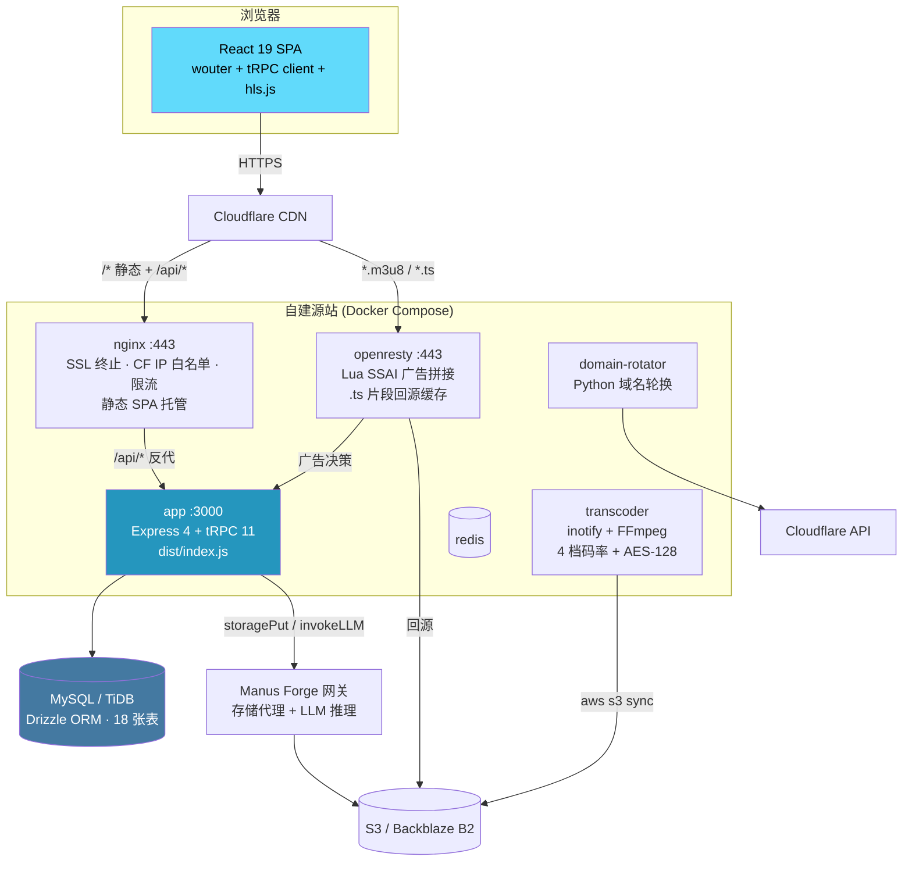

# OpenAdult

> 一个 TypeScript 全栈成人视频平台：tRPC 端到端类型安全 API、HLS 流媒体与 CDN 侧 SSAI 广告拼接、LLM 驱动的聊天推荐与女优相似度检索，以及一整套 Docker + Nginx + OpenResty 的自建源站部署栈。


---

## ⚠️ 内容分级与合规声明

**本项目是一个成人内容（18+ / NSFW）视频平台的完整技术实现，仅作为全栈架构与流媒体工程的技术研究材料公开。**

在你 clone 之前，请明确以下几点：

| 事项 | 说明 |
|------|------|
| **年龄限制** | 平台面向的内容类别在绝大多数司法辖区要求 18 岁（或当地法定成年年龄）以上。仓库本身**不包含任何内容素材**，只有代码。 |
| **法律责任** | 部署者需自行承担内容合规、版权、年龄验证（AVS）、2257 记录保存、数据保护（GDPR/个人信息保护法）等全部法律义务。**代码作者不对任何部署行为负责。** |
| **地域限制** | 成人内容的合法性因国家/地区而异（部分地区完全禁止）。部署前请确认目标市场与服务器所在地的法律。 |
| **反封锁模块** | `deploy/anti-block/` 中的域名轮换与 JS 挑战代码用于抵御恶意扫描与 DDoS，**不得**用于规避合法监管、法院命令或平台封禁。 |
| **内容审核** | 本仓库**没有实现**内容审核、CSAM 检测、年龄验证或 DMCA 下架流程。任何面向公众的部署都必须自行补齐这些环节。 |
| **LLM 模型** | 默认 LLM 是经 abliteration 处理的去对齐模型（见 `server/_core/env.ts:57`），因为通用模型会对本领域内容拒答。这意味着模型侧**没有安全护栏**，输出需自行过滤。 |

> **不要把 `main` 分支直接推上生产。** 仓库当前状态存在若干已知的安全缺陷（默认管理员凭据 `admin/admin`、`sql.raw` 字符串拼接、部分写接口未鉴权、存储代理无访问控制等），完整清单见 [`docs/PROGRESS.md`](docs/PROGRESS.md)。

---

## ✨ 核心特性

### 🎬 HLS 流媒体播放
自研播放器（`client/src/components/VideoPlayer.tsx`，基于 hls.js）支持多码率切换、拖拽进度条、倍速、全屏三级降级与断点续播。服务端提供 `pseudo`（S3 重定向的伪清单）与 `real`（CDN 多码率 master playlist）两种 HLS 模式，由 `HLS_MODE` 切换。

### 🤖 LLM 聊天推荐（RAG）
每轮对话先从库内检索相关视频/女优注入 system prompt，让模型只在真实库存内推荐，避免编造片名。推荐排序采用「LLM 生成文案 + 本地确定性加权打分」的混合模式，保证结果可解释、不随模型漂移。

### 🔍 女优相似度检索
支持按名称检索与上传图片检索两条路径。图片路径通过 LLM 视觉分析提取面部特征（Node 端无 DOM，无法用 face-api.js）。⚠️ 注意：向量匹配链路目前**尚未接通**（`actress_face_embeddings` 表只写不读），详见 [`docs/PROGRESS.md`](docs/PROGRESS.md)。

### 📺 SSAI 服务端广告拼接
广告在 m3u8 清单层用 `#EXT-X-DISCONTINUITY` 与正片拼接（正片与广告使用完全一致的 FFmpeg 编码参数），客户端广告拦截器无法按域名或请求特征过滤。支持 pre-roll / mid-roll / post-roll 三种坑位与全局/单视频两级投放规则。

### ⬆️ 大文件分片上传
50MB 分片 × 4 并发，前端 canvas 抽帧生成封面，分片走裸二进制 `POST /api/upload/chunk`（绕开 tRPC 以避免 base64 33% 体积膨胀），会话与分片元数据落库支持断点续传。

### 🔐 双轨认证体系
普通用户走 Manus OAuth + HS256 JWT Cookie（`publicProcedure` / `protectedProcedure` / `adminProcedure` 三级中间件）；管理面板走独立的用户名密码会话（`admin_session_id` Cookie）。⚠️ 两套体系目前**未完全打通**，见 [`docs/PROGRESS.md`](docs/PROGRESS.md)。

### 🛡️ 反封锁基础设施
Python 守护进程多地探测域名可达性，被封时经 Cloudflare API 自动切换 DNS A 记录（`proxied=true` 保持源站 IP 隐藏）并 Telegram 播报新域名；配合 JS 指纹挑战 + PoW 过滤爬虫。

### 🎛️ 一体化管理后台
单页六 Tab：视频画廊、分片上传、视频元数据 CRUD、女优 CRUD、广告投放与分析、管理员凭据修改。

---

## 🏗️ 架构速览



**请求分流**（`server/_core/index.ts`）：

| 路径 | 处理方 |
|------|--------|
| `/api/trpc/*` | tRPC `appRouter` — 全部业务 API（`server/routers.ts:78`） |
| `/api/hls/*` | HLS 清单与片段（`server/_core/hlsRoutes.ts`） |
| `/api/upload/chunk` | 裸二进制分片上传，multer（`server/_core/fastUpload.ts`） |
| `/api/video-stream/:id` | multi-chunk 视频的 Range 流式重组（`server/_core/videoStream.ts`） |
| `/manus-storage/*` | S3 对象代理，视频走 Range 透传（`server/_core/storageProxy.ts`） |
| `/api/oauth/callback` | Manus OAuth 回调（`server/_core/oauth.ts`） |
| `/health` | Docker healthcheck 探针（`server/_core/index.ts:140`） |
| `/*` | SPA fallback（dev 走 Vite 中间件，prod 走 `dist/public/`） |

> 📖 完整架构说明、模块职责、数据流与设计决策见 **[docs/ARCHITECTURE.md](docs/ARCHITECTURE.md)**。

---

## 🧰 技术栈

| 层 | 选型 | 备注 |
|----|------|------|
| **语言** | TypeScript 5.9（ESM，`strict`） | 前后端同仓，`@/` → `client/src/`，`@shared/` → `shared/` |
| **前端框架** | React 19 | 无 SSR，纯 SPA |
| **路由** | wouter 3.7 | 非 react-router；带本地 patch `patches/wouter@3.7.1.patch` |
| **状态/数据** | TanStack Query 5 + tRPC React | 未登录在 QueryCache 层统一拦截并跳转 OAuth |
| **UI** | Tailwind CSS 4 + shadcn/ui | 53 个基础组件在 `client/src/components/ui/` |
| **播放器** | hls.js 1.6 | 控制条完全自研，未用 video.js/plyr |
| **后端框架** | Express 4 + tRPC 11 | superjson 序列化，zod 输入校验 |
| **ORM** | Drizzle ORM 0.44 + drizzle-kit | schema 定义在 `drizzle/schema.ts:94` 起 |
| **数据库** | MySQL 8 / TiDB / MariaDB | 18 张表，4 个增量迁移 |
| **认证** | Manus OAuth + jose (HS256 JWT) | 管理端另有 bcrypt 密码会话 |
| **对象存储** | Manus Forge 存储代理 → S3 兼容（Backblaze B2） | ⚠️ 见下方环境变量说明中的注意事项 |
| **AI** | Forge 网关（`invokeLLM`） | 聊天推荐、图像/人脸分析、上传元数据提取 |
| **构建** | Vite 7（前端）+ esbuild（后端） | 产物：`dist/public/` + `dist/index.js` |
| **测试** | Vitest 2 | `environment: node`，仅覆盖服务端 |
| **部署** | Docker Compose + Nginx + OpenResty + FFmpeg | 生产栈 9 个 service |

---

## 🚀 快速开始

### 先决条件

| 依赖 | 版本 | 说明 |
|------|------|------|
| Node.js | **22+** | 生产镜像为 `node:22-alpine` |
| pnpm | **10.4.1** | 见 `package.json` 的 `packageManager` 字段，`corepack enable` 即可 |
| Docker | 可选 | 仅 Path B 需要 |

### 安装

```bash
git clone <your-repo-url> OpenAdult
cd OpenAdult
pnpm install
cp .env.example .env
```

编辑 `.env`，**最少需要设置 `DATABASE_URL` 与 `JWT_SECRET`**（Path A 的脚本会自动用本地 MariaDB 的连接串）。

> ⚠️ 服务端通过 `import "dotenv/config"` 自动加载 `.env`，**不要 `source .env`** —— `DOMAIN_POOL` 之类的 JSON 值会破坏 shell 解析。

---

### Path A — 原生脚本（无需 Docker）✅ 已验证

脚本会下载一份**免 root 的便携 MariaDB** 到 `~/.openadult-localdb`（监听 `127.0.0.1:3307`），跑迁移、可选灌种子数据，然后启动**生产构建产物**（`node dist/index.js` —— 与容器内跑的完全是同一个 artifact）。

```bash
pnpm build                  # 产出 dist/index.js + dist/public
./scripts/dev-up.sh --seed  # 起 DB → migrate → seed → 启动服务
# → 打开 http://localhost:3000
```

停止：

```bash
./scripts/dev-down.sh        # 只停应用
./scripts/dev-down.sh --db   # 连本地 MariaDB 一起停
```

辅助脚本：

| 脚本 | 作用 |
|------|------|
| `scripts/localdb.sh {start\|stop\|status\|cli}` | 管理 `~/.openadult-localdb` 里的便携 MariaDB（端口 3307） |
| `scripts/dev-up.sh [--seed]` | DB + migrate +（seed）+ 在 `PORT`（默认 3000）启动生产服务 |
| `scripts/dev-down.sh [--db]` | 停应用（可选连带停 DB） |
| `scripts/dev-seed.sql` | 示例数据：3 个视频、2 位女优、1 条 pre-roll 广告 |

> `127.0.0.1:3307` 是 **MySQL 协议端口，不是 HTTP** —— 用 DB 客户端连（`./scripts/localdb.sh cli`），不要在浏览器里打开。唯一可浏览的地址是 **http://localhost:3000**。

---

### Path B — Docker 自包含本地栈

`deploy/docker/docker-compose.local.yml` 一条命令拉起 **db + migrate + app + HTTP-only nginx**，无 SSL、无 Cloudflare 白名单、无需外部数据库。

```bash
cd deploy/docker
docker compose -f docker-compose.local.yml up -d --build
# → 直连 app:        http://localhost:3000
# → 经 nginx:        http://localhost:8080

# 可选：灌示例数据
docker compose -f docker-compose.local.yml --profile seed run --rm seed
```

停止 / 重置：

```bash
docker compose -f docker-compose.local.yml down      # 停止
docker compose -f docker-compose.local.yml down -v   # 停止并删除 DB 数据卷
```

> ⚠️ 该 compose **未经运行时验证**（编写环境无 Docker）。YAML 合法性与 `migrate` 步骤（`node_modules/.bin/drizzle-kit migrate`）已在原生 MariaDB 上验证过。遇到构建/运行问题请提 issue。

---

### 无需数据库的配置自检

```bash
pnpm check   # tsc --noEmit
pnpm build   # vite + esbuild → dist/public + dist/index.js
pnpm test    # vitest（依赖 DB 的用例在无 DATABASE_URL 时会跳过）
```

> 数据库是「可缺席」的：`getDb()` 在无 `DATABASE_URL` 或连接失败时返回 `null`，各 procedure 自行降级（查询类返回空数组，写入类抛错）。好处是本地无库也能起服务，代价是「数据库宕机」与「确实没有数据」在前端看起来完全一样。

---

## 📁 目录结构

```
OpenAdult/
├── client/                     # React 19 SPA
│   └── src/
│       ├── main.tsx            # tRPC client + QueryClient 装配、未登录全局拦截
│       ├── App.tsx             # wouter 路由表（10 条，client/src/App.tsx:70 起）
│       ├── pages/              # Home / ChatPage / VideoDetailPage / FaceSearchPage / ...
│       ├── components/         # VideoPlayer / VideoUploadForm / AdManagementUI / ui(53)
│       ├── contexts/           # LanguageContext(ja/zh/en) · ThemeContext
│       └── lib/                # trpc.ts · videoUrl.ts · utils.ts
│
├── server/                     # Express + tRPC 后端
│   ├── _core/                  # ⚠️ 框架核心，谨慎修改
│   │   ├── index.ts            # 服务器入口 + 路由挂载顺序
│   │   ├── trpc.ts             # public / protected / admin 三级中间件
│   │   ├── sdk.ts  oauth.ts    # Manus OAuth + JWT 会话
│   │   ├── llm.ts              # invokeLLM() → Forge 网关
│   │   ├── hlsRoutes.ts        # HLS manifest / segment / key
│   │   ├── storageProxy.ts     # /manus-storage/* 对象代理
│   │   ├── videoStream.ts      # multi-chunk Range 重组
│   │   └── fastUpload.ts       # 裸二进制分片上传
│   ├── routers.ts              # appRouter 根路由（server/routers.ts:78）
│   ├── routers/                # videos(-v2) · actress-management(-v2) · faceSearch
│   │                           # video-upload(-v2) · admin-auth · ad-management · hls-stream
│   ├── db.ts                   # 数据库查询助手层
│   ├── storage.ts              # storagePut / storageGet
│   ├── llm-prompts.ts          # 提示词模板
│   └── *.test.ts               # Vitest
│
├── drizzle/                    # schema.ts（18 表）+ 0000~0003 迁移 + meta/
├── shared/                     # 前后端共享常量与类型
├── scripts/                    # localdb.sh · dev-up.sh · dev-down.sh · dev-seed.sql
├── deploy/
│   ├── docker/                 # docker-compose.yml(生产 9 服务) + .local.yml + 3 个 Dockerfile
│   ├── nginx/                  # openadult-main.conf · cloudflare-ips.conf · js-challenge.conf
│   ├── openresty/              # openresty-cdn.conf + lua/(SSAI 拼接)
│   ├── ffmpeg/                 # transcode_hls.sh · transcode_ad.sh · transcode_watcher.sh
│   ├── anti-block/             # domain_rotator.py · challenge.html
│   ├── monitoring/             # prometheus.yml
│   └── docs/                   # DEPLOY_TUTORIAL_CN.md · env-template.md
└── docs/                       # ARCHITECTURE.md · PROGRESS.md · DEVELOPMENT.md
```

> 📖 逐文件的职责说明见 **[docs/ARCHITECTURE.md](docs/ARCHITECTURE.md)**。

---

## ⌨️ 常用命令

| 命令 | 实际执行 | 用途 |
|------|----------|------|
| `pnpm dev` | `NODE_ENV=development tsx watch server/_core/index.ts` | 开发模式，后端热重载 + Vite 中间件托管前端 |
| `pnpm build` | `vite build && esbuild server/_core/index.ts --platform=node --packages=external --bundle --format=esm --outdir=dist` | 产出 `dist/public/` + `dist/index.js` |
| `pnpm start` | `NODE_ENV=production node dist/index.js` | 启动生产服务（容器内跑的就是这条） |
| `pnpm check` | `tsc --noEmit` | 类型检查 |
| `pnpm test` | `vitest run` | 服务端单测 |
| `pnpm format` | `prettier --write .` | 格式化 |
| `pnpm db:push` | `drizzle-kit generate && drizzle-kit migrate` | 生成迁移 SQL 并应用到 `DATABASE_URL` |

**本地开发脚本**（非 npm script，直接执行）：`./scripts/dev-up.sh [--seed]`、`./scripts/dev-down.sh [--db]`、`./scripts/localdb.sh {start|stop|status|cli}`。

---

## 🔑 环境变量速查

完整模板见 [`.env.example`](.env.example)（本地开发）与 [`deploy/docs/env-template.md`](deploy/docs/env-template.md)（生产）。后端代码统一通过 `server/_core/env.ts` 的 `ENV` 常量访问，**不直接读 `process.env`**。

### 必需（服务能起来的最低要求）

| 变量 | 说明 |
|------|------|
| `DATABASE_URL` | MySQL/TiDB 连接串。本地：`mysql://root@127.0.0.1:3307/openadult`；生产带 TLS：`...?ssl={"rejectUnauthorized":true}` |
| `JWT_SECRET` | 会话 Cookie 的 HS256 签名密钥，**≥32 字符**。⚠️ 留空时会降级为零长度密钥，等同于任何人都能伪造登录态 |

### 登录功能（Manus OAuth）

| 变量 | 说明 |
|------|------|
| `VITE_APP_ID` | OAuth client_id。带 `VITE_` 前缀意味着会被打进前端 bundle（公开值，非机密） |
| `OAUTH_SERVER_URL` | OAuth 服务器 base URL |
| `VITE_OAUTH_PORTAL_URL` | OAuth 登录门户地址（前端跳转用） |
| `OWNER_OPEN_ID` | 站点所有者 openId。该用户登录时会被自动提权为 `role=admin` |
| `OWNER_NAME` | 所有者显示名 |

> 留空时服务仍可启动，仅登录相关功能不可用。

### AI 能力（Forge 网关）

| 变量 | 说明 |
|------|------|
| `BUILT_IN_FORGE_API_URL` | Forge 网关 base URL（LLM 推理 + **对象存储**共用） |
| `BUILT_IN_FORGE_API_KEY` | Forge API Key，**机密** |
| `VITE_FRONTEND_FORGE_API_URL` / `VITE_FRONTEND_FORGE_API_KEY` | 前端侧 Forge 配置 |
| `HERETIC_LLM_MODEL` | LLM 模型名。**唯一带非空默认值的变量**（`p-e-w/Qwen3-4B-Instruct-2507-heretic-v2`，见 `server/_core/env.ts:57`） |

### 存储与流媒体

| 变量 | 说明 |
|------|------|
| `HLS_MODE` | `pseudo`（开发，片段 302 到 S3 原 MP4）或 `real`（生产，多码率 master playlist 指向 CDN） |
| `CDN_BASE_URL` | CDN 基础 URL，`HLS_MODE=real` 时必需 |
| `S3_BUCKET` / `S3_ENDPOINT` / `AWS_ACCESS_KEY_ID` / `AWS_SECRET_ACCESS_KEY` | ⚠️ **见下方注意事项** |

> **⚠️ S3 变量的重要注意事项**
> `.env.example` 与旧文档列出了 `S3_*` / `AWS_*` 四个变量，`package.json` 也依赖 `@aws-sdk/client-s3`，但**应用代码从不读取这些变量、也从不 import AWS SDK**。实际对象存储走的是 `server/storage.ts` 里的 Manus Forge 存储代理（`BUILT_IN_FORGE_API_URL` + `BUILT_IN_FORGE_API_KEY`）。
> 这些 S3 变量只对 **`deploy/ffmpeg/` 的转码脚本**（`aws s3 sync`）与 **OpenResty CDN 回源**有意义 —— 且 OpenResty 侧的 Backblaze 端点是硬编码在 `deploy/openresty/openresty-cdn.conf` 与两个 Lua 脚本里的，改存储商需要手工改多处。

### 可选 / 生产运维

| 变量 | 说明 |
|------|------|
| `PORT` | 应用端口，默认 3000。⚠️ 端口被占用时进程会**静默改听下一个可用端口**（`server/_core/index.ts`），在 Docker 里会导致「容器起来了但外部不可达」 |
| `NODE_ENV` | `production` 时走静态文件托管，否则挂 Vite 中间件。判定为严格等于 `"production"` |
| `ADMIN_API_KEY` | 内部服务调用密钥（转码脚本注册 HLS 密钥时用） |
| `ALLOWED_ORIGINS` | HLS 密钥服务的 Referer 白名单，逗号分隔。⚠️ 未配置时白名单**恒真**（等同放行），见 `server/_core/hlsRoutes.ts` |
| `CF_API_TOKEN` / `CF_ZONE_ID` | Cloudflare API，域名轮换必需 |
| `TG_BOT_TOKEN` / `TG_CHANNEL_ID` | Telegram 通知 |
| `DOMAIN_POOL` | 域名池 **JSON 数组**，如 `["a.com","b.net"]` |
| `ORIGIN_IP` | 源站公网 IP，域名轮换写 DNS A 记录用 |
| `GRAFANA_PASSWORD` | Grafana 管理员密码 |
| `VITE_ANALYTICS_ENDPOINT` / `VITE_ANALYTICS_WEBSITE_ID` | 前端埋点。⚠️ 未设置时 `client/index.html` 的占位符不会被替换，会在产物中留下字面量 `%VITE_ANALYTICS_ENDPOINT%` 并触发服务端 `URIError` |

---

## 📚 文档导航

| 文档 | 内容 |
|------|------|
| **[docs/ARCHITECTURE.md](docs/ARCHITECTURE.md)** | 完整架构：模块分层、逐文件职责、请求/数据流、关键设计决策与取舍 |
| **[docs/PROGRESS.md](docs/PROGRESS.md)** | 功能完成度矩阵（complete / partial / stub / missing）、已知缺陷与风险清单 |
| **[docs/DEVELOPMENT.md](docs/DEVELOPMENT.md)** | 开发规范：新增 tRPC 路由、新增数据表、调用 LLM、上传文件的标准流程 |
| **[LOCAL_DEV.md](LOCAL_DEV.md)** | 本地运行两条路径的原始说明 + 生产栈的三项前置条件 |
| **[DEPLOY_FIXES.md](DEPLOY_FIXES.md)** | 部署栈审计报告：14 项已修复缺陷 + 3 项「按设计保留」的前置条件 |
| **[CLAUDE.md](CLAUDE.md)** | 给 Claude Code 等 AI 编码助手的项目上下文与约定 |
| **[deploy/docs/DEPLOY_TUTORIAL_CN.md](deploy/docs/DEPLOY_TUTORIAL_CN.md)** | 811 行保姆级中文部署教程（VPS → 域名 → Cloudflare → B2 → 上线 → 运维） |
| **[deploy/docs/env-template.md](deploy/docs/env-template.md)** | 生产环境变量完整模板与说明表 |
| **[deploy/README.md](deploy/README.md)** | 部署栈组件说明 |

---

## 🚢 部署

生产栈由 `deploy/docker/docker-compose.yml` 编排，设计为**坐在 Cloudflare 后面的自建源站**，共 9 个 service：

| Service | 端口 | 职责 |
|---------|------|------|
| `migrate` | — | 一次性跑 `drizzle-kit migrate` 建表，`app` 通过 `service_completed_successfully` 严格排在其后 |
| `app` | 3000 | Node.js API + 前端（与本地 Path A 跑的是同一个 `dist/index.js`） |
| `nginx` | 80/443 | SSL 终止、Cloudflare IP 白名单 + `deny all`、三档限流、SPA 静态托管 |
| `openresty` | 8080→443 | CDN 边缘节点，Lua SSAI 广告拼接 + `.ts` 回源缓存 |
| `transcoder` | — | inotify 监控 + FFmpeg 4 档码率 HLS 转码 + AES-128 加密 |
| `domain-rotator` | — | 域名可达性探测 + Cloudflare DNS 切换 + Telegram 播报 |
| `redis` | 6379 | 缓存（⚠️ 容器已编排但应用代码尚未接入） |
| `prometheus` | 9090 | 指标收集（⚠️ 目标 exporter 尚未编排） |
| `grafana` | 3100 | 监控面板 |

一键部署（Ubuntu 22.04）：

```bash
# 在服务器上，仓库根目录
sudo ./deploy/scripts/deploy.sh
```

或手动：

```bash
pnpm install && pnpm build          # 生产静态资源由宿主 bind mount 进 nginx，必须先构建
cd deploy/docker
docker compose --env-file ../../.env up -d
```

**生产栈的三项硬前置条件**（缺一不可，详见 [`LOCAL_DEV.md`](LOCAL_DEV.md)）：

1. **外部数据库** —— 生产栈刻意不含 `db` service，`DATABASE_URL` 必须指向外部 MySQL/TiDB。
2. **真实 TLS 证书** —— `ssl-certs` 卷里必须有 `origin.pem` / `origin-key.pem`（nginx）与 `cdn-origin.pem` / `cdn-origin-key.pem`（openresty），否则 `listen 443 ssl` 起不来。
3. **必须走 Cloudflare** —— nginx 的 443 server 块是 `include cloudflare-ips.conf; deny all;`，直连源站一律 403。这是有意的源站硬化，本地查看请用 Path B。

> ⚠️ 部署栈中仍有若干**未修复的断链**（OpenResty 配置挂载点错位、`lua-resty-http` 未安装、Lua 调用的 4 个后端 API 不存在、Prometheus target 无 exporter、`deploy.sh` 与 compose 的证书路径不一致）。上线前请先读 [`docs/PROGRESS.md`](docs/PROGRESS.md) 与 [`DEPLOY_FIXES.md`](DEPLOY_FIXES.md)。

📖 完整部署流程见 **[deploy/docs/DEPLOY_TUTORIAL_CN.md](deploy/docs/DEPLOY_TUTORIAL_CN.md)**。

---

## 🤝 贡献

1. 读 [`docs/DEVELOPMENT.md`](docs/DEVELOPMENT.md) 了解添加功能的标准流程（schema → `server/db.ts` → router → 注册 → 前端 → 测试）。
2. 不要修改 `server/_core/`，除非你确切知道在做什么。
3. 提交前跑 `pnpm check && pnpm test && pnpm format`。
4. 数据库操作尽量收敛到 `server/db.ts`（现状是 13 个文件绕过了这一约定，新代码请不要继续扩大）。

---

## 📄 License

MIT（见 `package.json` 的 `license` 字段；仓库中尚未放置 `LICENSE` 文件，如需分发请补上标准 MIT 全文）。

## ⚖️ 免责声明

本软件按「原样」提供，不附带任何明示或暗示的担保。作者与贡献者**不对**以下任何情形承担责任：

- 使用本代码部署的任何服务所承载、分发或生成的内容；
- 因部署行为产生的任何法律责任，包括但不限于内容合规、版权侵权、年龄验证缺失、数据保护违规；
- 因代码中已知或未知缺陷（含本文与 [`docs/PROGRESS.md`](docs/PROGRESS.md) 已明确列出的安全问题）造成的数据泄露、服务中断或经济损失。

`deploy/anti-block/` 下的反封锁组件仅用于抵御恶意扫描与流量攻击。**使用者有责任确保其使用方式符合当地法律，不得用于规避合法监管、法院命令或司法辖区的内容限制。**

使用即表示你已阅读并接受上述条款，并确认你已年满所在司法辖区的法定成年年龄。
