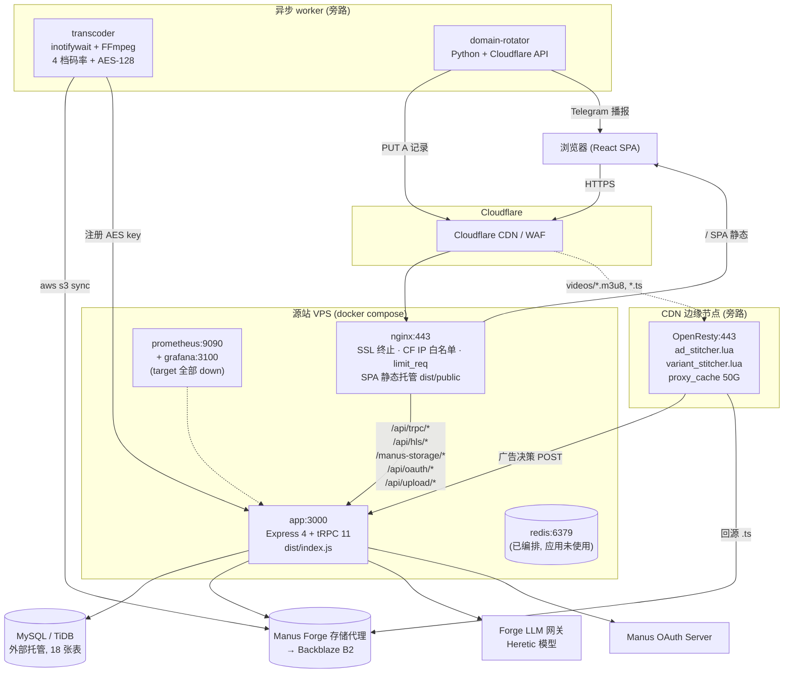
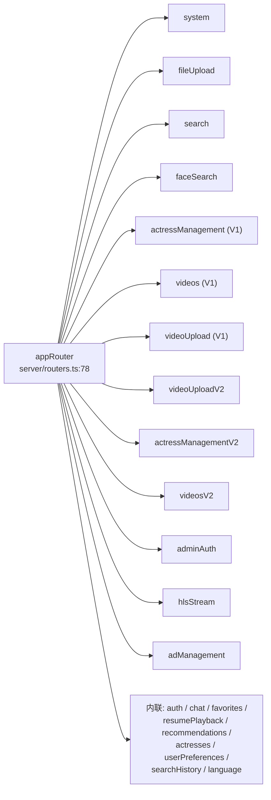
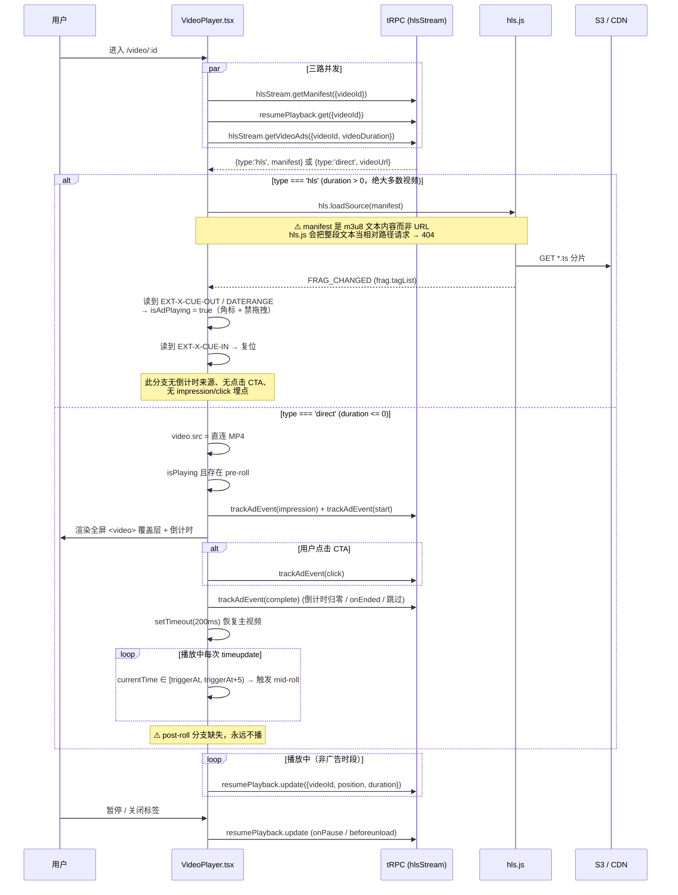
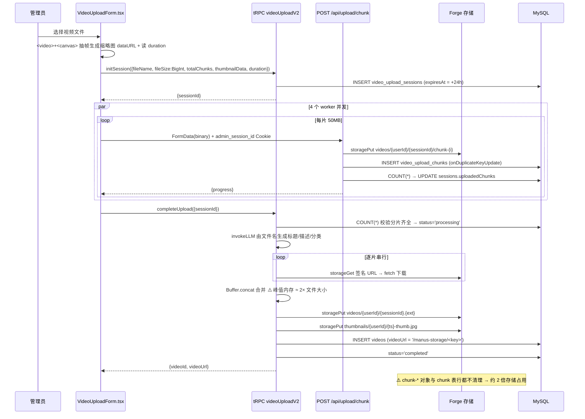
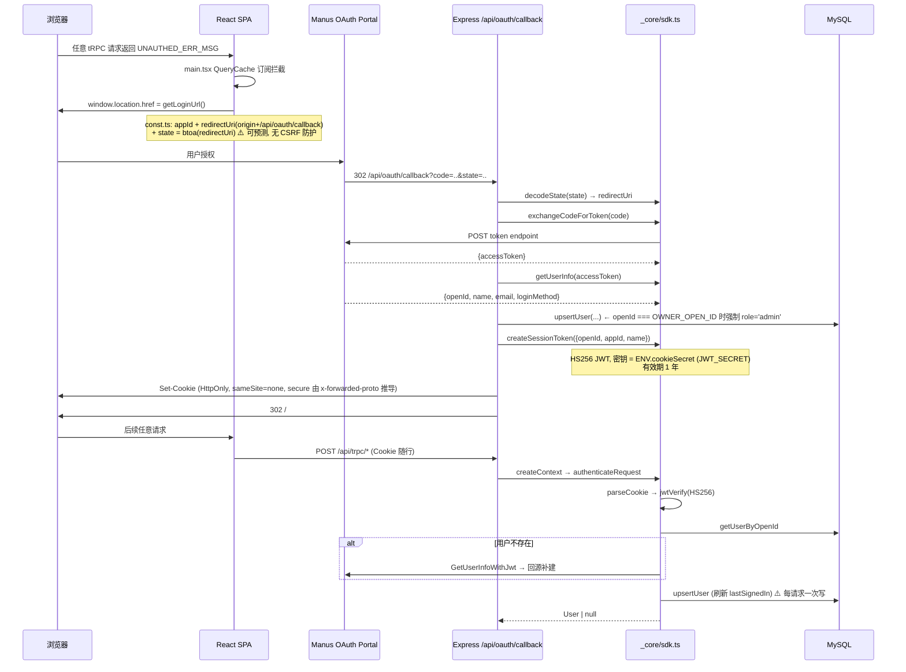
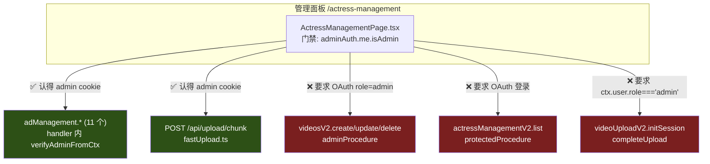
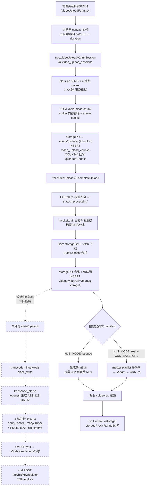
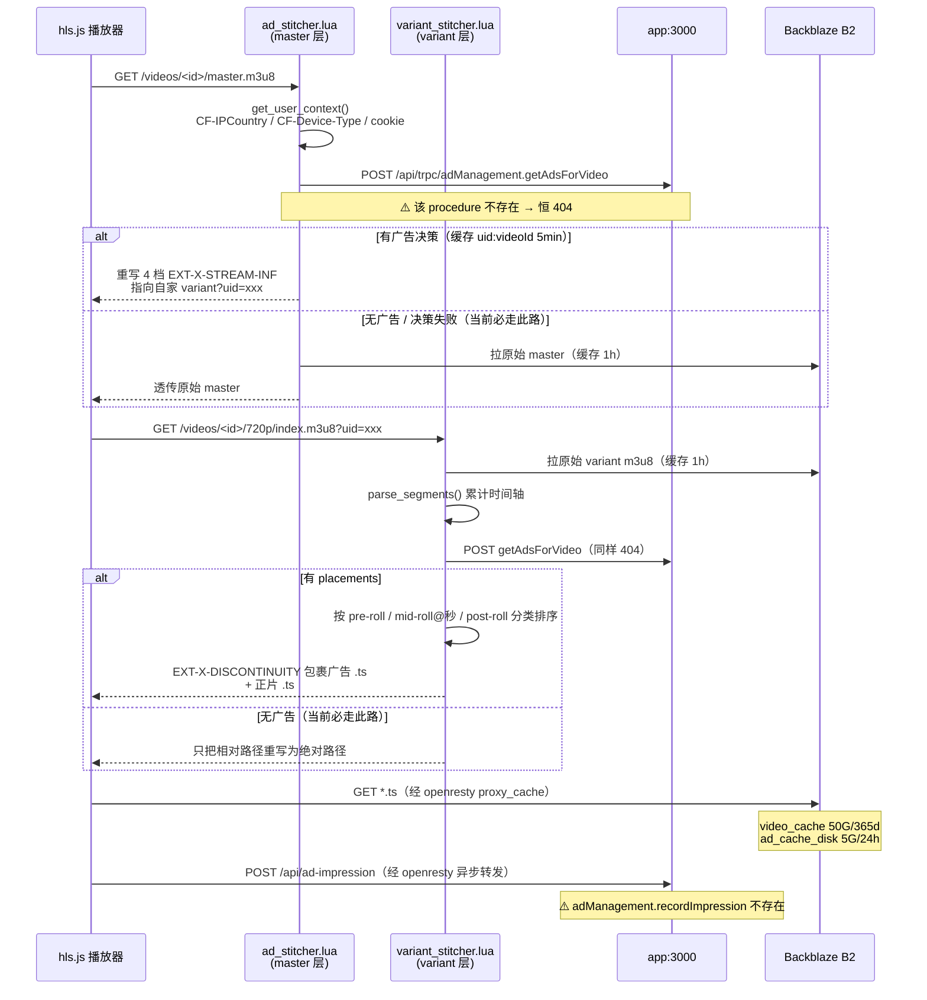
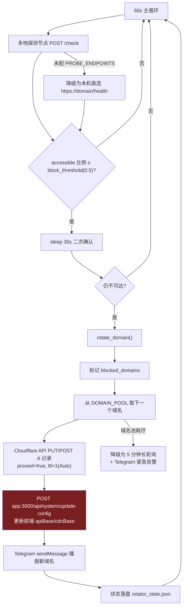

# OpenAdult 架构分析文档

> 面向刚接手本仓库的工程师。目标是让你读完这一份文档就能定位任何一段代码、理解它为什么长成这样、以及踩坑之前先知道坑在哪。
>
> 所有代码引用写成 `path/to/file.ts:123` 形式。行号取自本文撰写时的工作副本；`server/db.ts`、`server/routers.ts`、`drizzle/schema.ts` 近期有大量中文 JSDoc 注释被追加，行号可能有小幅漂移，以文件内符号名为准。

---

## 目录

1. [系统全景](#1-系统全景)
2. [技术栈与选型理由](#2-技术栈与选型理由)
3. [分层架构](#3-分层架构)
4. [后端详解：逐 router 的 procedure 清单](#4-后端详解逐-router-的-procedure-清单)
5. [前端详解](#5-前端详解)
6. [数据模型](#6-数据模型)
7. [认证与授权](#7-认证与授权)
8. [媒体流水线：上传 → 分片 → S3 → 转码 → HLS → 播放](#8-媒体流水线上传--分片--s3--转码--hls--播放)
9. [广告 SSAI：OpenResty Lua 拼接原理](#9-广告-ssaiopenresty-lua-拼接原理)
10. [反封锁体系：域名轮换 + JS 挑战](#10-反封锁体系域名轮换--js-挑战)
11. [关键设计决策与权衡](#11-关键设计决策与权衡)
12. [已知技术债与风险清单](#12-已知技术债与风险清单)
13. [附录：新人上手路线](#13-附录新人上手路线)

---

## 1. 系统全景

OpenAdult 是一个 TypeScript 全栈成人视频平台（约 27k 行），单体 Express 4 + tRPC 11 后端 + React 19 SPA 前端，数据落 MySQL/TiDB（Drizzle ORM），对象存储走 Manus Forge 存储代理（后端封装为「S3」语义，实际不是直连 S3），AI 能力（聊天 RAG 推荐、图像/人脸分析、上传元数据提取）统一经 Forge 网关调用 Heretic 模型。生产部署是坐在 Cloudflare 后面的自建源站：Nginx 做 SSL 终止 + Cloudflare IP 白名单 + 限流 + SPA 静态托管，只把 `/api/*` 反代给 Node 进程；另有三条旁路服务——OpenResty 作为独立 CDN 边缘节点在 m3u8 层做 SSAI 广告拼接、transcoder 用 inotify + FFmpeg 做多码率 AES-128 HLS 转码、domain-rotator 用 Python 探测域名可达性并经 Cloudflare API 自动换域名。

**必须先知道的三件事：**

1. **功能覆盖面很广，但成熟度极不均衡。** 广告管理、分片上传 V2、HLS 伪流、AI 聊天已可用；而「女优人脸相似度检索」——项目的核心卖点——目前没有任何真实的向量匹配路径（见 §12）。
2. **存在 V1/V2 双版本路由并存**（videos / actresses / videoUpload 各一对），权限模型、ID 获取方式、分页方式各不相同。改代码前先确认前端调的是哪一版。
3. **认证有两套并行且未完全打通的体系**（OAuth JWT 与管理面板密码会话），这是当前最大的架构断裂点，详见 §7。

### 1.1 生产架构图



### 1.2 请求路由表（Nginx 层）

| 路径 | 去向 | 定义位置 |
|---|---|---|
| `/` 及一切非 `/api` 路径 | Nginx 直出 `dist/public/` 静态文件（SPA fallback `index.html`） | `deploy/nginx/openadult-main.conf:66` |
| `/api/trpc/*` | Express → `appRouter`（约 70 个 procedure） | `server/_core/index.ts:149` |
| `/api/hls/*` | Express 原生路由（manifest / segment / ad-segment / key） | `server/_core/index.ts:134`、`server/_core/hlsRoutes.ts` |
| `/manus-storage/*` | Express 存储代理（视频 Range 透传，其余 307 到签名 URL） | `server/_core/storageProxy.ts:99` |
| `/api/video-stream/:videoId` | multi-chunk 视频流式重组 | `server/_core/videoStream.ts:109` |
| `/api/upload/chunk`、`/api/upload/status/:sessionId` | 二进制快传（绕过 tRPC，multer 内存存储） | `server/_core/fastUpload.ts:157`、`:282` |
| `/api/oauth/callback` | OAuth 回调，签发会话 Cookie | `server/_core/oauth.ts:74` |
| `/health` | Docker healthcheck 探针 | `server/_core/index.ts:140` |

### 1.3 Docker 服务清单

| 服务 | 端口 | 资源上限 | 用途 | 实际状态 |
|---|---|---|---|---|
| `migrate` | — | — | 一次性跑 `drizzle-kit migrate` 后退出，app 依赖其 `service_completed_successfully` | 可用（已在原生 MariaDB 上实测） |
| `app` | 3000/3001 → 3000 | 2G / 2 CPU | Node.js API + 兜底静态 | 可用 |
| `nginx` | 80/443 | — | 反向代理 + SSL + SPA | 可用（healthcheck 用 curl，镜像无 curl → 永久 unhealthy） |
| `openresty` | 8080 → 443 | 4G / 4 CPU | CDN + SSAI 拼接 | **配置挂载点错位 + 缺 lua-resty-http，实际不生效** |
| `transcoder` | — | 8G / 8 CPU | FFmpeg HLS 转码 | **watch 目录无生产者，不会被触发** |
| `domain-rotator` | — | — | 域名轮换 | 部分可用（DNS 换成功，前端配置回写端点不存在） |
| `redis` | 6379 | 256MB | 缓存 | **应用零引用，纯空转** |
| `prometheus` | 9090 | — | 指标采集 | **5 个 target 全部 down** |
| `grafana` | 3100 → 3000 | — | 监控面板 | 起得来但无数据、无 provisioning |

编排定义：`deploy/docker/docker-compose.yml:13`（migrate）到 `:207`（volumes）。

---

## 2. 技术栈与选型理由

| 层 | 选型 | 版本 | 为什么这么选 | 代价 |
|---|---|---|---|---|
| 语言 | TypeScript (ESM) | 5.x, `"type": "module"` | 前后端同一套类型；`AppRouter` 类型从服务端直接流向客户端 | 后端 esbuild 打包需 `--packages=external`，某些 CJS 依赖需 patch |
| 前端框架 | React 19 | `^19.2.1` | 生态最大；shadcn/ui 直接可用 | 并发渲染下 `useMemo` 内的副作用会重复执行（本仓库有多处踩中，见 §12） |
| 路由 | wouter | `3.7.1` + 本地 patch | 体积仅约 2KB，API 极简，无需 Router 上下文样板 | 无嵌套路由、无 loader、无内建 code-splitting；`patches/wouter@3.7.1.patch` 是必须维护的负担 |
| 样式 | Tailwind CSS 4 | — | 与 shadcn/ui 深度绑定；`@theme inline` + oklch 变量做双主题 | 业务页大量硬编码 `slate-900/purple-600`，主题变量形同虚设 |
| 组件库 | shadcn/ui | 53 个组件 | 源码进仓库、可任意改，无运行时依赖锁定 | 组件更新要手动 diff；`client/src/components/ui/` 不应改动 |
| 数据获取 | TanStack Query 5 + tRPC React Query | `^5.90.2` / `^11.6.0` | 缓存/失效/重试全托管；与 tRPC 类型推导天然集成 | 缓存失效边界需自己把握（本仓库多处只 `refetch()` 未 `invalidate()`） |
| API 协议 | tRPC 11 + superjson + zod | — | 无需写 OpenAPI/codegen，改后端 procedure 名前端立刻编译报错；`Date`/`BigInt` 经 superjson 自动穿透 | 非 TS 客户端无法调用；批量请求（`?batch=1`）让单请求体积上限成为约束，故大文件上传必须绕开 |
| 后端框架 | Express 4 | `^4.21.2` | 需要在 tRPC 之外挂载 5 组原生路由（存储代理 / 视频流 / 快传 / HLS / OAuth） | Express 4 无内建异步错误捕获；本仓库也没注册错误中间件（见 §12） |
| ORM | Drizzle ORM | `^0.44.5` | SQL-first、零运行时开销、类型从 schema 推导；`drizzle-kit` 生成迁移 | 关系式 API 需要 `relations.ts`，本仓库该文件是空的 → 所有关联查询手写 JOIN |
| 数据库 | MySQL / TiDB | mysql2 `^3.15.0` | TiDB 水平扩展；MySQL 兼容协议便于本地用 MariaDB 替代 | 全库 **零二级索引**（见 §6.3） |
| 对象存储 | Manus Forge 存储代理 | HTTP API | S3 凭据不出后端；换 CDN/换桶不改库（DB 只存 `/manus-storage/<key>` 相对路径） | 每次访问多一跳；视频要服务端 Range 透传，吃源站带宽 |
| 认证 | Manus OAuth + jose HS256 JWT Cookie | `jose@6.1.0` | 复用平台身份体系，不自建密码库 | 管理面板另起了一套 bcrypt 密码认证，两套并行（见 §7） |
| 视频播放 | hls.js | `^1.6.16` | 唯一成熟的浏览器端 HLS MSE 实现；Safari 走原生 | 播放器控制条完全自研（`VideoPlayer.tsx` 约 1100 行） |
| LLM | Forge 网关 → Heretic 模型 | — | 平台内置额度，无需自管 API Key | 无超时控制、无重试；`invokeLLM` 硬编码 `max_tokens=32768` |
| 转码 | FFmpeg (libx264) | ubuntu:22.04 容器 | 4 档码率并行 + `-hls_key_info_file` AES-128 | 8C/8G 是全栈最重的资源占用 |
| CDN 边缘 | OpenResty + Lua | `1.25.3.1-alpine` | 在 m3u8 层拼广告，客户端无法按域名/请求特征拦截 | 需要 `lua-resty-http`（官方镜像未内置） |
| 部署 | Docker Compose | v2（无 `version` 键） | 单机一键起 9 个服务 | 生产栈从未做过运行时验证（`DEPLOY_FIXES.md:4`） |

**被声明但实际未使用的依赖**（package.json 里有，代码里零引用）：

- `@aws-sdk/client-s3` / `@aws-sdk/s3-request-presigner` —— 实际存储走 Forge HTTP 代理，配置 `S3_BUCKET/AWS_ACCESS_KEY_ID` 等变量**不会有任何效果**。
- `@tensorflow/tfjs` 全家桶 —— 人脸识别最终改用 LLM 视觉，tfjs 从未 import，但仍进首包。
- `redis` / `ioredis` —— 根本没装，但 docker-compose 起了 redis 容器。

---

## 3. 分层架构

```
┌────────────────────────────────────────────────────────────────┐
│ 表现层  client/src/pages/*.tsx  +  components/*.tsx             │
│   · wouter 路由 · shadcn/ui · Tailwind · ErrorBoundary          │
│   · 状态：TanStack Query 缓存 + 2 个 Context + 组件局部 state    │
└──────────────────────────┬─────────────────────────────────────┘
                           │ trpc.*.useQuery / useMutation
                           │ （唯二例外：POST /api/upload/chunk、HLS/存储直链）
┌──────────────────────────▼─────────────────────────────────────┐
│ API 层  server/routers.ts + server/routers/*.ts                 │
│   · 13 个子路由模块 + 9 个内联路由，约 70 个 procedure           │
│   · zod 输入校验 · superjson 序列化                             │
│   · 权限：publicProcedure / protectedProcedure / adminProcedure  │
└──────────────────────────┬─────────────────────────────────────┘
                           │
┌──────────────────────────▼─────────────────────────────────────┐
│ 业务层（未独立成层，散落在 router handler 内）                    │
│   · server/llm-prompts.ts   —— prompt 模板 + RAG 上下文拼装      │
│   · server/db.ts 中的 calculateRecommendationScore /             │
│     analyzeUserPreferences —— 推荐打分与偏好聚合                  │
│   · server/routers/hls-stream.ts 的 buildManifest —— SSAI 拼接    │
└──────────────────────────┬─────────────────────────────────────┘
                           │
┌──────────────────────────▼─────────────────────────────────────┐
│ 数据访问层  server/db.ts（约 25 个查询助手）                     │
│   · getDb() 惰性单例，无 DATABASE_URL 时返回 null（降级）        │
│   ⚠ 约定「DB 操作集中在 db.ts」并未落实：13 个文件直接写 Drizzle │
└──────────────────────────┬─────────────────────────────────────┘
                           │
┌──────────────────────────▼─────────────────────────────────────┐
│ 基础设施层  server/_core/  （框架核心，谨慎修改）                │
│   index.ts / trpc.ts / context.ts / sdk.ts / oauth.ts /          │
│   cookies.ts / env.ts / llm.ts / storageProxy.ts /               │
│   videoStream.ts / fastUpload.ts / hlsRoutes.ts /                │
│   faceRecognition.ts / videoThumbnail.ts / vite.ts               │
└────────────────────────────────────────────────────────────────┘
```

### 3.1 各层的实际约定与偏离

| 层 | CLAUDE.md 的约定 | 实际情况 |
|---|---|---|
| API 层 | 所有业务 API 走 tRPC | 基本成立。例外：OAuth 回调、HLS 路由、存储代理、快传、`/health` |
| 数据访问层 | 「数据库操作集中在 db.ts，不要在路由文件中直接写 SQL」 | **未落实**。`server/db.ts` 只覆盖 users / chat / favorites / resumePlayback / preferences / recommendations / searchHistory；videos / actresses / ads / upload 等全部由路由自己写 Drizzle 查询 |
| 基础设施层 | 「不要修改 `server/_core/`」 | 成立，但该目录下有 5 个模块（`heartbeat.ts`、`dataApi.ts`、`map.ts`、`imageGeneration.ts`、`voiceTranscription.ts`）是 Manus 脚手架残留，**全仓库零引用** |
| 表现层 | 「前端不要直接调用 fetch/axios」 | 基本成立，唯一例外是 `client/src/components/VideoUploadForm.tsx` 的二进制分片 `fetch`（刻意为之） |

### 3.2 `server/_core/` 模块索引

| 文件 | 职责 | 关键导出 |
|---|---|---|
| `index.ts` | 服务器入口：创建 Express、50mb body 解析、按序注册 6 组路由、挂 tRPC、Vite/静态 | `findAvailablePort`（`:91`） |
| `trpc.ts` | tRPC 初始化 + 三级权限中间件，superjson transformer | `router`、`publicProcedure`(`:58`)、`protectedProcedure`(`:91`)、`adminProcedure`(`:106`) |
| `context.ts` | 每请求构造 `{req, res, user}`；认证失败静默降级 `user=null` | `createContext`(`:61`)、`TrpcContext`(`:42`) |
| `sdk.ts` | Manus OAuth SDK + 会话 JWT 签发/校验；用户不存在时回源补建 | `sdk`、`SDKServer`、`SessionPayload` |
| `oauth.ts` | 注册 `GET /api/oauth/callback` | `registerOAuthRoutes`(`:73`) |
| `cookies.ts` | Cookie 配置（`sameSite:'none'`，secure 由 `x-forwarded-proto` 推导） | — |
| `env.ts` | 环境变量集中读取，**无启动期校验**（`:34`~`:48`） | `ENV` |
| `llm.ts` | `invokeLLM()` 封装：归一化 messages，POST Forge `/v1/chat/completions` | `invokeLLM`、`InvokeParams` |
| `storageProxy.ts` | `GET /manus-storage/*`：视频 Range 透传，其余 307 | `registerStorageProxy`(`:98`) |
| `videoStream.ts` | multi-chunk 视频 Range 跨分片重组；视频缩略图代理 | `registerVideoStream`(`:90`) |
| `fastUpload.ts` | `POST /api/upload/chunk`（multer, 100MB/片）+ 状态查询 | `registerFastUpload`(`:133`) |
| `hlsRoutes.ts` | HLS 原生路由：key / segment / ad-segment / manifest；pseudo 与 real 双模式 | `default hlsRouter`(`:663`) |
| `faceRecognition.ts` | LLM 驱动的 14 维伪 embedding 提取 + 余弦相似度 | `extractFaceEmbedding`、`calculateCosineSimilarity`（**无调用点**） |
| `videoThumbnail.ts` | 占位缩略图生成；`extractVideoThumbnail` 是永远返回 null 的 stub | `generatePlaceholderThumbnail` |
| `systemRouter.ts` | 框架内置 `health`(`:42`) / `notifyOwner`(`:65`) | `systemRouter` |
| `vite.ts` | 开发模式 Vite 中间件 / 生产模式静态目录 | `setupVite`、`serveStatic` |

---

## 4. 后端详解：逐 router 的 procedure 清单

根路由注册在 `server/routers.ts:78`，聚合 13 个子模块（`:80`~`:92`）+ 9 个内联路由。



### 4.1 `auth` — 会话（内联，`server/routers.ts:99`）

| Procedure | 权限 | 输入 | 输出 | 副作用 |
|---|---|---|---|---|
| `me` (`:106`) | public | — | `User \| null` | 无（认证副作用发生在 `createContext` 里） |
| `logout` (`:118`) | public | — | `{success}` | 清除会话 Cookie |

### 4.2 `chat` — AI 聊天推荐（内联，`server/routers.ts:136`）

| Procedure | 权限 | 输入 | 输出 | 副作用 |
|---|---|---|---|---|
| `sendMessage` (`:149`) | protected | `{content: string.min(1)}` | `{message, videos[], actresses[]}` | 写 `chat_messages` ×2（user + assistant）、写 `search_history`、调用 LLM |
| `getHistory` (`:249`) | protected | `{limit=50}` | `ChatMessage[]`（已 `.reverse()` 成正序） | 无 |

`sendMessage` 是全站最复杂的 RAG 链路：先落库用户消息 → 并发跑 `analyzeUserPreferences` / `getRelevantVideosForChat` / `getRelevantActressesForChat` → `buildChatSystemPrompt` 把候选视频 ID 注入 system prompt（让模型只在真实库存内推荐）→ `invokeLLM` → 落库助手回复。

> ⚠️ **已知 bug**：`getChatHistory` 返回「最新在前」（`server/db.ts:317` 用 `desc(createdAt)`），但 `sendMessage` 里 `...history.map(...)` 未 reverse，**倒序历史被喂给模型**；且用户消息在取 history 之前就已落库，会重复出现两次。

### 4.3 `favorites` / `resumePlayback` / `searchHistory` / `userPreferences` / `language`（内联）

| Procedure | 位置 | 权限 | 输入 | 输出 | 副作用 |
|---|---|---|---|---|---|
| `favorites.add` | `:283` | protected | `{videoId}` | `{success}` | INSERT `favorites`（**无唯一约束，可重复插入**） |
| `favorites.remove` | `:298` | protected | `{videoId}` | `{success}` | DELETE by condition（会清掉全部重复行） |
| `favorites.list` | `:314` | protected | `{limit=50}` | `Video[]` | 无 |
| `resumePlayback.update` | `:340` | protected | `{videoId, position, duration}` | `{success}` | select-then-insert/update `resume_playback` |
| `resumePlayback.get` | `:358` | protected | `{videoId}` | 续播行 \| null | 无 |
| `searchHistory.list` | `:749` | protected | `{limit=20}` | 历史行[] | 无 |
| `searchHistory.save` | `:771` | protected | `{query, searchType, resultsCount=0}` | `{success}` | INSERT `search_history` |
| `searchHistory.delete` | `:796` | protected | `{historyId}` | `{success}` | 先 SELECT 校验归属再 DELETE（TOCTOU 窗口） |
| `searchHistory.clearAll` | `:832` | protected | — | `{success}` | DELETE by userId |
| `userPreferences.get` | `:707` | protected | — | 偏好行 \| null | 无 |
| `userPreferences.update` | `:722` | protected | `{preferredCategories?, preferredActresses?, avoidedCategories?}` | `{success}` | upsert `user_preferences`（**前端无任何 UI 调用**） |
| `language.set` | `:861` | protected | `{language: 'ja'\|'zh'\|'en'}` | `{success}` | **stub：不写库，直接 return** |

### 4.4 `recommendations` — AI 推荐（内联，`server/routers.ts:375`）

| Procedure | 权限 | 输入 | 输出 | 副作用 |
|---|---|---|---|---|
| `list` (`:383`) | protected | `{limit=20}` | 推荐行[]（JOIN videos） | 无 |
| `generate` (`:411`) | protected | — | `{success, message, count}` | 调 LLM（仅取文案）、`clearUserRecommendations` 全删、最多 20 次单行 INSERT |

架构上采用「**LLM 生成文案 + 本地确定性打分**」的混合模式：排序完全由 `calculateRecommendationScore`（`server/db.ts:783`，加权公式：关键词 0.3 / 分类 0.2 / 女优 0.2 / 观看史 0.15 / 热度 0.15）决定，LLM 输出只作展示文案。好处是可解释、不随模型漂移；代价是每次生成都要付一次 LLM 费用和延迟只为一句话。

> ⚠️ 已知缺陷：候选集是 `select().from(videos).limit(100)` 无 ORDER BY（新视频永远进不了推荐池）；`actressMatch` 因子硬编码传 0（权重 0.2 白丢，得分上限只有 0.8）；`avoidedCategories` 的 `-0.5` 惩罚被 `Math.max(categoryMatch, 0)` 夹回 0（**排斥分类完全无效**）；`clearUserRecommendations` 与批量 INSERT 之间无事务。

### 4.5 `actresses` — 公开女优查询（内联，`server/routers.ts:594`）

| Procedure | 权限 | 输入 | 输出 | 副作用 |
|---|---|---|---|---|
| `getProfile` (`:601`) | public | `{actressId}` | 女优行 + 视频数 | 无 |
| `search` (`:624`) | public | `{query: string.min(1)}` | 女优[]（含实时 COUNT 的 videoCount） | 无 |

> ⚠️ `search` 拉整张 `actresses` 表进 Node 内存再 JS filter，**无 LIMIT 且是 publicProcedure** —— 廉价的 DoS 面。

### 4.6 `videos` (V1) — `server/routers/videos.ts`

| Procedure | 位置 | 权限 | 输入 | 输出 | 副作用 |
|---|---|---|---|---|---|
| `list` | `:74` | public | `{page=1, limit=12, sortBy?, category?, actressName?, minRating?}` | `{videos[], pagination}` | 无 |
| `getById` | `:274` | public | `{videoId}` | 视频行 + actresses[] | 无 |
| `getCategories` | `:336` | public | — | `string[]` | 无 |
| `create` | `:375` | protected + 内联 role 校验 | `{title, description?, videoUrl, thumbnailUrl?, category?, duration?, tags?, actressIds?}` | `{success, videoId}` | INSERT `videos` + 批量 INSERT `video_actresses` |
| `update` | `:469` | protected + 内联 role 校验 | `{videoId, title?, description?, category?, tags?, actressIds?}` | `{success}` | UPDATE + 先删后插关联 |
| `delete` | `:552` | protected + 内联 role 校验 | `{videoId}` | `{success}` | DELETE videos + video_actresses（**不删 S3 对象**） |
| `getActresses` | `:606` | public | — | 全表 actresses（**无裁剪、无分页**） | 无 |

**V1 的特征**：读接口全 public（首页/列表页对匿名访客可用）；写接口用 `protectedProcedure` + handler 内手写 `ctx.user?.role !== 'admin'`；`create` 正确使用了驱动返回的 `insertId`；分页是「拉全表 → JS slice」。

### 4.7 `videosV2` — `server/routers/videos-v2.ts`

| Procedure | 位置 | 权限 | 输入 | 输出 | 副作用 |
|---|---|---|---|---|---|
| `create` | `:71` | **admin** | `{title, description?, videoUrl, thumbnailUrl?, category?, duration?, tags?, actressIds?}` | `{success, videoId}` | INSERT + 关联；**按 title 倒序回查自增 ID** |
| `list` | `:161` | **protected** | `{limit, offset, category?, sortBy?}` | `Video[]`（每条附 actresses） | 无 |
| `getById` | `:248` | protected | `{id}` | 视频行 + actresses | 无 |
| `update` | `:306` | admin | `{id, ...可选字段, actressIds?}` | `{success}` | UPDATE + 先删后插关联 |
| `delete` | `:410` | admin | `{id}` | `{success}` | DELETE videos + video_actresses |
| `getCategories` | `:463` | protected | — | `string[]` | 无 |

**V1 vs V2 对照表**（改代码前必读）：

| 维度 | `videos` (V1) | `videosV2` |
|---|---|---|
| 读权限 | `publicProcedure` | `protectedProcedure` ← **匿名访客看到空首页** |
| 写权限 | `protectedProcedure` + 手写 role 判断 | `adminProcedure` 中间件 |
| 分页 | 拉全表 + JS slice（有准确 total） | SQL `LIMIT/OFFSET`（**不返回 total**） |
| 女优关联查询 | 一次 `inArray` 批量取回 + 内存分组 | **每条视频一次 JOIN（N+1）** |
| 新记录 ID | `(result as any).insertId` ✅ | 按 title 倒序回查 ❌（同名并发会拿错 ID） |
| 前端调用方 | `VideosPage.tsx`、`VideoDetailPage.tsx`、`VideoActressLinker.tsx` | `Home.tsx`、`VideosPageV2.tsx`、`SearchResultsPage.tsx`、`VideoManagementUI.tsx` |

### 4.8 `actressManagement` (V1) — `server/routers/actressManagement.ts`

| Procedure | 位置 | 权限 | 输入 | 输出 | 副作用 |
|---|---|---|---|---|---|
| `uploadActressFaceImage` | `:72` | **public** ⚠️ | `{actressId, imageUrl, actressName?}` | `{success, embeddingId, dimension}` | **调 LLM 视觉分析** + upsert `actress_face_embeddings` |
| `getActressesWithEmbeddings` | `:185` | protected | `{limit=50}` | 女优 + embedding 元数据 | 无 |
| `getActressById` | `:244` | protected | `{actressId}` | 女优行 | 无 |
| `deleteActressFaceEmbedding` | `:289` | protected + 手写 admin 校验 | `{embeddingId}` | `{success}` | DELETE |

> 🚨 **严重安全问题**：`uploadActressFaceImage` 声明为 `publicProcedure`，注释声称「由管理面板的 admin cookie 保护」，但 handler 内**没有任何校验**。任何匿名请求即可覆写任意女优的人脸底库并触发 LLM 计费调用。同文件的 `deleteActressFaceEmbedding` 却做了 admin 校验 —— 策略自相矛盾。

### 4.9 `actressManagementV2` — `server/routers/actress-management-v2.ts`

| Procedure | 位置 | 权限 | 输入 | 输出 | 副作用 |
|---|---|---|---|---|---|
| `create` | `:70` | admin | `{name, japaneseName?, chineseName?, bio?, profileImageUrl?, birthDate?, tags?}` | `{success, actressId}` | INSERT；**按 name 回查 ID** |
| `list` | `:142` | protected | `{limit=50, offset=0}` | `Actress[]` | 无（**无 ORDER BY → 分页不稳定**） |
| `getById` | `:182` | protected | `{id}` | 女优行 | 无 |
| `update` | `:220` | admin | `{id, ...可选字段}` | `{success}` | UPDATE（只传 id 时 `.set({})` 会抛「No values to set」） |
| `delete` | `:299` | admin | `{id}` | `{success}` | DELETE actresses + face_embeddings（catch 块为空，**静默吞异常**） |
| `searchByName` | `:374` | protected | `{query: string.min(1)}` | `Actress[]` | 无（拉全表 JS 过滤） |

### 4.10 `faceSearch` — 女优相似度检索（`server/routers/faceSearch.ts`）

| Procedure | 位置 | 权限 | 输入 | 输出 | 副作用 |
|---|---|---|---|---|---|
| `searchByImage` | `:76` | **public** | `{imageUrl, userId?, threshold=0.7}` | `{matches[], analysis}` | **两次 LLM 调用**（特征提取 + 候选排序）+ 写 `face_search_history` |
| `searchByName` | `:301` | **public** | `{actressName, userId?, limit=10}` | `{actresses[], videos[]}` | 写 `face_search_history` |
| `getHistory` | `:460` | **public** ⚠️ | `{userId, limit=20}` | 历史行[] | 无 |

> 🚨 **越权读取**：`getHistory` 是 public 且 `userId` 直接来自 input，**任何人可枚举读取他人的人脸搜索历史（含上传图片 URL）**。`searchByImage/searchByName` 的 `userId` 同样来自 input，可伪造他人身份写历史。
>
> 🚨 **核心功能未接线**：这三个 procedure **完全不读 `actress_face_embeddings` 表**。`searchByImage` 是把全表女优的文本资料序列化进 prompt，让 LLM 主观排序。`input.threshold` 声明后从未使用（实际下限是 prompt 里硬编码的 0.3）。

### 4.11 `search` — 以图搜片 / 人脸检索（`server/search.ts:406`）

| Procedure | 位置 | 权限 | 输入 | 输出 | 副作用 |
|---|---|---|---|---|---|
| `faceSearch` | `:64` | protected | `{imageUrl: url, threshold=0.7}` | `{actresses[], videos[], message}` | 调 LLM（**结果被丢弃**）+ 写 `search_history` |
| `imageSearch` | `:269` | protected | `{imageUrl: url}` | `{videos[], tags[]}` | 调 LLM 打标签 + 写 `search_history` |

> 🚨 `search.faceSearch` 的相似度是 `server/search.ts:165` 的 `Math.random() * 0.5 + 0.5` —— **纯随机数**。上方 LLM 提取的面部特征完全未被使用。同一张图每次搜索返回的结果都不同。
>
> ⚠️ **命名歧义**：`search.faceSearch` 与根路由的 `faceSearch` 命名空间功能重叠但实现质量差异极大（一个是随机数，一个至少走了 LLM），前端两个入口分别调用了不同的那个（`FaceSearchPage.tsx` 调 `faceSearch.searchByImage`，`ChatPage.tsx` 调 `search.faceSearch`），且阈值一个传 0.3 一个传 0.7。

### 4.12 `videoUploadV2` — 分片上传（`server/routers/video-upload-v2.ts`）

| Procedure | 位置 | 权限 | 输入 | 输出 | 副作用 |
|---|---|---|---|---|---|
| `initSession` | `:95` | protected + role=admin | `{fileName, fileSize: bigint, totalChunks, thumbnailData?, duration?, ...metadata}` | `{sessionId}` | INSERT `video_upload_sessions`（`expiresAt = +24h`） |
| `uploadChunk` | `:208` | protected | `{sessionId, chunkIndex, chunkData: base64}` | `{success, uploadedChunks}` | storagePut 分片 + INSERT chunk 行 + 读-改-写 `uploadedChunkIds` |
| `completeUpload` | `:332` | protected | `{sessionId}` | `{success, videoId, videoUrl}` | 回拉全部分片 → `Buffer.concat` → storagePut 成品 → INSERT `videos` → status=completed |
| `getProgress` | `:636` | protected | `{sessionId}` | `{status, progress, uploadedChunkIndices}` | 无 |
| `cancelUpload` | `:718` | protected | `{sessionId}` | `{success}` | DELETE 会话+分片行（**不删 S3 对象**） |
| `getMissingChunks` | `:781` | protected | `{sessionId}` | `number[]` | 无 |

> ⚠️ 注意：`uploadChunk`（base64 走 tRPC）**不是前端实际使用的通道**。前端 `VideoUploadForm.tsx` 走的是 `POST /api/upload/chunk` 二进制端点（`server/_core/fastUpload.ts:157`）。两条通道维护的状态字段不同：fastUpload 只更新 `uploadedChunks` 与 `video_upload_chunks` 表，从不写 `uploadedChunkIds` —— 因此 `getMissingChunks` 在生产路径下**会把所有分片都报成缺失**，断点续传实际失效。

### 4.13 `videoUpload` (V1) — `server/routers/video-upload.ts`

| Procedure | 位置 | 权限 | 说明 |
|---|---|---|---|
| `initSession` | `:114` | protected | 会话存进程内 `Map`（含全部分片 Buffer） |
| `uploadChunk` | `:194` | protected | 分片常驻内存 |
| `completeUpload` | `:266` | protected | 合并上传；**忽略 thumbnailData 与 duration**（硬编码 duration=0） |
| `cancelUpload` | `:445` | protected | 清 Map |
| `getProgress` | `:481` | protected | 读 Map |

**遗留代码**：会话重启即丢、不支持多实例、超过 1 小时的上传会被清理任务中途干掉、`videoUrl` 存的是绝对 S3 URL（绕过存储代理）。**前端已无任何调用点**，可考虑下线。

### 4.14 `adminAuth` — 管理面板密码认证（`server/routers/admin-auth.ts`）

| Procedure | 位置 | 权限 | 输入 | 输出 | 副作用 |
|---|---|---|---|---|---|
| `me` | `:193` | public | — | `{isAdmin, username?}` | 无 |
| `login` | `:224` | public | `{username, password}` | `{success, username}` | `ensureAdminCredentials()`（**运行时 CREATE TABLE + 种子 admin/admin**）→ bcrypt 校验 → 签发 30 天 `admin_session_id` JWT |
| `logout` | `:277` | public | — | `{success}` | 清 Cookie（**无服务端吊销**） |
| `changeCredentials` | `:309` | public | `{currentPassword, newUsername?, newPassword: min(6)}` | `{success}` | UPDATE 凭据 + 换发 token |

> 🚨 **三个高危问题**：(1) 全部 SQL 走 `sql.raw` 字符串拼接，只做了 `.replace(/'/g, "''")` —— MySQL 默认模式下反斜杠仍是转义字符，可用 `\'` 突破；(2) 默认凭据硬编码 `admin/admin` 且在首次 login 时自动种下；(3) 无登录失败限流。

### 4.15 `adManagement` — 广告管理（`server/routers/ad-management.ts`）

全部 11 个 procedure 都声明为 `publicProcedure`，靠每个 handler 首行手工调 `verifyAdminFromCtx(ctx)` 校验 `admin_session_id` Cookie。这是为了绕开 `adminProcedure` 绑定的 OAuth role 语义。

| Procedure | 位置 | 输入 | 输出 | 副作用 |
|---|---|---|---|---|
| `listAds` | `:117` | — | `Ad[]`（无分页） | 无 |
| `createAd` | `:152` | `{name, type, videoUrl, thumbnailUrl?, clickUrl?, duration, priority=0}` | `{success, id}` | INSERT `ads` |
| `updateAd` | `:199` | `{id, ...可选字段, isActive?}` | `{success}` | UPDATE |
| `deleteAd` | `:251` | `{id}` | `{success}` | 先 DELETE placements 再 DELETE ads（**无事务**） |
| `listPlacements` | `:280` | `{videoId?}?` | `AdPlacement[]` + JOIN ads | 无（`.orderBy()` 后再链 `.where()` + `as any`） |
| `createPlacement` | `:331` | `{videoId: nullable, adId, position, insertAtSeconds?, midRollInterval?}` | `{success, id}` | INSERT |
| `deletePlacement` | `:371` | `{id}` | `{success}` | DELETE |
| `updatePlacement` | `:399` | `{id, position?, insertAtSeconds?, midRollInterval?, videoId?}` | `{success}` | UPDATE |
| `togglePlacement` | `:447` | `{id, isActive}` | `{success}` | UPDATE |
| `getAnalytics` | `:478` | — | 汇总（曝光/点击/CTR/完播率） | 无（读的是 `ads` 上的聚合计数器，**不读 `ad_impressions` 明细**） |
| `listVideos` | `:514` | — | 视频下拉列表（无分页） | 无 |

> ⚠️ 鉴权靠「每个 handler 记得写两行」，新增 procedure 忘写即完全公开。应抽成 tRPC middleware。
>
> ⚠️ **OpenResty Lua 调用的 `adManagement.getAdsForVideo` 与 `adManagement.recordImpression` 这两个 procedure 根本不存在**（见 §9）。

### 4.16 `hlsStream` — HLS 清单与广告（`server/routers/hls-stream.ts`）

| Procedure | 位置 | 权限 | 输入 | 输出 | 副作用 |
|---|---|---|---|---|---|
| `getManifest` | `:316` | public | `{videoId, baseUrl?}` | `{type:'hls', manifest}` \| `{type:'direct', videoUrl}` | 无 |
| `trackAdEvent` | `:403` | **public** ⚠️ | `{adId, videoId?, event: 7 值枚举}` | `{success}` | INSERT `ad_impressions` + `UPDATE ads SET impressions/clicks/completions = +1` |
| `getAdInfo` | `:473` | public | `{adId}` | 广告行 | 无 |
| `getVideoAds` | `:520` | public | `{videoId, videoDuration?}` | `{ads: [{adId, position, triggerAt, ...}]}` | 无 |

> 🚨 `trackAdEvent` 无鉴权、无限流、无幂等校验，直接自增 `ads` 计数器 —— **广告计费口径可被任意伪造**，`getAnalytics` 的数据不可作为对外结算依据。
>
> ⚠️ `ads.priority` 字段存在，`getAdsForVideo` 内部注释写「Sort by priority」，但代码只有 `slice(0, 1)` —— **后台配置的优先级完全无效**。
>
> ⚠️ `getManifest` 与 `getVideoAds` 各自复刻了一遍 pre/mid/post-roll 展开逻辑，但只有前者做了「每坑位最多 1 条」的截断，两者行为不一致。

### 4.17 `fileUpload` — 通用文件上传 + LLM 分析（`server/file-upload.ts`）

| Procedure | 位置 | 权限 | 输入 | 输出 | 副作用 |
|---|---|---|---|---|---|
| `uploadFile` | `:72` | protected | `{filename, mimeType, fileData: base64, fileType: 'image'\|'video'\|'audio'}` | `{success, url, fileKey}` | storagePut → `uploads/{userId}/{ts}-{filename}` + INSERT `user_uploads` |
| `analyzeImage` | `:158` | protected | `{imageUrl, prompt?}` | LLM 分析文本 | 调 LLM |
| `analyzeVideo` | `:227` | protected | `{videoUrl, prompt?, frameCount=3}` | LLM 分析文本 | 调 LLM（`frameCount` **未使用**，无抽帧） |
| `analyzePDF` | `:303` | protected | `{pdfUrl, prompt?}` | LLM 分析文本 | 调 LLM |
| `getUploadHistory` | `:367` | protected | `{limit=20, offset=0}` | `{uploads[], total}` | 无（`total` 返回的是**当前页条数**；排序默认 ASC → 最旧在前） |
| `deleteUpload` | `:420` | protected | `{uploadId}` | `{success}` | 只删 DB 行，**不删 S3 对象** |

> ⚠️ 三个 `analyze*` 直接把客户端传入的任意 URL 交给 LLM 网关拉取，**无域名白名单** → SSRF / LLM 额度盗刷面。
>
> ⚠️ `uploadFile` 的 S3 key 直接插值未清洗的 `input.filename`，含 `../` 可跳出目录；且**无文件大小上限**，`fileType` 允许 `video`。

### 4.18 `system` — 框架内置（`server/_core/systemRouter.ts`）

| Procedure | 位置 | 权限 | 说明 |
|---|---|---|---|
| `health` | `:42` | public | 健康探针 |
| `notifyOwner` | `:65` | admin | 向所有者发通知 |

---

## 5. 前端详解

### 5.1 路由表（`client/src/App.tsx:70`~`:79`）

| 路径 | 组件 | 文件 | 认证要求 |
|---|---|---|---|
| `/` | `Home` | `client/src/pages/Home.tsx` | 无（但内容依赖 `videosV2.list` 的 protected 权限 → 匿名看到空首页） |
| `/chat` | `ChatPage` | `client/src/pages/ChatPage.tsx` | 需登录 |
| `/dashboard` | `Dashboard` | `client/src/pages/Dashboard.tsx` | 需登录（**首帧崩溃，见下**） |
| `/face-search` | `FaceSearchPage` | `client/src/pages/FaceSearchPage.tsx` | 无（faceSearch 全 public） |
| `/actress-management` | `ActressManagementPage` | `client/src/pages/ActressManagementPage.tsx` | admin 密码会话（**客户端门禁**） |
| `/videos` | `VideosPage` | `client/src/pages/VideosPage.tsx` | 无（videos V1 public） |
| `/video/:id` | `VideoDetailPage` | `client/src/pages/VideoDetailPage.tsx` | 无 |
| `/search` | `SearchResultsPage` | `client/src/pages/SearchResultsPage.tsx` | 部分需登录 |
| `/admin-login` | `AdminLoginPage` | `client/src/pages/AdminLoginPage.tsx` | 无 |
| `/404` + fallback | `NotFound` | `client/src/pages/NotFound.tsx` | 无 |

**未注册路由的页面**：`client/src/pages/VideosPageV2.tsx`（仅作为管理后台 gallery 面板被内嵌）、`client/src/pages/ComponentShowcase.tsx`（1437 行，线上不可达但仍进首包）。

### 5.2 Provider 层级（`client/src/App.tsx`）

```
ErrorBoundary
 └ LanguageProvider          ← ⚠️ 首帧不提供 Context（isLoaded 分支）
    └ ThemeProvider defaultTheme="dark"   ← 未传 switchable → toggleTheme 恒为 undefined
       └ TooltipProvider
          └ Router (wouter Switch)
          └ Toaster (sonner)
```

> 🚨 **确定性 bug**：`client/src/contexts/LanguageContext.tsx` 在 `isLoaded === false` 时 `return <>{children}</>`，即**不挂载 Provider**；而 `isLoaded` 只在 `useEffect` 里置 true（effect 在首次 commit 之后才跑）。`Dashboard.tsx` 在渲染期调用 `useLanguage()` 会命中 throw → 被 ErrorBoundary 兜住 → **访问 `/dashboard` 首帧即报错页**。

### 5.3 状态管理

| 类别 | 载体 | 说明 |
|---|---|---|
| 服务端状态 | TanStack Query（经 tRPC hooks） | 全部数据获取；缓存 key 是 `[procedure, input]` |
| 认证状态 | `client/src/_core/hooks/useAuth.ts` | 封装 `auth.me` + `logout`；返回 `{user, loading, isAuthenticated, refresh, logout}` |
| 管理员状态 | `trpc.adminAuth.me` 直接查询 | 不走 useAuth，独立命名空间 |
| 全局 UI 状态 | 2 个 Context：`LanguageContext` / `ThemeContext` | 都基本闲置（见下） |
| 页面局部状态 | `useState` | 筛选/分页/表单，**均未同步到 URL** → 刷新即丢 |
| 未登录重定向 | `client/src/main.tsx` QueryCache/MutationCache 订阅 | 统一在缓存层拦截 `UNAUTHED_ERR_MSG` 并跳 OAuth |

**未登录拦截的实现要点**（`client/src/main.tsx:66`）：

```ts
const isUnauthorized = error.message === UNAUTHED_ERR_MSG;
```

用的是**错误文案的字符串全等比较**（常量来自 `shared/const.ts`，前后端共享），而不是 `error.data?.code === 'UNAUTHORIZED'`。文案一改或被 i18n 翻译，登录跳转就静默失效且无编译期报错。

**tRPC 客户端配置**（`client/src/main.tsx:109`）：`httpBatchLink` → `/api/trpc`，`transformer: superjson`（与 `server/_core/trpc.ts` 一致），自定义 fetch 注入 `credentials: "include"` 让浏览器带上 HttpOnly 会话 Cookie。

### 5.4 Context 现状

| Context | 文件 | 实际状态 |
|---|---|---|
| `LanguageContext` | `client/src/contexts/LanguageContext.tsx` | Provider 可用，但**只有 `Dashboard.tsx` 一处消费**；`client/src/locales/translations.ts` 的 `getTranslation` 全项目零引用；`LanguageSwitcher.tsx` 未被任何页面挂载 → **界面永远是硬编码日语** |
| `ThemeContext` | `client/src/contexts/ThemeContext.tsx` | `App.tsx` 未传 `switchable` → `toggleTheme` 恒为 `undefined`；业务页大量硬编码 `slate-900/purple-600` 而非语义色 token → 即使打开开关也不会跟随 CSS 变量 |

### 5.5 关键组件职责

| 组件 | 行数量级 | 职责 | 消费的 tRPC |
|---|---|---|---|
| `VideoPlayer.tsx` | ~1100 | 自研 HLS 播放器：hls.js 内核 + 自定义控制条 + 画质切换 + 续播 + 两套广告 | `hlsStream.getManifest` / `getVideoAds` / `trackAdEvent`、`resumePlayback.get/update` |
| `VideoUploadForm.tsx` | ~750 | 浏览器端 canvas 抽帧 + 50MB×4 并发分片 + 3 次重试 | `videoUploadV2.initSession` / `completeUpload` + 裸 `POST /api/upload/chunk` |
| `AdManagementUI.tsx` | ~850 | 广告后台三个 Tab：素材 CRUD / 投放位 / 分析 | `adManagement.*` 全部 11 个 |
| `ActressManagementUI.tsx` | ~450 | 女优 CRUD + 保存后自动注册人脸特征 | `actressManagementV2.*` + `fileUpload.uploadFile` + `actressManagement.uploadActressFaceImage` |
| `VideoManagementUI.tsx` | ~350 | 视频元数据 CRUD + 女优多选 | `videosV2.create/update/delete/list` + `actressManagementV2.list` |
| `VideoCard.tsx` | ~200 | IntersectionObserver 懒加载封面 + hover 400ms 播 10s 静音预览 | 无 |
| `FileUploadBox.tsx` | ~250 | 通用小文件上传（base64）+ 图片自动 LLM 分析 | `fileUpload.uploadFile` / `analyzeImage` |
| `DashboardLayout.tsx` | ~200 | shadcn Sidebar + 可拖拽宽度（localStorage 持久化） | 无（menuItems 仍是脚手架占位数据 `/some-path`） |
| `AdminCredentialsForm.tsx` | ~120 | 管理员账号密码修改 | `adminAuth.changeCredentials` |
| `ErrorBoundary.tsx` | ~60 | 类组件错误边界（**生产环境直接渲染完整 error.stack**） | 无 |

**死代码组件**（约 2000+ 行，无任何生产引用）：`AIChatBox.tsx`（仅被未注册的 showcase 引用）、`VideoActressLinker.tsx`、`Map.tsx`、`ManusDialog.tsx`、`LanguageSwitcher.tsx`、`DashboardLayoutSkeleton.tsx`（部分）、`hooks/useComposition.ts`。

### 5.6 视频 URL 归一化

`client/src/lib/videoUrl.ts` 是所有播放地址的必经之路，负责把三种历史格式收敛到相对路径：

| 输入格式 | `resolveVideoUrl` 输出 | `resolvePreviewUrl` 输出 | 来源 |
|---|---|---|---|
| `multi-chunk:<sessionId>` | `/api/video-stream/:videoId` | `/api/video-thumbnail/:videoId` | 历史遗留（**当前无写入方**） |
| `https://forge.manus.ai/...` 绝对 URL | `/manus-storage/<key>` | 同左 | videoUpload V1 |
| `/manus-storage/<key>` | 原样 | 原样 | videoUploadV2 ✅ |

这样做的目的是配合**域名轮换**：DB 里永远不存绝对域名，换域名不需要迁移数据。

### 5.7 HLS 播放器与广告叠加时序

播放器实现了**两套互斥的广告机制**，靠 `getManifest` 返回的判别联合 `type` 字段分流（`client/src/components/VideoPlayer.tsx:207`）：



**这张图上的三个坑：**

1. **HLS 参数类型错配**（确定性缺陷）：`VideoPlayer.tsx:207` 取 `hlsData.manifest` 当作 URL，`:228` 直接 `hls.loadSource(manifestUrl)`；但 `server/routers/hls-stream.ts:316` 的 `getManifest` 返回的是 **m3u8 文本内容**。正确端点是 `server/_core/hlsRoutes.ts` 里的 `GET /api/hls/manifest/:videoId.m3u8`。
2. **覆盖层广告近乎不可达**：服务端只要 `video.duration > 0` 就返回 `type:'hls'`，而 direct 覆盖层广告（唯一带完整埋点的那套）只在 `duration === 0` 时才走。
3. **mid-roll 触发窗口写死为 5 秒**：用户拖拽跨过该窗口即整条广告被跳过；`shownAdIds` 只存组件内存，刷新即重放。

### 5.8 上传时序



---

## 6. 数据模型

Drizzle schema 定义在 `drizzle/schema.ts`，共 **18 张表**（注：CLAUDE.md 正文写「15 张表」是过时的，其表格里实际列了 18 行）。另有一张 `admin_credentials` 表**不在 schema 内**，由 `server/routers/admin-auth.ts` 运行时 `CREATE TABLE IF NOT EXISTS` 自建。

### 6.1 ER 图

```mermaid
erDiagram
    users ||--o{ chat_messages : "userId"
    users ||--o{ search_history : "userId"
    users ||--o{ favorites : "userId"
    users ||--o{ resume_playback : "userId"
    users ||--|| user_preferences : "userId (UNIQUE)"
    users ||--o{ recommendations : "userId"
    users ||--o{ user_uploads : "userId"
    users ||--o{ face_search_history : "userId"
    users ||--o{ video_upload_sessions : "userId"
    users ||--o{ ad_impressions : "userId (nullable)"

    videos ||--o{ video_actresses : "videoId"
    videos ||--o{ favorites : "videoId"
    videos ||--o{ resume_playback : "videoId"
    videos ||--o{ recommendations : "videoId"
    videos ||--o{ ad_placements : "videoId (nullable=全局)"
    videos ||--o{ ad_impressions : "videoId (nullable)"

    actresses ||--o{ video_actresses : "actressId"
    actresses ||--o{ actress_face_embeddings : "actressId"
    actresses ||--o{ face_search_history : "topMatchActressId"

    video_upload_sessions ||--o{ video_upload_chunks : "sessionId (唯一物理 FK, CASCADE)"

    ads ||--o{ ad_placements : "adId"
    ads ||--o{ ad_impressions : "adId"

    users {
        int id PK
        varchar64 openId UK
        text name
        varchar320 email
        varchar64 loginMethod
        enum role "user|admin"
        enum language "ja|zh|en"
        timestamp lastSignedIn
    }
    videos {
        int id PK
        varchar255 title
        int duration "秒"
        varchar512 thumbnailUrl
        varchar512 videoUrl "3 种格式并存"
        varchar100 category
        json tags
        int views "只读不写"
        decimal rating "读出是 string"
    }
    actresses {
        int id PK
        varchar255 name
        varchar255 japaneseName
        varchar255 chineseName
        varchar512 profileImageUrl
        text faceEmbedding "死列"
        json tags
        int videoCount "只读不写"
    }
    video_actresses {
        int id PK
        int videoId
        int actressId
    }
    actress_face_embeddings {
        int id PK
        int actressId
        varchar512 faceImageUrl
        text embedding "JSON 数组"
        int embeddingDimension "默认128, 实际14"
    }
    video_upload_sessions {
        varchar255 id PK
        int userId
        bigint fileSize
        int totalChunks
        int uploadedChunks
        text uploadedChunkIds
        enum status "uploading|processing|completed|failed"
        mediumtext metadata
        timestamp expiresAt "从不读取"
    }
    video_upload_chunks {
        int id PK
        varchar255 sessionId FK
        int chunkIndex
        int chunkSize
        varchar512 storageKey
        varchar64 checksum
    }
    ads {
        int id PK
        varchar255 name
        enum type "pre|mid|post-roll"
        varchar512 videoUrl
        int duration
        int priority "排序未实现"
        boolean isActive
        int impressions
        int clicks
        int completions
    }
    ad_placements {
        int id PK
        int videoId "null=全局"
        int adId
        enum position
        int insertAtSeconds
        int midRollInterval
        boolean isActive
    }
    ad_impressions {
        int id PK
        int adId
        int videoId
        int userId
        enum event "7 值(VAST 四分位)"
    }
```



### 6.2 逐表字段说明

#### `users` — `drizzle/schema.ts:94`

| 字段 | 类型 | 约束 | 说明 |
|---|---|---|---|
| `id` | int | PK, AI | |
| `openId` | varchar(64) | NOT NULL, **UNIQUE** | Manus OAuth 的用户唯一标识；`upsertUser` 靠它做 `ON DUPLICATE KEY UPDATE` |
| `name` | text | | 展示名，可为空 → **会触发 session 校验死循环，见 §12** |
| `email` | varchar(320) | | |
| `loginMethod` | varchar(64) | | OAuth 提供方 |
| `role` | enum('user','admin') | NOT NULL, default 'user' | `openId === OWNER_OPEN_ID` 时自动置 admin（`server/db.ts` upsertUser 内） |
| `language` | enum('ja','zh','en') | NOT NULL, default 'ja' | 被 chat 读取选提示词；**`language.set` 是 stub，从不更新** |
| `createdAt` / `updatedAt` | timestamp | | `updatedAt` 有 `onUpdateNow()` |
| `lastSignedIn` | timestamp | default now | **无 `onUpdateNow()`**，靠 `sdk.authenticateRequest` 每请求显式写一次（写热点） |

#### `videos` — `drizzle/schema.ts:134`

| 字段 | 类型 | 说明 |
|---|---|---|
| `id` | int PK AI | |
| `title` | varchar(255) NOT NULL | |
| `description` | text | |
| `duration` | int | **秒**为单位；`<= 0` 时 `getManifest` 降级为直连 MP4 |
| `releaseDate` | timestamp | |
| `thumbnailUrl` / `videoUrl` | varchar(512) | `videoUrl` 有三种格式：`/manus-storage/<key>`（V2）、绝对 Forge URL（V1）、`multi-chunk:<sessionId>`（历史） |
| `category` | varchar(100) | 单值分类，与 `tags` 是两套维度 |
| `tags` | json `string[]` | MySQL 层无法索引数组元素 |
| `views` | int default 0 | **只读不写**：6+ 处 `orderBy(desc(views))`，但全仓库无自增语句 → 「热门排序」等价于按 id 排序 |
| `rating` | decimal(3,2) default '0' | 读出是 **string**（如 `"8.50"`），比较前需 `parseFloat` |

#### `actresses` — `drizzle/schema.ts:172`

| 字段 | 类型 | 说明 |
|---|---|---|
| `name` / `japaneseName` / `chineseName` | varchar(255) | 同一人的三种写法；只有 `name` 必填。**`faceSearch.searchByName` 的过滤匹配三个字段但打分只看前两个** |
| `bio` | text | 会被完整序列化进 LLM prompt |
| `profileImageUrl` | varchar(512) | |
| `faceEmbedding` | text | **死列**：被 `actress_face_embeddings` 表取代，全仓库唯一提及是 `server/search.ts` 的一句注释 |
| `tags` | json `string[]` | |
| `videoCount` | int default 0 | **只读不写**（仅种子 SQL 写过）；`actresses.search` 已改用实时 `COUNT(*)` 绕开 |

#### `video_actresses` — `drizzle/schema.ts:207`

| 字段 | 类型 | 说明 |
|---|---|---|
| `videoId` / `actressId` | int NOT NULL | 裸 int，无 FK、**无 `(videoId, actressId)` 唯一索引** → 重复关联会让 JOIN 出现重复视频 |

更新语义是「先全删该 videoId 的关联行、再批量插入」，因此本表 id 不连续。

#### `chat_messages` — `drizzle/schema.ts:236`

| 字段 | 类型 | 说明 |
|---|---|---|
| `role` | enum('user','assistant') | **没有 `system`** —— system prompt 由 `server/llm-prompts.ts` 即时拼接，不入库 |
| `content` | text | 上限约 64KB，超长回复有截断风险 |

无「会话」维度分组列 → 同一用户的所有对话是一条时间线，无法支持多个独立会话。

#### `search_history` — `drizzle/schema.ts:265`

| 字段 | 类型 | 说明 |
|---|---|---|
| `query` | text NOT NULL | 人脸/图像搜索存的是 JSON 字符串（如 `{"imageUrl":"..."}`）；`Home.tsx` 的历史列表靠 `startsWith('{')` 过滤 |
| `searchType` | enum('text','face','image') | |
| `resultsCount` | int default 0 | 前端跳转前写入时恒传 0 → 同一次搜索可能落两条记录，其中一条无意义 |

既是历史记录，也是 `analyzeUserPreferences` 的偏好来源。

#### `favorites` — `drizzle/schema.ts:289`

`userId` / `videoId` 裸 int。**缺 `(userId, videoId)` UNIQUE** → 重复点击/前端重试会插重复行，`getUserFavorites` 返回重复视频、`analyzeUserPreferences` 的女优权重被虚高。

#### `resume_playback` — `drizzle/schema.ts:316`

| 字段 | 说明 |
|---|---|
| `position` / `duration` | 秒 |
| `lastWatchedAt` | 有 `onUpdateNow()` |

同时兼作观看历史来源（`getUserWatchHistory`）。**缺 `(userId, videoId)` UNIQUE**，靠 select-then-insert，并发下产生重复行。

#### `user_preferences` — `drizzle/schema.ts:346`

| 字段 | 说明 |
|---|---|
| `userId` | **UNIQUE**（全库仅两个唯一约束之一） |
| `preferredCategories` / `preferredActresses` / `avoidedCategories` | json 数组 |

读写函数与 tRPC procedure 都齐全，被 `recommendations.generate` 消费；但 **前端没有任何设置界面** → 该表实际永远为空 → 推荐里的 `categoryMatch` 恒为 0。

#### `recommendations` — `drizzle/schema.ts:374`

| 字段 | 说明 |
|---|---|
| `reason` | LLM 生成的推荐理由文案 |
| `score` | decimal(5,2)，由 `calculateRecommendationScore` 算出 |

写入前先 `clearUserRecommendations` 全删再逐条 INSERT（最多 20 次单行插入，**无事务**）。

#### `user_uploads` — `drizzle/schema.ts:404`

| 字段 | 说明 |
|---|---|
| `uploadType` | enum('image','video')。0002 迁移删掉了 0001 的 `fileType`（含 'audio'）；`file-upload.ts` 把 audio 强行映射成 video |
| `fileUrl` / `s3Key` / `s3Url` | **三个地址列职责重叠** |
| `metadata` | text 存 JSON 字符串 |
| `expiresAt` | **从不写入也无清理任务** |

#### `actress_face_embeddings` — `drizzle/schema.ts:467`

| 字段 | 说明 |
|---|---|
| `actressId` | 无索引、**无 UNIQUE** → 应用层用 select-then-update 模拟 upsert，并发会插重复行 |
| `embedding` | text 存 JSON 数组 |
| `embeddingDimension` | default **128**，而 `faceRecognition.ts` 实际产出 **14 维** → 该列既不写也不读，是错误的元数据 |

**只写不读**：写入齐全（`actressManagement.uploadActressFaceImage`），但检索链路（`faceSearch.ts`、`search.ts`）从不读取。

#### `face_search_history` — `drizzle/schema.ts:497`

| 字段 | 说明 |
|---|---|
| `uploadedImageUrl` | **schema 漂移点**：`schema.ts:500` 已改为可空，但 0002 迁移 SQL 与 0003 快照仍是 `NOT NULL`，且**没有 0004 迁移** → `searchByName` 插入 null 会被 MySQL 拒绝（包在 try/catch 里只 warn，历史静默丢失） |
| `matchedActressIds` | text 存 JSON 数组 |
| `similarityScore` | decimal(5,4) |

#### `video_upload_sessions` — `drizzle/schema.ts:549`

| 字段 | 说明 |
|---|---|
| `id` | varchar(255) PK，应用生成 `${userId}-${ts}-${Math.random().toString(36).substr(2,9)}` |
| `fileSize` | bigint `mode:"bigint"` → 读出是 JS BigInt，与 number 做算术会抛 TypeError；靠 superjson 才能穿过 tRPC |
| `uploadedChunkIds` | text 存 JSON 数组；**只有 tRPC 通道写、fastUpload 通道不写** |
| `status` | enum，`'failed'` 值在整个代码库中**从未被写入** |
| `metadata` | mediumtext（0003 从 text 扩容，用于装 base64 缩略图） |
| `expiresAt` | 初始化时设 +24h，**全项目无任何读取方** |

#### `video_upload_chunks` — `drizzle/schema.ts:589`

| 字段 | 说明 |
|---|---|
| `sessionId` | **全库唯一的物理外键**，`REFERENCES video_upload_sessions(id) ON DELETE CASCADE` |
| `chunkIndex` / `chunkSize` / `storageKey` / `checksum` | 缺 `(sessionId, chunkIndex)` UNIQUE → `fastUpload.ts` 的 `.onDuplicateKeyUpdate()` **永远不会触发**（只有 id 一个键），重试会插重复行并灌水 `COUNT(*)` |

#### `ads` / `ad_placements` / `ad_impressions` — `drizzle/schema.ts:627` / `:667` / `:701`

| 表 | 关键点 |
|---|---|
| `ads` | `priority` 排序未实现；`impressions/clicks/completions` 是聚合计数器，用 `sql\`impressions + 1\`` 原子自增 |
| `ad_placements` | `videoId` 可空（NULL = 全站生效）；`insertAtSeconds` 与 `midRollInterval` 是两种互斥的 mid-roll 表达方式，schema 层无约束 |
| `ad_impressions` | 7 值 VAST 四分位枚举；**只写不读** —— `getAnalytics` 读的是 `ads` 上的计数器。高写入量 + 无索引 → 长期膨胀 |

#### `admin_credentials` — **不在 schema 内**

由 `server/routers/admin-auth.ts` 的 `ensureAdminCredentials()` 在每次 login 时用 `db.execute(sql.raw("CREATE TABLE IF NOT EXISTS admin_credentials ..."))` 运行时创建，并在表为空时种子 `admin/admin`（bcrypt）。`drizzle-kit generate` 永远看不到它。

### 6.3 索引现状（重点）

```
全库 18 张表，除 PRIMARY KEY 外只有：
  · users.openId                UNIQUE
  · user_preferences.userId     UNIQUE
  · video_upload_chunks.sessionId  FK 自动索引
没有任何 index() / uniqueIndex() 调用。
```

后果（可在 `drizzle/meta/0003_snapshot.json` 验证 `indexes` 全为空）：

| 高频过滤列 | 影响的查询 |
|---|---|
| `chat_messages.userId` | 每次进 `/chat` 都全表扫 |
| `search_history.userId` | 首页搜索历史 + 每轮聊天的偏好分析 |
| `favorites.userId` | Dashboard 收藏列表 |
| `resume_playback.userId/videoId` | 每次播放的续播读写 |
| `video_actresses.videoId/actressId` | 所有列表页的女优 JOIN |
| `videos.category/views/createdAt` | 首页六个分类流 + 全部排序 |
| `ad_placements.videoId` | 每次生成 manifest |
| `ad_impressions.adId` | 高写入埋点表 |

### 6.4 迁移体系

| 迁移 | 内容 |
|---|---|
| `0000_orange_toro` | 建 `users` |
| `0001_perfect_demogoblin` | 建 videos / actresses / video_actresses / chat_messages / search_history / favorites / resume_playback / user_preferences / recommendations / user_uploads；给 users 加 `language` |
| `0002_public_vector` | 建 actress_face_embeddings / face_search_history / video_upload_sessions / video_upload_chunks(+FK)；重构 user_uploads（删 `fileType`，加 `uploadType/fileUrl/metadata`，s3Key/s3Url 改可空） |
| `0003_right_shriek` | 建 ads / ad_placements / ad_impressions；`video_upload_sessions.metadata` 扩为 mediumtext |

账本在 `drizzle/meta/_journal.json`。**孤儿文件**：`drizzle/0000_yielding_pete_wisdom.sql` 与 `0000_orange_toro.sql` 内容完全相同但未被 journal 引用，手工执行会重复建表。

配置：`drizzle.config.ts`（无 `DATABASE_URL` 直接 throw），`pnpm db:push` = `drizzle-kit generate && drizzle-kit migrate`。

### 6.5 对象存储

**不是直连 S3。** `server/storage.ts` 走 Manus Forge HTTP 代理：

| 函数 | 实现 |
|---|---|
| `storagePut(key, buffer, contentType)` | `POST {FORGE_API_URL}/v1/storage/upload?path=<key>` + multipart FormData + `Authorization: Bearer <FORGE_API_KEY>` → `{key, url}` |
| `storageGet(key)` | `GET {FORGE_API_URL}/v1/storage/downloadUrl?path=<key>` → 短期签名 URL |

**Key 命名规范（隐性契约，不能随意改）**：

| 用途 | Key 模板 | 写入方 |
|---|---|---|
| 分片 | `videos/{userId}/{sessionId}/chunk-{i}` | `fastUpload.ts`、`video-upload-v2.ts` |
| 成品视频（V2） | `videos/{userId}/{sessionId}.{ext}` | `video-upload-v2.ts` |
| 成品视频（V1） | `videos/{userId}/{ts}-{fileName}` | `video-upload.ts` |
| 缩略图 | `thumbnails/{userId}/{ts}-thumb.jpg` | `video-upload-v2.ts` |
| 通用上传 | `uploads/{userId}/{ts}-{filename}` | `file-upload.ts` |
| 图像生成 | `generated/{ts}.png` | `_core/imageGeneration.ts`（无调用点） |

`server/_core/storageProxy.ts` 在 key 无扩展名时靠 `videos/` / `chunk-` / `thumbnails/` 前缀反推 MIME —— **改前缀会破坏 Content-Type 推断**。

---

## 7. 认证与授权

### 7.1 OAuth 登录时序



### 7.2 三级权限模型（`server/_core/trpc.ts`）

| Procedure 类型 | 定义 | 语义 | 失败时 |
|---|---|---|---|
| `publicProcedure` | `:58` | 无需登录 | — |
| `protectedProcedure` | `:91` | `t.procedure.use(requireUser)`，`ctx.user` 必定存在 | `TRPCError UNAUTHORIZED` (401)，message = `UNAUTHED_ERR_MSG` |
| `adminProcedure` | `:106` | 要求 `ctx.user.role === 'admin'` | `TRPCError FORBIDDEN` (403)，message 含错误码 10002 |

> ⚠️ `adminProcedure` 未复用 `requireUser` 而是自行判空 → **未登录用户拿到 403 而非 401**，前端无法区分「应引导登录」与「已登录但无权限」。

`createContext`（`server/_core/context.ts:61`）在 `authenticateRequest` 抛异常时**无条件吞掉并降级为匿名，且不记日志** —— 数据库不可用、OAuth 超时、正常未登录三种情况在调用方看来完全一致。

### 7.3 管理员双认证（架构断裂点）

系统里同时跑着**两套互不认识的认证**：

| | OAuth 会话 | 管理面板会话 |
|---|---|---|
| Cookie 名 | 会话 Cookie（见 `_core/cookies.ts`） | `admin_session_id` |
| 签名密钥 | `JWT_SECRET` | `JWT_SECRET + "_admin"` |
| 有效期 | 1 年 | 30 天 |
| 凭据来源 | Manus OAuth | `admin_credentials` 表（bcrypt，运行时自建，种子 admin/admin） |
| 被哪些 procedure 识别 | `publicProcedure` / `protectedProcedure` / `adminProcedure` | **只有** `adManagement.*` 与 `POST /api/upload/chunk` |
| 前端入口 | 页面各处的登录按钮 → `getLoginUrl()` | `/admin-login` → `adminAuth.login` |



**结论**：管理员必须**同时**以 `role='admin'` 的 OAuth 用户登录，管理面板的视频/女优管理与分片上传的 tRPC 部分才能工作。否则前端门禁通过（因为只查 `adminAuth.me`），但后端 procedure 全部 401/403。这是当前最需要修的架构问题——正确的方向是把 admin cookie 校验做成 tRPC middleware（如 `adminSessionProcedure`），让两套认证在中间件层合流。

### 7.4 权限矩阵速查

| 资源 | 匿名 | 登录用户 | OAuth admin | admin 密码会话 |
|---|---|---|---|---|
| `videos.list` / `getById` / `getCategories` | ✅ | ✅ | ✅ | ✅ |
| `videosV2.list` / `getById` | ❌ | ✅ | ✅ | ❌ |
| `videosV2.create/update/delete` | ❌ | ❌ | ✅ | ❌ |
| `actresses.getProfile` / `search` | ✅ | ✅ | ✅ | ✅ |
| `actressManagementV2.*` 读 | ❌ | ✅ | ✅ | ❌ |
| `actressManagementV2.*` 写 | ❌ | ❌ | ✅ | ❌ |
| `actressManagement.uploadActressFaceImage` | ✅ 🚨 | ✅ | ✅ | ✅ |
| `faceSearch.*`（含 getHistory） | ✅ 🚨 | ✅ | ✅ | ✅ |
| `search.faceSearch` / `imageSearch` | ❌ | ✅ | ✅ | ❌ |
| `chat` / `favorites` / `resumePlayback` / `recommendations` | ❌ | ✅ | ✅ | ❌ |
| `videoUploadV2.*` | ❌ | ❌ | ✅ | ❌ |
| `POST /api/upload/chunk` | ❌ | ❌ | ❌ | ✅ |
| `adManagement.*` | ❌ | ❌ | ❌ | ✅ |
| `hlsStream.*`（含 trackAdEvent） | ✅ 🚨 | ✅ | ✅ | ✅ |
| `GET /manus-storage/*` | ✅ 🚨 | ✅ | ✅ | ✅ |

---

## 8. 媒体流水线：上传 → 分片 → S3 → 转码 → HLS → 播放

### 8.1 端到端流程图



**虚线部分（转码流水线）目前是断的**：`transcoder` 监听 `upload-data` 卷的 `/data/uploads`，但该卷未挂给 `app` 服务，且 `server/storage.ts` 走 Forge HTTP 代理而非本地磁盘写盘 → `inotifywait` 永远等不到文件。

### 8.2 上传通道对比

| | tRPC 通道 `videoUploadV2.uploadChunk` | 二进制通道 `POST /api/upload/chunk` |
|---|---|---|
| 定义位置 | `server/routers/video-upload-v2.ts:208` | `server/_core/fastUpload.ts:157` |
| 数据编码 | base64（**+33% 体积膨胀**） | 原始二进制（multer FormData） |
| 鉴权 | OAuth `protectedProcedure` | `admin_session_id` Cookie |
| 单片上限 | 受 body parser 50mb 限制 | 100MB（multer） |
| 更新 `uploadedChunkIds` | ✅ 读-改-写（并发丢索引） | ❌ 不写 |
| 更新 `uploadedChunks` | ✅ 累加 | ✅ `COUNT(*)` 重算（更安全） |
| 分片行去重 | ❌ 无 `onDuplicateKeyUpdate` | ⚠️ 有但因缺唯一索引而不生效 |
| **前端实际使用** | ❌ | ✅ |

### 8.3 HLS 双模式（`server/_core/hlsRoutes.ts`）

| 模式 | 触发条件 | manifest 生成 | 片段来源 |
|---|---|---|---|
| `pseudo`（默认） | `HLS_MODE` 未设或 = "pseudo" | 每 6 秒一条 `#EXTINF`，指向 `/api/hls/segment/:id?start=..&dur=..` | **302 到完整 MP4** —— `/segment` 端点忽略 start/dur，也无 `#EXT-X-BYTERANGE`，每「取一个分片」都会拉整个文件 |
| `real` | `HLS_MODE=real` **且** `CDN_BASE_URL` 已配 | `:211` 生成多码率 master playlist；带 `?q=720p` 进 `generateVariantPlaylist` | CDN 预转码 `.ts`，路径 `{CDN}/videos/{storageKey \|\| videoId}/{q}/segNNNN.ts` |

> ⚠️ `real` 模式用 `(videoData as any).storageKey`，但 **`videos` 表没有 `storageKey` 列** → 永远退化成用数字 id 当目录名，很可能与 FFmpeg 产物路径对不上。

### 8.4 HLS 端点清单（`server/_core/hlsRoutes.ts`）

| 端点 | 说明 |
|---|---|
| `GET /api/hls/key/:videoId` | 发放 AES-128 密钥。Referer 白名单校验 —— **`ALLOWED_ORIGINS` 未配时 `[""].some(o => referer.includes(o))` 恒真，等于完全放行**；密钥缺失时返回 32 个 0 的假密钥 |
| `POST /api/hls/key/register` | 转码脚本注册密钥（`Bearer ADMIN_API_KEY`）。**密钥写进 `process.env[\`HLS_KEY_${videoId}\`]` 而非数据库** → 重启丢失、多实例不共享 |
| `GET /api/hls/segment/:videoId` | pseudo 模式 302 到 S3；real 模式指向 CDN |
| `GET /api/hls/ad-segment/:adId` | 广告片段 |
| `GET /api/hls/manifest/:videoId.m3u8` | 真正的 manifest URL 端点（**前端目前没用它**） |

### 8.5 multi-chunk 视频流式重组（`server/_core/videoStream.ts`）

对 `videoUrl` 以 `multi-chunk:<sessionId>` 开头的历史记录：

1. 从 `video_upload_chunks` 按 `chunkIndex` 排序、累加 `chunkSize` 算总长度；
2. 把 HTTP Range 请求映射到具体分片的字节区间；
3. 逐片带 Range 回源拼接输出（单次响应最大 5MB）。

内部自带 `getSignedUrl()` 直接打 Forge，**未复用 `server/storage.ts`**；每个分片单独调一次 presign 且串行无缓存 → 一次跨 5 分片的 Range = 5 次串行外部 RTT。

### 8.6 存储代理（`server/_core/storageProxy.ts:99`）

```
GET /manus-storage/<key>
  → 用 BUILT_IN_FORGE_API_KEY 向 Forge 换签名 URL
  → MIME 是 video/* ？
      是 → 服务端透传上游响应（保留 Range/Content-Range/Accept-Ranges，支持拖动）
      否 → 307 重定向到签名 URL
```

**取舍**：视频透传吃源站带宽但能防盗链；非视频重定向省带宽但会把 presigned URL 暴露在浏览器地址栏/Network 面板/Referer 里，用户可在签名有效期内直连 S3。

> 🚨 该端点**无任何鉴权与路径白名单**，`req.params[0]` 原样当存储键转发。任何人猜到 key（如 `videos/<userId>/<sessionId>/chunk-0`）即可读取任意对象。

---

## 9. 广告 SSAI：OpenResty Lua 拼接原理

### 9.1 为什么在 CDN 边缘做 SSAI

服务端广告插入（Server-Side Ad Insertion）把广告 `.ts` 片段直接拼进 m3u8 播放列表，用 `#EXT-X-DISCONTINUITY` 分隔。因为广告与正片用**完全相同的 FFmpeg 编码参数**（同分辨率/码率/采样率/GOP 策略，见 `deploy/ffmpeg/transcode_ad.sh` 与 `transcode_hls.sh`），且都从同一个 CDN 域名下发，客户端广告拦截器**无法按域名或请求特征过滤**。

### 9.2 两级拼接架构



### 9.3 分层职责与缓存策略

| 层 | 文件 | 职责 | 缓存 |
|---|---|---|---|
| master | `deploy/openresty/lua/ad_stitcher.lua` | 只做码率清单重写 + 把 `uid` 透传到 query string；**不含广告** | 禁缓存（个性化不污染 master 的 CDN 缓存） |
| variant | `deploy/openresty/lua/variant_stitcher.lua` | 真正的广告插入：`parse_segments` 算时间轴 → 按位置排序 → `#EXT-X-DISCONTINUITY` 包裹 | `m3u8_cache` 100m / 1h |
| 共享内存 | `deploy/openresty/openresty-cdn.conf` | `ad_cache` 50m（广告决策 5min + 原始 manifest 1h）、`m3u8_cache` 100m、`rate_limit` 10m | — |
| 磁盘 | 同上 | `proxy_cache_path` 视频 50G/30d、广告 5G/7d | — |

### 9.4 降级设计

Lua 层对广告服务不可用做了全链路降级：`fetch_ads` 超时/非 200 → 返回 nil → 直接透传 S3 原始 manifest；`get_ad_placements` 失败 → 返回 `{}` → 只重写相对路径。**播放不中断**。这也是为什么下面三处断链目前不会导致线上事故，只是广告完全不出。

### 9.5 SSAI 当前的三处断链（都需要修）

| # | 问题 | 证据 |
|---|---|---|
| 1 | **OpenResty 主配置挂载点错位** | `deploy/docker/docker-compose.yml:102` 挂到 `/etc/openresty/nginx.conf`，但 `deploy/openresty/openresty-cdn.conf:8` 的注释自己指明镜像加载的是 `/usr/local/openresty/nginx/conf/nginx.conf` → 容器以默认配置启动，所有 SSAI location 不存在 |
| 2 | **`lua-resty-http` 未安装** | 三处 `require "resty.http"`（两个 Lua + conf 内 `content_by_lua_block`），官方 `openresty/openresty:1.25.3.1-alpine` 不内置该 OPM 模块，compose 无 `opm get` 步骤 → Lua 在 require 阶段就 500 |
| 3 | **后端 API 契约不存在** | Lua 调 `adManagement.getAdsForVideo` 与 `adManagement.recordImpression`，`server/routers/ad-management.ts` 中**都没有**。语义最接近的是 `hlsStream.getVideoAds`（query 需 GET，入参是 number）与 `hlsStream.trackAdEvent`（mutation），签名不兼容 |

### 9.6 应用层的另一套 SSAI（可用）

与 OpenResty 那套并行，Express 层自己也实现了一份 SSAI：`server/routers/hls-stream.ts:316` 的 `getManifest` 会在 `buildManifest` 里插入 `#EXT-X-DISCONTINUITY` 生成含广告的 m3u8，片段 URL 指向 `/api/hls/segment/:videoId` 与 `/api/hls/ad-segment/:adId`。这条路径**不依赖 OpenResty**，是当前唯一能出广告的服务端路径（但受限于 §5.7 的前端 loadSource bug）。

---

## 10. 反封锁体系：域名轮换 + JS 挑战

### 10.1 域名轮换（`deploy/anti-block/domain_rotator.py`）



**设计要点：**

- **投票 + 二次确认**：用多地探测节点投票（阈值 0.5）+ 30 秒二次确认，避免瞬时抖动误触发换域名。
- **DNS 记录固定 `proxied=true` + `ttl=1`**：换域名后源站 IP 依然不暴露给公网。
- **状态持久化**：`rotator_state.json` 落在 `rotator-state` 命名卷，重启不丢已封域名记录。

**两处外部依赖不成立：**

| 问题 | 后果 |
|---|---|
| 默认探测节点是 `probe-jp/us/eu/sg.openadult.openadult.internal` 占位域名 | 未配 `PROBE_ENDPOINTS` 时 4 个探测点串行各超时 10s = 每轮 40s，多地区投票机制形同虚设，只靠单点自检兜底 |
| `POST http://app:3000/api/system/update-config` 端点不存在 | `server/_core/systemRouter.ts` 只有 `health`(`:42`) 与 `notifyOwner`(`:65`) 两个 tRPC procedure，`server/_core/index.ts` 也未注册任何 `/api/system` REST 路由 → **换域名后 Cloudflare DNS 和 Telegram 会更新，但前端 apiBase/cdnBase 不会跟着变** |

**与 Cookie 策略的冲突**：`server/_core/cookies.ts` 的 domain 提升到父域的逻辑被整段注释掉，Cookie 退化为 host-only → **每次轮换域名，全体用户登录态即丢失**。这与域名轮换的目标直接矛盾。

### 10.2 JS 挑战（`deploy/nginx/js-challenge.conf` + `deploy/anti-block/challenge.html`）

设计上的三层防护：

1. **已知 bot UA 直接 403**（curl / wget / python-requests / Go-http-client）；
2. **无 `js_verified` cookie 则 302 到 `/challenge`**（静态资源与 `/health` 白名单）；
3. **`challenge.html` 收集浏览器指纹**（UA/语言/核数/内存/时区/屏幕/Canvas/WebGL）+ **自实现 `simpleHash` 的 PoW（难度 3）** → 通过后写 24h 有效的 `js_verified` cookie → 跳回 `?return=`。

> 🚨 **实际未启用**：两个文件本身完整，compose 也挂载了（`deploy/docker/docker-compose.yml:82,84`），但 `deploy/nginx/openadult-main.conf` 全文**既无 `include .../js-challenge.conf` 也无 `location /challenge`**，`challenge.html` 挂到 `/var/www/challenge/index.html` 无任何 server 块引用。且一旦贸然启用，`js-challenge.conf` 会 302 到不存在的 `/challenge` → **重定向死循环**。

### 10.3 源站硬化

`deploy/nginx/openadult-main.conf:38` 的 443 server 块：

```
include cloudflare-ips.conf;   # 15 条 IPv4 + 7 条 IPv6 allow
deny all;                      # 其余全部拒绝
```

**这也是本地无法用生产 compose 浏览的根因**——必须走 `deploy/docker/docker-compose.local.yml`（HTTP-only，全量反代 `app:3000`）。

三档限流（`:8`~`:10`）：`api 30r/s` / `login 5r/m` / `upload 2r/s`。

> ⚠️ `cloudflare-ips.conf` 注释称每周 cron 更新，但**仓库内无该 cron 脚本** → CF 新增 IP 段后合法流量会被 `deny all` 拦掉。

---

## 11. 关键设计决策与权衡

| # | 决策 | 为什么这么选 | 代价 |
|---|---|---|---|
| 1 | **tRPC-first**：除 OAuth 回调、HLS、存储代理、快传、`/health` 外全部走 tRPC | `AppRouter` 类型单向流向前端，改后端 procedure 名前端立刻编译报错；无需 codegen | 非 TS 客户端无法调用；批量请求让单请求体积成为硬约束，大文件必须绕开（决策 12） |
| 2 | **三级权限中间件而非路由级守卫**（`server/_core/trpc.ts:58/91/106`） | 权限在 procedure 声明处表达，权限即类型 | 「用 public + handler 内手工校验」的绕过写法（`adManagement`、`actressManagement`）无法被类型系统约束，新增 procedure 忘写即公开 |
| 3 | **数据库「可缺席」设计**（`server/db.ts:71` 的 `getDb()` 返回 null） | 本地无库也能起服务，降低上手门槛 | 错误语义不统一（查询返空数组、写入抛错）；「DB 宕机」与「确实没数据」在调用方看来完全一致 → 线上表现为「页面空白但无错误日志」 |
| 4 | **所有者自动提权**（upsertUser 时 `openId === OWNER_OPEN_ID` 强制 `role='admin'`） | 免去手工改库 | 提权规则藏在数据层，审计时不易发现 |
| 5 | **管理面板独立密码认证** | 管理员不一定有 OAuth 账号；后台可脱离外部身份系统运行 | 两套认证未打通 → §7.3 的架构断裂；凭据表游离于 Drizzle 之外 → 无类型、被迫用 `sql.raw` → SQL 注入面 |
| 6 | **LLM 驱动的人脸识别替代 face-api.js** | Node 端无 DOM，face-api.js 不可用 | LLM 视觉输出 14 个 0-100 分再归一化成伪 embedding；这类向量任意两两余弦相似度通常已 >0.9，**默认阈值 0.7 几乎不过滤任何候选** → 检索会返回库里绝大部分人，只是排了个序 |
| 7 | **AI 推荐 = LLM 文案 + 本地确定性打分** | 排序可解释、不随模型漂移 | 每次生成都付一次 LLM 费用和延迟，只换来一句展示文案 |
| 8 | **聊天走 RAG**（先检索库内视频/女优注入 system prompt） | 让模型只在真实库存内推荐，避免编造不存在的片名 | 每轮对话前要串行发起 4~5 次 DB 查询且无缓存 → 多轮对话下压力与首字延迟明显放大 |
| 9 | **推荐「预计算 + 读缓存」**（generate 落库、list 只读） | 读路径不受 LLM 延迟影响 | `clearUserRecommendations` 与批量 INSERT 之间无事务 → 中途失败会把用户推荐清空 |
| 10 | **HLS 双模式**（pseudo / real） | 未接 CDN 时也能提供 HLS 语义的播放体验 | pseudo 模式的伪 HLS 实际不成立：`/segment` 忽略 start/dur、无 BYTERANGE → 每「取一个分片」都拉整个 MP4 |
| 11 | **SSAI 在 m3u8 层拼接，广告与正片同编码参数** | 客户端无法按域名/请求特征过滤广告 | 广告素材必须走与正片完全一致的转码流水线；改一处编码参数要同步两个脚本 |
| 12 | **上传刻意绕开 tRPC**（`/api/upload/chunk` 用 multer 收原始二进制） | 避免 base64 带来的 33% 体积膨胀 | 该端点需要自己实现鉴权 → 用了 admin cookie，与 tRPC 侧的 OAuth 权限体系分叉；两条通道维护的状态字段不同 → `getMissingChunks` 失效 |
| 13 | **分片会话落库而非放内存**（V2 对 V1 的核心改进） | 支持断点续传与多实例部署 | `completeUpload` 用 `COUNT(*)` 而非会话计数器规避竞态（作者已意识到），但 `uploadChunk` 的读-改-写没回补 |
| 14 | **视频对外一律用 `/manus-storage/<key>` 相对路径入库** | 签名 URL 由代理请求时现换，不会写死过期签名；换 CDN/域名不改库 | 每次访问多一跳；视频要服务端 Range 透传，吃源站带宽 |
| 15 | **缩略图在浏览器端 canvas 抽帧** | 服务端无需 ffmpeg 参与首屏图 | 设置了手动封面时会跳过抽帧 → `duration` 保持 0 → 该视频彻底失去 SSAI 能力 |
| 16 | **关系式 API 完全弃用**（`drizzle/relations.ts` 是空文件） | 手写 JOIN 更贴近 SQL、更可控 | 所有关联查询都要手写；`videosV2.list` 因此写成了 N+1 |
| 17 | **零索引 MVP 取舍** | 快速迭代，先跑通功能 | 数据量增长后所有列表页与 JOIN 线性劣化；这是**最高优先级的技术债** |
| 18 | **端口自动探测**（`server/_core/index.ts:91` 的 `findAvailablePort`） | 本地多实例开发方便 | 生产环境有害：3000 被占用时静默改听 3001，而 Docker 端口映射、Nginx upstream、Prometheus target 都是静态配置 → 容器起来了但外部完全不可达，healthcheck 失败后陷入重启循环 |
| 19 | **本地开发提供两条零交集路径** | Path A（`scripts/localdb.sh` + `dev-up.sh`）不依赖 Docker（下载便携 MariaDB 到 `$HOME`，免 root）；Path B（`docker-compose.local.yml`）不依赖宿主环境 | 两套要各自维护；Path B 从未做过运行时验证 |
| 20 | **前端页面全部静态 import**（`client/src/App.tsx:38`~`:46`） | 避免动态 import 在某些部署环境的 chunk 加载问题 | 无 code-splitting：`ComponentShowcase.tsx`（1437 行，线上不可达）、hls.js、recharts、@tensorflow/tfjs 全部进首包 |

---

## 12. 已知技术债与风险清单

按严重程度排序。每条给出可验证的代码位置。

### 12.1 🚨 P0 — 安全

| # | 问题 | 位置 | 影响 |
|---|---|---|---|
| S1 | **空 JWT_SECRET 等于完全绕过认证**：`ENV.cookieSecret` 缺失时降级为空字符串，`getSessionSecret()` 编码成零长度 HS256 密钥，jose 不拒绝 → 任何人可用公开可推导的空密钥伪造任意 openId 的 session | `server/_core/env.ts:36` | 完全绕过认证 |
| S2 | **SQL 注入面**：`admin-auth.ts` 全部用 `sql.raw` 字符串拼接，只做 `.replace(/'/g, "''")`（ANSI 风格），MySQL 默认模式下仍支持反斜杠转义，可用 `\'` 突破。`changeCredentials` 的 `newUsername` 完全由调用方控制 | `server/routers/admin-auth.ts:224`、`:309` | 管理面板数据库沦陷 |
| S3 | **默认凭据 admin/admin**：`ensureAdminCredentials()` 在表为空时自动种下，且该值在源码中公开可知 | `server/routers/admin-auth.ts:224` 调用链 | 生产未及时改密即公开后门 |
| S4 | **未鉴权的 LLM 写入**：`uploadActressFaceImage` 是 `publicProcedure`，注释声称受 admin cookie 保护但 handler 无任何校验 | `server/routers/actressManagement.ts:72` | 任意匿名请求可覆写女优人脸底库 + 刷 LLM 账单 |
| S5 | **越权读取他人检索历史**：`faceSearch.getHistory` 是 public 且 `userId` 来自 input | `server/routers/faceSearch.ts:460` | 可枚举读取任意用户的人脸搜索历史（含上传图片 URL） |
| S6 | **存储代理无鉴权**：`GET /manus-storage/*` 不做任何身份校验或路径白名单 | `server/_core/storageProxy.ts:99` | 知道 key 即可拉取任意对象，包括他人 uploads 与上传中的分片 |
| S7 | **HLS 密钥 Referer 白名单形同虚设**：`ALLOWED_ORIGINS` 未配时 `[""].some(o => referer.includes(o))` 恒为 true；`allowedOrigins.length > 0` 这个守卫本身永远为真 | `server/_core/hlsRoutes.ts` 内 `/key/:videoId` handler | 加密视频的 AES 密钥可被任意来源取走 |
| S8 | **fastUpload 密钥降级**：`ENV.cookieSecret` 缺失时回退到硬编码 `"fallback-secret"` | `server/_core/fastUpload.ts:133` 内 `verifyAdminSession` | 漏配 JWT_SECRET 时任何人可自签令牌获得完整上传权限 |
| S9 | **SSRF / LLM 额度盗刷**：`analyzeImage/analyzeVideo/analyzePDF` 把客户端传入的任意 URL 交给 LLM 网关拉取，入参只用 `z.string()` 无 `.url()` 无域名白名单 | `server/file-upload.ts:158`、`:227`、`:303` | 探测网关侧内网可达性 + 白嫖 LLM 额度 |
| S10 | **广告数据可任意伪造**：`trackAdEvent` 无鉴权、无限流、无幂等，直接自增 `ads` 计数器 | `server/routers/hls-stream.ts:403` | 广告计费口径不可信 |
| S11 | **路径遍历**：`uploadFile` 的 S3 key 直接插值未清洗的 `input.filename` | `server/file-upload.ts:72` | 含 `../` 可写到 `uploads/<id>/` 之外 |
| S12 | **生产环境暴露完整 error.stack** | `client/src/components/ErrorBoundary.tsx` | 泄露打包产物文件名与代码结构 |

### 12.2 🚨 P0 — 确定性 bug（会导致功能不可用）

| # | 问题 | 位置 | 表现 |
|---|---|---|---|
| B1 | **登录死循环**：`verifySession()` 要求 JWT payload 的 `name` 为非空字符串，但 `createSessionToken()` 用 `name: options.name \|\| ""` 签发 → OAuth 资料中 name 为空的用户**签出的 token 100% 无法通过自身校验**。同样地，`VITE_APP_ID` 未配置时 `appId` 为空串，会让**所有**用户校验失败 | `server/_core/sdk.ts` | 回调成功、cookie 已种、302 回首页，但每个后续请求都被判为匿名，重复登录永远无法解决 |
| B2 | **`/dashboard` 首帧崩溃**：`LanguageProvider` 在 `isLoaded=false` 时不挂载 Provider，而 `Dashboard.tsx` 在渲染期调用 `useLanguage()` | `client/src/contexts/LanguageContext.tsx` + `client/src/pages/Dashboard.tsx` | 访问 `/dashboard` 直接看到 ErrorBoundary 错误页 |
| B3 | **HLS 加载参数类型错配**：前端把 m3u8 **文本内容**当 URL 传给 `hls.loadSource` | `client/src/components/VideoPlayer.tsx:207`、`:228` vs `server/routers/hls-stream.ts:316` | hls.js 把整段清单文本当相对 URL 请求 → 必然 404；NETWORK_ERROR 分支还会 `startLoad()` 反复重试 |
| B4 | **人脸相似度是随机数**：`const score = Math.random() * 0.5 + 0.5`，上方 LLM 提取的特征被完全丢弃 | `server/search.ts:165` | 同一张图每次搜索结果都不同且与图片内容无关 |
| B5 | **`avoidedCategories` 完全无效**：`categoryMatch = -0.5` 被 `Math.max(categoryMatch, 0)` 夹回 0 | `server/routers.ts:411` 的 `generate` handler | 用户设置的「不想看的分类」毫无作用 |
| B6 | **跨用户数据污染**：`trackWatchBehavior` 用 JS 的 `&&` 连接两个 `eq()`，`&&` 返回右操作数 → userId 过滤被静默丢弃，UPDATE 会覆盖该 videoId 下**所有用户**的进度 | `server/db.ts:729` | 所幸该函数当前**无调用点** |
| B7 | **`update` 只改女优关联必定 500**：Drizzle 的 `mapUpdateSet()` 剔除 undefined 后若 entries 为空则抛 `"No values to set"` | `server/routers/videos.ts:469`、`videos-v2.ts:306`、`actress-management-v2.ts:220` | 女优关联根本没机会更新 |
| B8 | **`getMissingChunks` 恒报全部缺失**：判定依赖 `uploadedChunkIds`，但生产路径 `fastUpload` 从不写该列 | `server/routers/video-upload-v2.ts:781` vs `server/_core/fastUpload.ts:157` | 断点续传实际失效 |
| B9 | **损坏视频被当作上传成功**：`completeUpload` 中分片下载失败只 `console.error`，随后 `Buffer.concat` 照常执行 | `server/routers/video-upload-v2.ts:332` | 缺字节的视频被上传、写库、session 置 completed |
| B10 | **`searchVideos` 忽略 query 参数** | `server/db.ts:227` | 对任何关键词返回相同的前 N 条（当前无调用点） |
| B11 | **聊天上下文倒序 + 末条重复** | `server/routers.ts:149` | 模型看到逆序历史 + 重复提问，多轮连贯性退化 |
| B12 | **`buildDownloadUrl` 未检查 `response.ok`** | `server/storage.ts` | 4xx/5xx 时返回 `undefined` 一路传下去，或抛出与真实原因无关的 JSON 解析异常 |
| B13 | **`FilePickerButton` 的 children 被静默丢弃** | `client/src/components/FilePickerButton.tsx` | `ChatPage.tsx` 里传的 `<Sparkles/>` / `<Search/>` 图标永远不渲染 |
| B14 | **`FileUploadBox` 进度条永不动**：模拟进度的 `setInterval` 写在 `await` 之后，此时 `isUploading` 已被置 false | `client/src/components/FileUploadBox.tsx` | 大图上传时用户看不到任何进度；且 interval 可能对已卸载组件 setState |
| B15 | **续播 5 秒自动保存几乎不触发**：effect 依赖数组含 `currentTime`（每 250ms 更新）与 `updateResumeMutation`（每渲染新对象），interval 在到达 5000ms 前就被重建 | `client/src/components/VideoPlayer.tsx:447` | 只靠 onPause 与 beforeunload 保存，直接关标签页会丢进度 |
| B16 | **上传取消误伤**：单例 `abortControllerRef` 被多文件并发覆盖 | `client/src/components/VideoUploadForm.tsx` | 取消 A 实际中断 B |
| B17 | **`VideoActressLinker` 静默丢数据**：挂载时不加载已有关联，`selectedActresses` 从空数组开始，而 `videos.update` 是全量覆盖语义 | `client/src/components/VideoActressLinker.tsx` | 给已有 3 位女优的视频补加 1 人 → 原有 3 条被删（该组件当前无生产引用） |
| B18 | **`Map.tsx` 的 Promise 永久 pending**：脚本加载失败时只 `console.error`，既不 reject 也不 resolve | `client/src/components/Map.tsx` | 地图永久空白（该组件无引用） |
| B19 | **Range end 未 clamp**：客户端请求 `bytes=0-999999999` 时 `Content-Length` 与 `Content-Range` 都非法 | `server/_core/videoStream.ts:109` | 客户端因收到字节数少于声明而挂起 |
| B20 | **进度计算未防除零**：`totalChunks` 为 0 时 `Math.round((count/0)*100)` = NaN/Infinity | `server/_core/fastUpload.ts:157`、`:282` | JSON 序列化成 null，前端进度条崩坏 |
| B21 | **`invokeLLM` 忽略 maxTokens**：`InvokeParams` 声明了 `maxTokens`/`max_tokens` 但从未读取，`payload.max_tokens = 32768` 是无条件硬编码赋值 | `server/_core/llm.ts` | 任何传 maxTokens 限制输出长度的调用点静默失效 |
| B22 | **`HttpError.statusCode` 无人读取**：未注册 Express 错误中间件，tRPC errorFormatter 也不认识 HttpError | `shared/_core/errors.ts` + `server/_core/index.ts` | `sdk.ts` 抛的 `ForbiddenError(403)` 实际返回 500 |

### 12.3 ⚠️ P1 — 架构断裂与部署断链

| # | 问题 | 位置 |
|---|---|---|
| A1 | **管理面板认证断裂**：前端只做 admin 密码登录，但调用的 `videosV2.*` / `actressManagementV2.*` / `videoUploadV2.*` 全部依赖 OAuth 会话 | §7.3 |
| A2 | **首页对匿名用户不可用**：`videosV2.list` 是 protectedProcedure，`Home.tsx` 六个分类查询全部 `enabled: isAuthenticated` | `server/routers/videos-v2.ts:161` + `client/src/pages/Home.tsx` |
| A3 | **OpenResty 配置挂载点错位** → SSAI 完全不生效 | `deploy/docker/docker-compose.yml:102` |
| A4 | **`lua-resty-http` 未安装** → Lua 在 require 阶段 500 | `deploy/openresty/lua/*.lua` |
| A5 | **SSAI 后端 API 不存在**：`adManagement.getAdsForVideo` / `recordImpression` | `server/routers/ad-management.ts` |
| A6 | **转码流水线无生产者**：`upload-data` 卷未挂给 app，storage 走 Forge 代理而非本地磁盘 | `deploy/docker/docker-compose.yml:118` |
| A7 | **转码状态回调 `hlsStream.updateTranscodeStatus` 不存在** | `deploy/ffmpeg/transcode_watcher.sh` |
| A8 | **域名轮换配置回写端点 `/api/system/update-config` 不存在** | `deploy/anti-block/domain_rotator.py` |
| A9 | **监控栈 5 个 target 全部 down**：`/api/metrics` 未实现、exporter sidecar 未编排、`redis:6379` 不是 metrics 端口、node-exporter 服务不存在 | `deploy/monitoring/prometheus.yml` |
| A10 | **deploy.sh 与 compose 证书路径不一致**：脚本写宿主 `/etc/nginx/ssl`，compose 挂的是命名卷 `ssl-certs` | `deploy/scripts/deploy.sh` vs `deploy/docker/docker-compose.yml:85` |
| A11 | **JS Challenge 挂载了但从未 include**，启用会造成重定向死循环 | `deploy/nginx/openadult-main.conf` |
| A12 | **HLS 密钥只存 `process.env`**：重启丢失、多实例不共享、缺失时返回全零假密钥 | `server/_core/hlsRoutes.ts` |
| A13 | **Cookie domain 逻辑被注释掉** → 与域名轮换直接冲突，换域名即全体掉登录 | `server/_core/cookies.ts` |
| A14 | **`sameSite: 'none'` 硬编码** → 本地 HTTP 开发时浏览器直接丢弃 Cookie | `server/_core/cookies.ts` |
| A15 | **nginx healthcheck 用 curl** 而 `nginx:1.25-alpine` 无 curl → 永久 unhealthy | `deploy/docker/docker-compose.yml:90` |
| A16 | **生产静态资源依赖宿主 bind mount** + `.dockerignore` 排除 `dist` → 纯 `docker compose up` 得到空 web root | `deploy/docker/docker-compose.yml:86` |
| A17 | **`VITE_ANALYTICS_*` 未设置产出坏 HTML**：`%VITE_ANALYTICS_ENDPOINT%` 占位符不被替换 → 浏览器请求 `/%VITE_ANALYTICS_ENDPOINT%/umami` → Express serve-static 抛未捕获 URIError | `client/index.html` |
| A18 | **`schema.ts` 与迁移快照漂移**：`face_search_history.uploadedImageUrl` 代码侧已可空但无 0004 迁移 → `searchByName` 插入 null 被 MySQL 拒绝（静默 warn） | `drizzle/schema.ts:500` |
| A19 | **`admin_credentials` 表不在 schema 内** | `server/routers/admin-auth.ts` |
| A20 | **`videos`/`ads` 表缺 `storageKey` 列**，但 `hlsRoutes.ts` 用 `(x as any).storageKey` 拼 CDN 路径 | `server/_core/hlsRoutes.ts` |

### 12.4 ⚠️ P1 — 性能与扩展性

| # | 问题 | 位置 |
|---|---|---|
| P1 | **全库零二级索引** | §6.3 |
| P2 | **拉全表 + JS 过滤/分页**：`videos.list`、`actresses.search`（**public 且无 LIMIT**）、`actressManagementV2.searchByName`、`faceSearch.searchByName`、`videos.getCategories` | `server/routers/videos.ts:74`、`server/routers.ts:624`、等 |
| P3 | **N+1 查询**：`videosV2.list` 对每条视频单独查女优（limit 上限 100 → 一次请求最多 100 条连接） | `server/routers/videos-v2.ts:161` |
| P4 | **`completeUpload` 全量内存合并**：峰值内存 ≈ 2× 文件大小，声称支持的 100GB 必然 OOM。正解是 S3 Multipart Upload | `server/routers/video-upload-v2.ts:332` |
| P5 | **每请求写库**：`authenticateRequest` 每次都 upsert 刷新 `lastSignedIn` | `server/_core/sdk.ts` |
| P6 | **`analyzeUserPreferences` 每轮聊天串行 4~5 次查询且无缓存**（Redis 已在 compose 中就绪但未用） | `server/db.ts:826` |
| P7 | **LLM 调用无超时**（无 AbortSignal / fetch timeout）→ 上游挂起时无限期占住连接与事件循环 | `server/_core/llm.ts` |
| P8 | **`videoStream` 每分片单独串行 presign 且无缓存** | `server/_core/videoStream.ts:109` |
| P9 | **multer memoryStorage 无并发闸门**：8 路 × 100MB = 约 800MB 瞬时驻留 | `server/_core/fastUpload.ts` |
| P10 | **搜索是纯前端过滤**：`SearchResultsPage` 拉 `limit:100` 后浏览器 filter → 第 101 条起永远搜不到 | `client/src/pages/SearchResultsPage.tsx` |
| P11 | **无 code-splitting**：ComponentShowcase(1437 行) + hls.js + recharts + tfjs 全进首包 | `client/src/App.tsx:38` |
| P12 | **`res.write` 无背压处理**（忽略返回值、不处理 'drain'） | `server/_core/videoStream.ts`、`storageProxy.ts` |
| P13 | **无连接池配置**：`drizzle(connectionString)` 单参形式，无池大小/超时/SSL/重连 | `server/db.ts:71` |

### 12.5 ⚠️ P2 — 数据一致性

| # | 问题 | 位置 |
|---|---|---|
| C1 | **缺唯一约束导致重复行**：`favorites(userId,videoId)`、`resume_playback(userId,videoId)`、`video_actresses(videoId,actressId)`、`video_upload_chunks(sessionId,chunkIndex)`、`actress_face_embeddings(actressId)` | `drizzle/schema.ts` |
| C2 | **`uploadChunk` 读-改-写竞态**：并发上传丢索引，重试重复 push 使计数虚高 | `server/routers/video-upload-v2.ts:208` |
| C3 | **自增 ID 反查不可靠**：`videosV2.create` 按 title、`actressManagementV2.create` 按 name 倒序取最新一条 | `server/routers/videos-v2.ts:71`、`actress-management-v2.ts:70` |
| C4 | **全线缺事务**：videos/actresses 的 create/update/delete、recommendations 的 DELETE+20 次 INSERT、`deleteAd` 的两条 DELETE | 多处 |
| C5 | **资源泄漏（S3 对象从不清理）**：`videos.delete`、`videosV2.delete`、`fileUpload.deleteUpload`、`videoUploadV2.cancelUpload`、`completeUpload` 合并后不删分片 | 多处 |
| C6 | **级联清理不完整**：删视频不清 favorites/resume_playback/recommendations；删女优不清 user_preferences.preferredActresses / face_search_history | 多处 |
| C7 | **`expiresAt` 无清理任务**：`video_upload_sessions` 与 `user_uploads` 的过期字段从不被读取 | `drizzle/schema.ts:562`、`:413` |
| C8 | **`status='failed'` 从未被写入**：`completeUpload` 抛错时会话永久卡在 `processing` | `server/routers/video-upload-v2.ts:332` |
| C9 | **孤儿迁移文件** `drizzle/0000_yielding_pete_wisdom.sql` | `drizzle/` |

### 12.6 ℹ️ P3 — 死代码与未接线

| 类别 | 清单 |
|---|---|
| **后端未接线模块** | `server/_core/heartbeat.ts`、`dataApi.ts`、`map.ts`、`imageGeneration.ts`、`voiceTranscription.ts` —— 全部导出但零 import（Manus 模板残留，约 1000+ 行） |
| **后端死函数** | `faceRecognition.ts` 的 `findSimilarActresses` / `calculateCosineSimilarity` / `parseEmbedding`（embedding **只写不读**）；`db.searchVideos`；`llm-prompts.ts` 的 `USER_QUERY_EXAMPLES` / `buildActressProfilePrompt`；`ad-management.ts:` 的空函数 `requireAdmin`；`videoThumbnail.ts` 的 `extractVideoThumbnail`（永远 return null）与 `createDataURIThumbnail`（无调用点） |
| **未使用的 import** | `server/routers.ts` 的 `like`/`or`/`recommendations`/`getVideoById`/`getActressesByVideo`/`trackWatchBehavior`/`buildSearchAnalysisPrompt`；各 router 的 `inArray`/`sql`/`and`/`eq`/`adImpressions`/`videoActresses`/`desc`/`protectedProcedure` |
| **前端死组件**（约 2000+ 行） | `pages/ComponentShowcase.tsx`（1437 行，无路由）、`components/AIChatBox.tsx`（仅被 showcase 引用）、`VideoActressLinker.tsx`、`Map.tsx`、`ManusDialog.tsx`、`LanguageSwitcher.tsx`、`hooks/useComposition.ts` |
| **未接线的功能** | `VideoDetailPage` 收藏按钮（纯本地 state + toast，不调 `favorites.add/remove`）；`Dashboard` 搜索历史 Tab（硬编码空数组）；`VideosPageV2` 搜索框（state 存了但不参与查询）；`userPreferences` 前端无设置界面；`language.set` 后端 stub；`ad_impressions` 只写不读 |
| **stub 实现** | `language.set`、`extractVideoThumbnail`、`db.searchVideos`、HLS 加密密钥落库、`shared/types.ts`（barrel 无引用方）、`drizzle/relations.ts`（空文件）、前端测试（`client/src/pages/ChatPage.test.tsx` 只有两行注释） |
| **配置与实现不符** | package.json 声明 AWS SDK 但零引用；docker-compose 起 redis 但应用无客户端；`@tensorflow/tfjs` 从未 import；CLAUDE.md 写「15 张表」实际 18 张；CLAUDE.md 写「DB 操作集中在 db.ts」但 13 个文件直接写 Drizzle |

### 12.7 测试覆盖

| 范围 | 现状 |
|---|---|
| 后端 | 8 个测试文件（`server/admin-auth.test.ts`、`auth.logout.test.ts`、`chat-preferences.test.ts`、`faceSearch.test.ts`、`file-upload.test.ts`、`search.test.ts`、`routers/video-upload.test.ts`、`routers/video-playback.test.ts`），多为纯逻辑/形状断言。**videos / videosV2 / actressManagementV2 / adManagement / hlsStream / videoUploadV2 六个路由无对应测试** |
| 前端 | **零覆盖**（`vitest.config.ts` 只配置 `environment: node`，只跑 `server/*.test.ts`） |
| 部署栈 | **从未做过运行时验证**（`DEPLOY_FIXES.md:4` 与 `LOCAL_DEV.md:60` 明确声明作者机器无 Docker）；唯一实测过的是 Path A 原生路径与 migrate 步骤 |

---

## 13. 附录：新人上手路线

### 13.1 本地跑起来（Path A，已验证）

```bash
pnpm install
pnpm build                       # vite build → dist/public/，esbuild → dist/index.js
bash scripts/localdb.sh start    # 下载便携 MariaDB 到 ~/.openadult-localdb，起在 127.0.0.1:3307
bash scripts/dev-up.sh --seed    # migrate + 灌种子数据 + setsid node dist/index.js + 轮询 /health
# → http://localhost:3000
bash scripts/dev-down.sh --db    # 停应用 + 停 DB
```

日志在 `.dev-app.log`，PID 在 `.dev-app.pid`。注意：`dev-up.sh` 跑的是**生产构建产物**（`node dist/index.js`），不是 `vite dev`。要热重载用 `pnpm dev`。

### 13.2 阅读顺序建议

1. `server/_core/index.ts` —— 看清 6 组路由的注册顺序，这是理解请求分发的起点。
2. `server/_core/trpc.ts` + `server/_core/context.ts` —— 三级权限中间件与每请求上下文。
3. `server/routers.ts:78` —— 根路由聚合，快速建立 procedure 全景。
4. `drizzle/schema.ts` —— 18 张表；注意哪些字段是「只写不读」或「只读不写」。
5. `server/db.ts:71` 的 `getDb()` —— 理解「数据库可缺席」的降级语义。
6. `client/src/main.tsx` + `client/src/App.tsx` —— tRPC 客户端接线与 Provider 层级。
7. `client/src/components/VideoPlayer.tsx` —— 最复杂的前端组件，两套广告 + 续播 + HLS。
8. `deploy/docker/docker-compose.yml` —— 9 个服务的编排与依赖顺序。

### 13.3 改代码前的检查清单

- [ ] 这个功能是 V1 还是 V2 路由？前端调的是哪一版？（`videos` vs `videosV2` 等）
- [ ] 新增 procedure 的权限用的是中间件（`adminProcedure`）还是手工校验？如果是 `adManagement` 命名空间，**别忘了 handler 首行的 `verifyAdminFromCtx`**。
- [ ] 涉及管理面板的接口，用户会以哪套认证访问？OAuth 还是 admin cookie？（见 §7.3）
- [ ] 新增查询是否会退化成全表扫描？表上有索引吗？（提示：**没有**）
- [ ] 多步写入是否需要事务？当前全仓库零事务。
- [ ] 删除操作是否需要清理 S3 对象与关联表行？当前全部只删 DB 行。
- [ ] 新增表是否加了必要的唯一约束？（`favorites`、`resume_playback` 等已踩过坑）
- [ ] 前端新页面是否需要在 `client/src/App.tsx` 注册路由？（`VideosPageV2` 和 `ComponentShowcase` 都忘了）
- [ ] `pnpm check` 是否通过？（`tsc --noEmit`）

### 13.4 建议的修复优先级

| 阶段 | 内容 |
|---|---|
| **立即** | S1（空 JWT_SECRET）、S2/S3（admin-auth SQL 注入 + 默认凭据）、S4/S5（faceSearch 与 actressManagement 的未鉴权接口）、B1（登录死循环）、B2（`/dashboard` 崩溃） |
| **第一周** | A1（管理面板认证断裂——抽 `adminSessionProcedure` middleware）、B3（HLS loadSource）、P1（补索引）、C1（补唯一约束） |
| **第一个月** | B4/S7（人脸检索接上真实 embedding + HLS 密钥落库）、P4（改用 S3 Multipart Upload）、A3/A4/A5（SSAI 三处断链）、C4/C5（事务 + S3 清理） |
| **长期** | 下线 V1 路由；把 DB 操作真正收敛到 `db.ts`；补前端测试；清理约 3000 行死代码；给部署栈做一次真实的运行时验证 |

---

*文档基于 4 个分析 agent 的结构化架构事实 + 逐文件代码观察整理。发现与实际代码不符之处，以代码为准并更新本文档。*
