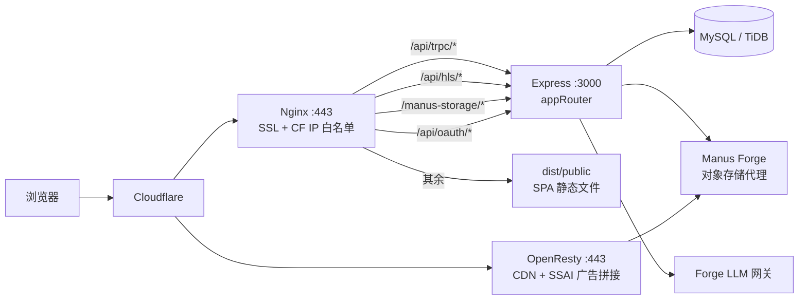
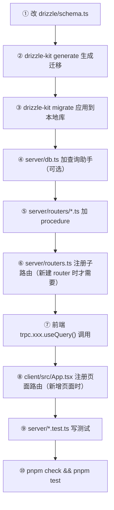
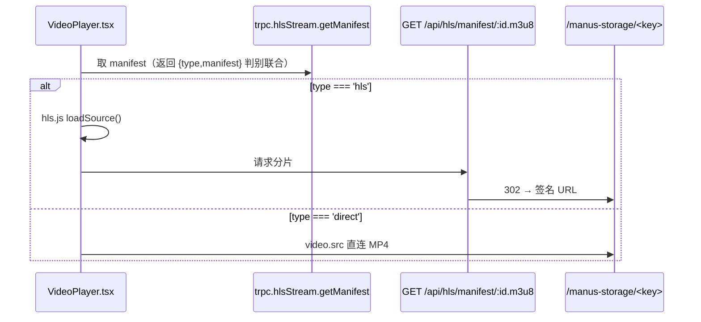

# OpenAdult 开发者手册 / 新机器接手指南

> 面向刚拿到这个仓库、准备在一台新 PC 的 VS Code 上继续开发的工程师。
> 本文只写「怎么干活」，架构背景请配合仓库根目录的 `CLAUDE.md` 一起读。
>
> 相关文档：
> - `CLAUDE.md` —— 项目总览、目录树、架构决策（Claude Code 的上下文文件，人也能读）
> - `LOCAL_DEV.md` —— 本地运行与生产部署的两条路径
> - `DEPLOY_FIXES.md` —— 部署栈审计与已修复的 14 个缺陷
> - `deploy/docs/env-template.md` —— 环境变量完整清单
> - `deploy/docs/DEPLOY_TUTORIAL_CN.md` —— 保姆级生产部署教程

---

## 目录

1. [新机器环境搭建 checklist](#1-新机器环境搭建-checklist)
2. [项目结构速查](#2-项目结构速查)
3. [日常开发工作流](#3-日常开发工作流)
4. [代码规范](#4-代码规范)
5. [常见任务 cookbook](#5-常见任务-cookbook)
6. [调试指南](#6-调试指南)
7. [测试](#7-测试)
8. [构建与发布](#8-构建与发布)
9. [Git 工作流建议](#9-git-工作流建议)
10. [踩坑记录](#10-踩坑记录)

---

## 1. 新机器环境搭建 checklist

### 1.1 前置：操作系统

| 环境 | 支持度 | 说明 |
|------|--------|------|
| Linux x86_64 | ✅ 完整支持 | 主要开发环境 |
| WSL2 (Ubuntu) | ✅ 完整支持 | **Windows 用户请务必在 WSL2 里开发**，不要用 Windows 原生 shell |
| macOS | ⚠️ 部分支持 | `pnpm dev` / `pnpm build` / `pnpm test` 全部可用；但 `scripts/localdb.sh` 下载的是 **linux-systemd-x86_64** 的 MariaDB tarball（见 `scripts/localdb.sh:30`），macOS 上不可用，需改用 Docker 或 Homebrew MySQL |
| Windows 原生 | ❌ | `scripts/*.sh` 是 bash 脚本；`.vscode/settings.json` 已把 `files.eol` 锁成 `\n`，但 Git 的 `autocrlf` 仍可能污染脚本 |

> **WSL 提示**：把仓库 clone 到 WSL 的文件系统内（如 `~/work/OpenAdult`），**不要**放在 `/mnt/c/...` —— 跨文件系统的 `node_modules` 会让 Vite 的文件监听慢到不可用。

### 1.2 Node.js 版本

`package.json` **没有 `engines` 字段**，版本要求需要从依赖推断：

| 依据 | 要求 |
|------|------|
| `vite@^7.1.7`（`package.json:110`） | Node `^20.19.0 \|\| >=22.12.0` |
| `@types/node@^24.7.0`（`package.json:95`） | 类型定义按 Node 24 API 面写的 |
| 当前开发机实测 | `v24.17.0` ✅ |

**结论：安装 Node 22 LTS 或 Node 24。不要用 Node 18 或更低（Vite 7 会直接拒绝启动）。**

```bash
# 推荐用 nvm 管理版本
curl -o- https://raw.githubusercontent.com/nvm-sh/nvm/v0.40.1/install.sh | bash
exec $SHELL
nvm install 24
nvm use 24
node -v          # 期望 v24.x（或 v22.12+）
```

可选：在仓库根目录建一个 `.nvmrc`（当前仓库里没有，建议补上）：

```bash
echo "24" > .nvmrc   # 之后进目录执行 nvm use 即可
```

### 1.3 pnpm

本项目**强制使用 pnpm**（有 `patchedDependencies` 与 `overrides`，npm/yarn 装出来的依赖树不等价）。

`package.json:114` 声明了 `"packageManager": "pnpm@10.4.1+sha512..."`，最省事的方式是用 corepack 让它自动对齐版本：

```bash
corepack enable
corepack prepare pnpm@10.4.1 --activate
pnpm -v          # 期望 10.4.1
```

> ⚠️ `devDependencies` 里还有一条 `"pnpm": "^10.15.1"`（`package.json:103`），这是历史遗留、与 `packageManager` 字段不一致。**以 `packageManager` 声明的 10.4.1 为准**，corepack 会自动使用它。

### 1.4 VS Code 扩展

仓库里已经带了 `.vscode/extensions.json` 和 `.vscode/settings.json`（它们被 `.gitignore:22-24` 显式放行提交），**打开工程后 VS Code 会主动弹窗提示安装推荐扩展，点「Install All」即可**。

如果没弹窗：命令面板（`Ctrl+Shift+P`）→ `Extensions: Show Recommended Extensions`。

清单如下（源：`.vscode/extensions.json`）：

| 扩展 ID | 作用 | 必要性 |
|---------|------|--------|
| `esbenp.prettier-vscode` | Prettier，读根目录 `.prettierrc` | **必装**（保存自动格式化已在 settings 里开启） |
| `bradlc.vscode-tailwindcss` | Tailwind CSS 4 类名补全 | **必装** |
| `dbaeumer.vscode-eslint` | ESLint | 装上待用（**仓库当前没有 ESLint 配置**，靠 `tsc --noEmit` 兜底） |
| `dsznajder.es7-react-js-snippets` | React 代码片段 | 可选 |
| `christian-kohler.path-intellisense` | 路径补全，配合 `@/` `@shared/` 别名 | 推荐 |
| `mikestead.dotenv` | `.env` 语法高亮 | 推荐 |
| `ms-azuretools.vscode-docker` | Docker Compose 部署栈 | 部署时需要 |
| `cweijan.vscode-mysql-client2` | 连本地 MariaDB `127.0.0.1:3307` | 强烈推荐 |
| `vitest.explorer` | Vitest 测试面板 | 推荐 |
| `bierner.markdown-mermaid` | 预览 `docs/` 里的 mermaid 图 | 可选 |
| `anthropic.claude-code` | Claude Code VS Code 扩展 | 可选 |

`.vscode/settings.json` 已经替你配好的关键项（无需手动改）：

- `typescript.tsdk: node_modules/typescript/lib` —— 用仓库锁定的 **TypeScript 5.9.3**，而不是 VS Code 内置版本。首次打开 `.ts` 文件时右下角会问「使用工作区版本？」，**选 Yes**。
- `editor.formatOnSave: true` + Prettier 为默认格式化器
- `typescript.preferences.importModuleSpecifier: "non-relative"` —— 自动 import 优先走 `@/` 别名
- `tailwindCSS.experimental.classRegex` —— 让 `cn()` / `cva()` 里的字符串也有类名补全
- `files.eol: "\n"` —— 防止 Windows 上 CRLF 破坏 shell 脚本

### 1.5 clone → install → 配置 → 首次运行

```bash
# ① 拉代码
git clone <repo-url> OpenAdult
cd OpenAdult

# ② 装依赖（会自动应用 patches/wouter@3.7.1.patch）
pnpm install

# ③ 配置环境变量
cp .env.example .env
# 编辑 .env，最少填这两项：
#   DATABASE_URL=mysql://root@127.0.0.1:3307/openadult
#   JWT_SECRET=<至少 32 位随机串>
```

生成一个像样的 `JWT_SECRET`：

```bash
node -e "console.log(require('crypto').randomBytes(32).toString('hex'))"
```

> ⚠️ **绝对不要 `source .env`**。`DOMAIN_POOL` 之类的值是 JSON 数组，shell 解析会炸。
> 服务端通过 `import "dotenv/config"` 自动加载（见 `.env.example:6-8`）。

**不填 OAuth / Forge / S3 也能跑起来**：
- 没有 `VITE_APP_ID` / `OAUTH_SERVER_URL` → 登录功能不可用，但站点能开
- 没有 `BUILT_IN_FORGE_API_KEY` → AI 聊天 / 人脸检索 / 图像分析报错，其余正常
- 没有 S3 相关变量 → 上传不可用（注意：**这些 `S3_*` / `AWS_*` 变量实际上代码里根本没读**，见 [踩坑记录](#10-踩坑记录)）

```bash
# ④ 启动本地数据库（首次会下载 ~330MB 的便携版 MariaDB 到 ~/.openadult-localdb）
./scripts/localdb.sh start
# 输出：[localdb] ready ✅  DATABASE_URL=mysql://root@127.0.0.1:3307/openadult

# ⑤ 建表
export DATABASE_URL="mysql://root@127.0.0.1:3307/openadult"
pnpm exec drizzle-kit migrate

# ⑥ （可选）灌示例数据：2 位女优 + 3 个视频 + 1 条广告
~/.openadult-localdb/mariadb-11.4.5-linux-systemd-x86_64/bin/mariadb \
  -h127.0.0.1 -P3307 -uroot openadult < scripts/dev-seed.sql

# ⑦ 起开发服务器（前后端同一个端口，带 HMR）
pnpm dev
# → http://localhost:3000
```

### 1.6 首次运行验证

三条命令全绿就说明环境没问题：

```bash
pnpm check   # tsc --noEmit  → 无输出即通过
pnpm build   # vite build + esbuild → 产出 dist/public + dist/index.js
pnpm test    # vitest run → 全部 pass（DB 相关断言自动跳过）
```

再手动确认：

```bash
curl -s http://localhost:3000/health          # {"status":"ok",...}
curl -s http://localhost:3000/api/trpc/system.health   # tRPC 通路
./scripts/localdb.sh status                   # DB 在跑
```

浏览器打开 `http://localhost:3000` 应看到首页。

> **注意**：首页的六个视频分类走的是 `videosV2.list`，它是 `protectedProcedure`（`server/routers/videos-v2.ts:161`），**未登录时首页视频区是空的**，这不是 bug。想看到内容请用 `/videos`（V1 列表，`publicProcedure`）。

### 1.7 三种运行模式怎么选

| 模式 | 命令 | 适用场景 | 特点 |
|------|------|----------|------|
| **开发模式**（日常用这个） | `pnpm dev` | 写代码 | `tsx watch` 热重载后端 + Vite 中间件模式提供前端 HMR，**同一个端口 3000** |
| **生产构建本地跑** | `./scripts/dev-up.sh --seed` | 验证构建产物、复现线上问题 | 跑的是 `node dist/index.js`，与 Docker 容器内完全一致的产物 |
| **Docker 本地全栈** | `cd deploy/docker && docker compose -f docker-compose.local.yml up -d --build` | 验证容器化、nginx 反代 | 含 MariaDB + migrate + app + HTTP-only nginx（`:8080`）。⚠️ 该 compose **从未做过运行时验证**（`DEPLOY_FIXES.md:4-6`） |

停止：

```bash
./scripts/dev-down.sh          # 停 dev-up.sh 起的 app
./scripts/dev-down.sh --db     # 连本地 DB 一起停
```

辅助脚本一览（源：`LOCAL_DEV.md:28-33`）：

| 脚本 | 作用 |
|------|------|
| `scripts/localdb.sh {start\|stop\|restart\|status\|cli}` | 免 root 的便携 MariaDB，端口 3307，数据在 `~/.openadult-localdb` |
| `scripts/dev-up.sh [--seed]` | DB → migrate → (seed) → build（若无 dist）→ 起生产服务器 |
| `scripts/dev-down.sh [--db]` | 停应用（可选连 DB） |
| `scripts/dev-seed.sql` | 示例数据 |

---

## 2. 项目结构速查

```
OpenAdult/
├── client/src/          前端 React SPA
│   ├── main.tsx         入口：QueryClient + tRPC client + 全局 401 拦截
│   ├── App.tsx          wouter 路由表 + Provider 装配
│   ├── pages/           页面组件
│   ├── components/      业务组件 + ui/（53 个 shadcn 组件）
│   ├── contexts/        LanguageContext / ThemeContext
│   ├── lib/             trpc.ts / utils.ts / videoUrl.ts
│   └── locales/         三语文案表
├── server/
│   ├── _core/           ⚠️ 框架基础设施，非必要不改
│   ├── routers.ts       tRPC 根路由（appRouter）
│   ├── routers/         功能路由模块
│   ├── db.ts            数据访问层（getDb + 查询助手）
│   ├── storage.ts       对象存储封装
│   └── *.test.ts        Vitest 测试
├── drizzle/             schema.ts + 迁移 SQL
├── shared/              前后端共享常量与类型
├── deploy/              Docker / Nginx / OpenResty / FFmpeg / 反封锁 / 监控
├── scripts/             本地开发脚本
└── docs/                本文档所在
```

请求流（生产拓扑）：



三级权限模型（定义在 `server/_core/trpc.ts:50-116`）：

| Procedure | 要求 | `ctx.user` 类型 | 失败 |
|-----------|------|-----------------|------|
| `publicProcedure`（`trpc.ts:58`） | 无 | `User \| null` | 不失败 |
| `protectedProcedure`（`trpc.ts:91`） | 已登录 | `User` | `UNAUTHORIZED` 401 |
| `adminProcedure`（`trpc.ts:106`） | `users.role === 'admin'` | `User` | `FORBIDDEN` 403 |

> **另有第二套认证**：管理面板用独立用户名/密码（`server/routers/admin-auth.ts`），签发 `admin_session_id` Cookie，与 OAuth 体系**互不打通**。详见 [踩坑记录 #1](#坑-1-两套认证体系没打通)。

---

## 3. 日常开发工作流

以「给视频加一个 `isFeatured`（是否精选）字段，并在首页展示精选视频」为例，走完整链路。



### ① 改 schema

`drizzle/schema.ts`（`videos` 表定义在 `drizzle/schema.ts:134`）：

```ts
export const videos = mysqlTable("videos", {
  id: int("id").autoincrement().primaryKey(),
  title: varchar("title", { length: 255 }).notNull(),
  // ...existing columns
  isFeatured: boolean("isFeatured").notNull().default(false),  // ← 新增
});
```

> 表定义末尾已经导出了推断类型（`drizzle/schema.ts:151-153`）：
> `export type Video = typeof videos.$inferSelect;`
> `export type InsertVideo = typeof videos.$inferInsert;`
> 加字段后这两个类型自动带上新列，**所有用到它们的地方会在 `pnpm check` 时暴露不兼容**。

### ② + ③ 生成并应用迁移

`drizzle.config.ts:3-6` 会在 `DATABASE_URL` 缺失时直接抛错，而**它不加载 `.env`**，所以必须显式导出：

```bash
export DATABASE_URL="mysql://root@127.0.0.1:3307/openadult"

pnpm exec drizzle-kit generate   # 在 drizzle/ 下生成 0004_xxx.sql + 更新 meta/_journal.json
pnpm exec drizzle-kit migrate    # 应用到本地库

# 或者一步到位（package.json:13）
pnpm db:push
```

生成的 SQL 请**打开看一眼再提交**——drizzle-kit 对列重命名的推断有时会退化成「删列 + 加列」，那会丢数据。

### ④ 加查询助手（`server/db.ts`）

按仓库约定，数据库操作应集中在 `server/db.ts`：

```ts
/**
 * 查询精选视频（首页展示用）。
 *
 * @param limit 返回条数上限，默认 12
 * @returns 精选视频数组；数据库不可用时返回空数组
 */
export async function getFeaturedVideos(limit: number = 12) {
  const db = await getDb();
  if (!db) return [];                      // ← 数据库「可缺席」是全仓库统一约定
  return await db
    .select()
    .from(videos)
    .where(eq(videos.isFeatured, true))
    .orderBy(desc(videos.createdAt))
    .limit(limit);
}
```

> `getDb()` 定义在 `server/db.ts:71`，无 `DATABASE_URL` 或连接失败时返回 `null` 而**不抛错**。
> 每个查询函数都要自己判空：查询类返回空值，写入类抛错。

### ⑤ 加 procedure

在 `server/routers/videos-v2.ts` 的 `videosV2Router`（`server/routers/videos-v2.ts:52`）里加：

```ts
import { getFeaturedVideos } from "../db";

export const videosV2Router = router({
  // ...existing procedures

  /**
   * 获取精选视频列表。
   * @权限 public —— 首页对匿名访客也要可见
   */
  listFeatured: publicProcedure
    .input(z.object({ limit: z.number().min(1).max(50).default(12) }))
    .query(async ({ input }) => {
      return await getFeaturedVideos(input.limit);
    }),
});
```

### ⑥ 注册（仅新建 router 文件时）

`server/routers.ts:78` 的 `appRouter` 里加一行：

```ts
export const appRouter = router({
  // ...
  videosV2: videosV2Router,          // 已有的
  myFeature: myFeatureRouter,        // ← 新加的
});
```

**加完这一行，前端立刻就有类型了** —— `client/src/lib/trpc.ts:32` 用 `import type { AppRouter } from "../../../server/routers"` 把类型从服务端引到前端。

### ⑦ 前端调用

```tsx
import { trpc } from "@/lib/trpc";

function FeaturedSection() {
  const { data, isLoading, isError } = trpc.videosV2.listFeatured.useQuery({ limit: 12 });

  if (isLoading) return <Skeleton className="h-48" />;
  if (isError)   return <p className="text-red-400">読み込みに失敗しました</p>;  // 别漏掉错误态
  if (!data?.length) return null;

  return (
    <div className="grid grid-cols-2 gap-4 md:grid-cols-4">
      {data.map(v => <VideoCard key={v.id} {...v} />)}
    </div>
  );
}
```

Mutation：

```tsx
const utils = trpc.useUtils();
const mutation = trpc.videosV2.update.useMutation({
  onSuccess: () => {
    utils.videosV2.list.invalidate();       // ← 用 invalidate 而不是局部 refetch，
    utils.videosV2.listFeatured.invalidate(); //   否则其他页面的缓存还是旧数据
    toast.success("更新しました");
  },
  onError: (e) => toast.error(e.message),   // ← 别省，否则失败时界面毫无反馈
});
```

### ⑧ 注册页面路由（仅新增页面时）

`client/src/App.tsx:70-82`，**兜底 `<Route component={NotFound} />` 必须留在最后**（wouter 的 `<Switch>` 按声明顺序取第一个命中）：

```tsx
import FeaturedPage from "./pages/FeaturedPage";

<Switch>
  <Route path={"/"} component={Home} />
  {/* ... */}
  <Route path={"/featured"} component={FeaturedPage} />   {/* ← 新增，放在兜底之前 */}
  <Route path={"/404"} component={NotFound} />
  <Route component={NotFound} />
</Switch>
```

### ⑨ + ⑩ 测试与检查

```bash
pnpm check   # 类型检查，必须绿
pnpm test    # 跑测试
pnpm format  # 提交前格式化
```

---

## 4. 代码规范

### 4.1 TypeScript 约定

来源：`tsconfig.json`

| 配置 | 值 | 含义 |
|------|-----|------|
| `strict` | `true` | 严格模式，不允许隐式 any / 隐式 null |
| `module` / `moduleResolution` | `ESNext` / `bundler` | 纯 ESM，import 不写扩展名 |
| `noEmit` | `true` | tsc 只做类型检查，产物由 vite + esbuild 生成 |
| `jsx` | `preserve` | JSX 交给 Vite/esbuild 处理 |
| `exclude` | `["node_modules","build","dist","**/*.test.ts"]` | **测试文件不参与 `pnpm check`**，由 vitest 单独处理 |

`package.json:4` 声明了 `"type": "module"`，全项目 ESM：

```ts
// ✅ 正确
import { getDb } from "./db";
import type { AppRouter } from "../../../server/routers";

// ❌ 错误
const db = require("./db");
module.exports = ...;
```

### 4.2 路径别名

定义在 `tsconfig.json:18-21` + `vite.config.ts` + `vitest.config.ts`（三处必须一致）：

| 别名 | 指向 | 用在 |
|------|------|------|
| `@/*` | `client/src/*` | **仅前端** |
| `@shared/*` | `shared/*` | 前后端都可 |

```ts
// 前端
import { Button } from "@/components/ui/button";
import { cn } from "@/lib/utils";
import { UNAUTHED_ERR_MSG } from "@shared/const";

// 后端引用 drizzle schema 用相对路径（没有别名）
import { videos } from "../drizzle/schema";
```

> 例外：`client/src/lib/trpc.ts:32` 用相对路径 `../../../server/routers` 跨出 client 目录引类型 —— 这是唯一的合法跨界引用，且**必须写 `import type`**，否则 Vite 会把整棵服务端依赖树（数据库驱动、密钥读取）打进前端 bundle。

### 4.3 tRPC 约定

- 所有业务 API 都是 tRPC procedure。裸 Express 路由只有 6 处例外（`server/_core/index.ts:117-148`）：`/manus-storage/*`、`/api/video-stream/*`、`/api/upload/*`、`/api/hls/*`、`/api/oauth/*`、`/health`
- 序列化器：**superjson**（`Date` / `Map` / `Set` / `undefined` 自动处理）。前后端必须配同一个，否则静默错乱
- 输入校验：**zod**（`z.object({...})`），别用手写 if
- 权限用 procedure 类型表达，不要在 handler 里手写 `if (ctx.user?.role !== 'admin')` —— 用 `adminProcedure`
- `BigInt` 字段（如 `video_upload_sessions.fileSize`）靠 superjson 才能穿过网络，别在中间手动 `JSON.stringify`

### 4.4 前端约定

- UI 组件从 `@/components/ui/*` 引（shadcn/ui，`components.json` 配置的是 `new-york` 风格）
- 样式用 Tailwind CSS 4，条件类名用 `cn()`（`@/lib/utils`）
- 路由用 **wouter**（不是 react-router）。SPA 内跳转用 `useLocation()` 拿到的 `navigate`，**不要用 `window.location.href`**（会整页重载并清空 React Query 缓存）
- 用户状态用 `useAuth()`（`client/src/_core/hooks/useAuth.ts`）
- **不要直接 `fetch` / `axios`** —— 用 tRPC hooks。唯二例外：分片上传的 `POST /api/upload/chunk`、HLS/storage 直链
- 默认暗色主题
- 文案：新代码优先走 `client/src/locales/translations.ts`，现存页面大量硬编码日语（历史债）

### 4.5 后端约定

- **不要随意改 `server/_core/`** —— 框架基础设施
- 数据库操作集中在 `server/db.ts`（现实：13 个路由文件违反了这条，新代码请遵守）
- LLM 调用统一走 `invokeLLM()`（`server/_core/llm.ts:426`）
- 文件存储用 `storagePut()` / `storageGet()`（`server/storage.ts:181` / `server/storage.ts:221`）
- 环境变量通过 `ENV` 对象访问（`server/_core/env.ts:32`），不要散落 `process.env`
- 不要硬编码端口，用 `process.env.PORT`

### 4.6 注释风格（重要）

**本仓库已统一为简体中文 JSDoc 注释。** 新增/修改代码时请保持一致。

文件头部块注释模板（参考 `server/db.ts:1-42`、`server/_core/trpc.ts:1-35`、`client/src/App.tsx:1-29`）：

```ts
/**
 * ============================================================================
 * <文件路径> — <一句话职责>
 * ============================================================================
 *
 * 【架构定位】
 *   这个文件在整体架构中处于哪一层、解决什么问题。
 *
 * 【主要导出物】
 *   - foo() : 干什么
 *   - Bar   : 什么类型
 *
 * 【上下游依赖】
 *   上游（调用方）：...
 *   下游（被依赖）：...
 *
 * 【关键设计决策 / 坑】
 *   1. 为什么这么写、有什么代价、踩过什么坑。
 */
```

函数级 JSDoc：

```ts
/**
 * 按 openId 插入或更新用户记录。
 *
 * 语义为 MySQL 的 `INSERT ... ON DUPLICATE KEY UPDATE`，唯一键是 `users.openId`。
 *
 * @param user 待写入的用户数据；`openId` 必填。
 *             传 `null` 表示「显式清空该字段」，传 `undefined` 表示「保持不变」。
 * @returns 无返回值
 * @throws 数据库不可用时抛错
 */
```

约定细则：

- **中文写"为什么"，不写"是什么"** —— `// 自增 i` 这种没价值，`// 这里必须重新传 user 是为了类型收窄` 才有价值
- procedure 上标注 `@权限 public / 登录 / admin`（见 `server/routers/videos-v2.ts:56`）
- 已知缺陷用 `// TODO:` 或 `// FIXME:` 标注并写清后果，不要默默留坑
- 保留原有英文注释时，在旁边补中文说明，**不要直接翻译覆盖**（原注释可能记录了历史上下文）

### 4.7 格式化

Prettier 配置（`.prettierrc`）：`semi: true`、双引号、`printWidth: 80`、2 空格、`arrowParens: "avoid"`、`endOfLine: "lf"`。

VS Code 已配保存自动格式化。命令行批量：

```bash
pnpm format    # prettier --write .
```

> 仓库**没有 ESLint 配置**。类型安全的唯一保障是 `pnpm check`，**提交前务必跑**。

---

## 5. 常见任务 cookbook

### 5.1 新增 tRPC 路由模块

**① 建文件** `server/routers/my-feature.ts`：

```ts
/**
 * ============================================================================
 * server/routers/my-feature.ts — <功能名> 路由
 * ============================================================================
 * 【架构定位】tRPC 业务路由层，挂载点见 server/routers.ts。
 * 【主要导出物】myFeatureRouter
 */
import { z } from "zod";
import { eq, desc } from "drizzle-orm";
import { publicProcedure, protectedProcedure, adminProcedure, router } from "../_core/trpc";
import { getDb } from "../db";
import { videos } from "../../drizzle/schema";

export const myFeatureRouter = router({
  /** 列表查询。@权限 public */
  list: publicProcedure
    .input(z.object({
      limit: z.number().min(1).max(100).default(20),
      offset: z.number().min(0).default(0),
    }))
    .query(async ({ input }) => {
      const db = await getDb();
      if (!db) return [];
      return await db.select().from(videos)
        .orderBy(desc(videos.createdAt))
        .limit(input.limit).offset(input.offset);
    }),

  /** 创建。@权限 admin */
  create: adminProcedure
    .input(z.object({ title: z.string().min(1).max(255) }))
    .mutation(async ({ input, ctx }) => {
      const db = await getDb();
      if (!db) throw new Error("Database not available");
      const result = await db.insert(videos).values({ title: input.title });
      // ✅ 用驱动返回的 insertId 拿新记录 ID
      // ❌ 不要「按 title 倒序取最新一条」反查 —— 并发下会拿到别人的行
      return { id: (result as any).insertId as number };
    }),
});
```

**② 注册** `server/routers.ts:78` 的 `appRouter`：

```ts
import { myFeatureRouter } from "./routers/my-feature";

export const appRouter = router({
  // ...
  myFeature: myFeatureRouter,
});
```

**③ 前端用**：

```tsx
const { data } = trpc.myFeature.list.useQuery({ limit: 20, offset: 0 });
const create = trpc.myFeature.create.useMutation();
```

### 5.2 新增数据表

**①** `drizzle/schema.ts` 加表定义（务必加索引，见 [踩坑记录](#坑-6-全库几乎没有二级索引)）：

```ts
import { mysqlTable, int, varchar, timestamp, index, uniqueIndex } from "drizzle-orm/mysql-core";

export const videoTags = mysqlTable("video_tags", {
  id: int("id").autoincrement().primaryKey(),
  videoId: int("videoId").notNull(),
  tag: varchar("tag", { length: 64 }).notNull(),
  createdAt: timestamp("createdAt").defaultNow().notNull(),
}, (t) => ({
  // 高频过滤列必须建索引
  videoIdIdx: index("idx_video_tags_videoId").on(t.videoId),
  // 语义上唯一的组合必须加唯一约束，否则重复写入会静默产生重复行
  uniq: uniqueIndex("uniq_video_tags").on(t.videoId, t.tag),
}));

export type VideoTag = typeof videoTags.$inferSelect;
export type InsertVideoTag = typeof videoTags.$inferInsert;
```

**②** 生成 + 应用迁移：

```bash
export DATABASE_URL="mysql://root@127.0.0.1:3307/openadult"
pnpm exec drizzle-kit generate
cat drizzle/0004_*.sql     # ← 提交前一定要看一眼生成的 SQL
pnpm exec drizzle-kit migrate
```

**③** 在 `server/db.ts` 加查询助手（见 [§3 ④](#-加查询助手-serverdbts)）。

### 5.3 调用 LLM

```ts
import { invokeLLM } from "../_core/llm";

const response = await invokeLLM({
  messages: [
    { role: "system", content: "你是一个视频标签提取助手，只返回 JSON 数组。" },
    { role: "user", content: `视频标题：${title}` },
  ],
});
const content = response.choices[0]?.message?.content ?? "";
```

多模态（图片分析）：

```ts
const response = await invokeLLM({
  messages: [{
    role: "user",
    content: [
      { type: "text", text: "描述这张图里的人物特征，输出 JSON。" },
      { type: "image_url", image_url: { url: imageUrl, detail: "high" } },
    ],
  }],
});
```

⚠️ 注意事项：

- 模型名不由调用方决定，全局锁定 `ENV.hereticLlmModel`（`server/_core/llm.ts:442`）
- `maxTokens` 参数**声明了但不生效** —— `max_tokens` 被硬编码为 32768（`server/_core/llm.ts` 里的 payload 构造）。想控制输出长度只能在 prompt 里约束
- **没有超时控制**。上游挂起会一直占住 tRPC 连接。用户可触达的链路（chat / search）要谨慎
- LLM 返回的 JSON **必须做运行时校验**，别直接 `as SomeType`：

```ts
let tags: string[] = [];
try {
  const parsed = JSON.parse(content.match(/\[[\s\S]*\]/)?.[0] ?? "[]");
  tags = Array.isArray(parsed) ? parsed.filter(t => typeof t === "string") : [];
} catch {
  console.warn("[my-feature] LLM 返回的不是合法 JSON，降级为空标签", content.slice(0, 200));
}
```

- prompt 模板集中在 `server/llm-prompts.ts`，用户输入拼进 prompt 时注意 injection 边界

### 5.4 上传文件到对象存储

```ts
import { storagePut, storageGet } from "../storage";

// 上传：key 用 <用途前缀>/<userId>/<唯一名> 的约定
const safeName = path.basename(input.filename).replace(/[^\w.\-]/g, "_"); // ← 必须清洗
const { key, url } = await storagePut(
  `uploads/${ctx.user.id}/${Date.now()}-${safeName}`,
  fileBuffer,
  "image/png",
);

// 入库存相对路径，而不是绝对签名 URL（签名会过期）
await db.insert(videos).values({ videoUrl: `/manus-storage/${key}` });

// 需要临时下载链接时再换
const { url: signedUrl } = await storageGet(key);
```

**key 命名是隐性契约**，`server/_core/storageProxy.ts` 靠前缀反推 MIME，别乱改：

| 前缀 | 用途 |
|------|------|
| `videos/{userId}/{sessionId}/chunk-{i}` | 上传分片 |
| `videos/{userId}/{sessionId}.{ext}` | 合并后的成品视频 |
| `thumbnails/{userId}/{ts}-thumb.jpg` | 缩略图 |
| `uploads/{userId}/{ts}-{filename}` | 通用文件上传 |
| `generated/{ts}.png` | AI 生成图 |

⚠️ 大文件（>100MB）**不要走 `storagePut` 一次性上传** —— 它把整个文件包成 Blob 常驻内存。走分片通道 `videoUploadV2` + `POST /api/upload/chunk`。

⚠️ `storagePut` / `storageGet` 走的是 **Manus Forge 存储代理**（HTTP API），**不是 AWS SDK**。`.env` 里的 `S3_BUCKET` / `AWS_ACCESS_KEY_ID` 等变量**代码里根本没读**。

### 5.5 新增页面路由

**①** 建 `client/src/pages/MyPage.tsx`：

```tsx
/**
 * client/src/pages/MyPage.tsx — <页面职责>
 */
import { useLocation } from "wouter";
import { trpc } from "@/lib/trpc";
import { Button } from "@/components/ui/button";

export default function MyPage() {
  const [, navigate] = useLocation();
  const { data, isLoading, isError } = trpc.myFeature.list.useQuery({ limit: 20, offset: 0 });

  if (isLoading) return <div className="p-8 text-slate-400">読み込み中...</div>;
  if (isError)   return <div className="p-8 text-red-400">読み込みに失敗しました</div>;

  return (
    <div className="min-h-screen bg-slate-950 p-8">
      <Button onClick={() => navigate("/")}>ホームへ</Button>
      {/* ... */}
    </div>
  );
}
```

**②** 注册到 `client/src/App.tsx:70-82`（放在兜底 Route 之前）。

**③** 带参数的路由（参考 `client/src/App.tsx:76` 的 `/video/:id`）：

```tsx
import { useParams } from "wouter";

export default function MyDetailPage() {
  const params = useParams<{ id: string }>();
  const id = Number(params.id);
  // ⚠️ 非数字路径会得到 NaN，务必显式处理，别只靠 !!id 判断
  if (!Number.isInteger(id)) return <div>不正なIDです</div>;
  // ...
}
```

### 5.6 新增多语言文案

**①** 在 `client/src/locales/translations.ts` 的 **三种语言** 里同步加键（ja 是基准，`TranslationKey` 类型从 `translations.ja` 推导）：

```ts
export const translations = {
  ja: {
    nav: { /* ... */ },
    myFeature: {
      title: "私の機能",
      empty: "データがありません",
    },
  },
  zh: {
    nav: { /* ... */ },
    myFeature: {
      title: "我的功能",
      empty: "暂无数据",
    },
  },
  en: {
    nav: { /* ... */ },
    myFeature: {
      title: "My Feature",
      empty: "No data",
    },
  },
};
```

**②** 页面里用：

```tsx
import { useLanguage } from "@/contexts/LanguageContext";
import { translations } from "@/locales/translations";

function MyPage() {
  const { language } = useLanguage();
  const t = translations[language];
  return <h1>{t.myFeature.title}</h1>;
}
```

⚠️ 三点提醒：

1. **没有类型约束保证三语结构一致** —— zh/en 漏键不会编译报错，只会运行时静默回落。加键时三处一起改
2. `getTranslation()` 的兜底是 `value || key`（不是 `??`），**空字符串文案会退化成显示 key 路径**
3. 语言状态在 `client/src/contexts/LanguageContext.tsx`，持久化在 localStorage。服务端的 `language.set` procedure 是**空实现**，不写库

### 5.7 新增 shadcn 组件

`components.json` 已配好（`style: new-york`，`baseColor: neutral`，CSS 变量模式）：

```bash
pnpm dlx shadcn@latest add dialog
# 组件会落到 client/src/components/ui/dialog.tsx
```

用：

```tsx
import { Dialog, DialogContent, DialogTitle } from "@/components/ui/dialog";
```

⚠️ `client/src/components/ui/` 下的 53 个文件是**生成物，业务代码只消费不修改**。需要定制时在外面包一层业务组件。

---

## 6. 调试指南

### 6.1 服务端日志在哪

| 运行方式 | 日志位置 |
|----------|----------|
| `pnpm dev` | 直接打在当前终端 |
| `./scripts/dev-up.sh` | `.dev-app.log`（仓库根目录，见 `scripts/dev-up.sh:22`）。`tail -f .dev-app.log` |
| Docker | `docker compose -f deploy/docker/docker-compose.local.yml logs -f app` |

启动失败时 `dev-up.sh` 会自动 `tail -20` 日志（`scripts/dev-up.sh:67`）。

### 6.2 前端 tRPC 请求怎么看

tRPC 走 `httpBatchLink`，所有调用会**合并成一个 POST** 请求：

1. DevTools → Network → 过滤 `trpc`
2. 请求 URL 形如 `/api/trpc/videosV2.list,auth.me?batch=1`，路径里能看出这一批包含哪些 procedure
3. 响应是 superjson 格式：`[{"result":{"data":{"json":...,"meta":...}}}]` —— `json` 字段才是真实数据
4. 报错时看响应里的 `error.json.message` 与 `error.json.data.code`

调试技巧：

```tsx
// 临时在组件里打印完整 query 状态
const q = trpc.videosV2.list.useQuery({ limit: 20, offset: 0 });
console.log({ status: q.status, error: q.error, data: q.data });
```

React Query DevTools 未安装。要用的话临时加：

```bash
pnpm add -D @tanstack/react-query-devtools
```

然后在 `client/src/main.tsx` 的 `<QueryClientProvider>` 内加 `<ReactQueryDevtools />`。**调完记得撤掉，别提交**。

### 6.3 数据库怎么连

```bash
# 命令行 SQL shell（最快）
./scripts/localdb.sh cli
```

```sql
SHOW TABLES;
DESCRIBE videos;
SELECT id, title, category, duration, videoUrl FROM videos LIMIT 10;
SELECT * FROM __drizzle_migrations;   -- 已应用的迁移
```

VS Code 图形化（装 `cweijan.vscode-mysql-client2` 后）：

| 项 | 值 |
|----|-----|
| Host | `127.0.0.1` |
| Port | `3307` |
| User | `root` |
| Password | *(空)* |
| Database | `openadult` |

重置本地库（**会清空所有本地数据**）：

```bash
./scripts/localdb.sh stop
rm -rf ~/.openadult-localdb/data
./scripts/localdb.sh start
export DATABASE_URL="mysql://root@127.0.0.1:3307/openadult"
pnpm exec drizzle-kit migrate
```

### 6.4 HLS 播放问题排查

播放链路：



排查顺序：

1. **先看 `videos.duration`** —— `hlsStream.getManifest` 在 `duration <= 0` 时会整体降级为 `type: 'direct'`（直连 MP4，没有 SSAI 广告）：
   ```sql
   SELECT id, title, duration, videoUrl FROM videos WHERE id = 42;
   ```
   上传时若设了手动封面会跳过抽帧，`duration` 就会是 0 —— 这是最常见的"广告不播/HLS 不生效"原因。

2. **确认端点是否可达**：
   ```bash
   curl -i http://localhost:3000/api/hls/manifest/42.m3u8
   curl -i http://localhost:3000/manus-storage/videos/1/xxx/yyy.mp4   # 期望 200 或 307
   ```

3. **⚠️ 已知缺陷**：`client/src/components/VideoPlayer.tsx:207` 把 `getManifest` 返回的 **m3u8 文本内容**当成 URL 交给 `hls.loadSource()`（文件里 `VideoPlayer.tsx:205` 的注释已经承认了这一点）。hls.js 会把整段清单文本当相对路径去请求，必然 404，然后在 `NETWORK_ERROR` 分支反复 `startLoad()` 重试。
   **正确端点是 `GET /api/hls/manifest/:videoId.m3u8`**（`server/_core/hlsRoutes.ts` 里注册的 Express 路由）。修这个 bug 时把 `manifestUrl` 改成拼出来的 URL 即可。

4. **`multi-chunk:` 前缀的历史视频**：`videoUrl` 以 `multi-chunk:<sessionId>` 开头的记录走 `/api/video-stream/:videoId`（分片流式重组）。前端归一化逻辑在 `client/src/lib/videoUrl.ts`。

5. **AES-128 加密**：`HLS_MODE=real` 时密钥服务在 `/api/hls/key/:videoId`。当前实现把密钥存在 `process.env` 里（重启即丢、多实例不共享），未注册时返回全零密钥 —— 本地开发请用 `HLS_MODE=pseudo`。

### 6.5 常见报错与解法

| 报错 | 原因 | 解法 |
|------|------|------|
| `DATABASE_URL is required to run drizzle commands` | `drizzle.config.ts:4` 不加载 `.env` | `export DATABASE_URL="mysql://root@127.0.0.1:3307/openadult"` 后再跑 drizzle-kit |
| 页面全部空白 / 列表恒空但无错误 | `getDb()` 返回 null（DB 没连上），查询静默降级为 `[]` | `./scripts/localdb.sh status`；看日志有无 `[Database] Failed to connect` |
| `Please login (10001)` 后被弹去 OAuth | `protectedProcedure` 拦截 | 正常行为。未配 OAuth 时相关功能不可用 |
| 已登录但仍 403 `NOT_ADMIN` | 用的是 OAuth 的 `adminProcedure`，而你只做了 admin 密码登录 | 见 [踩坑 #1](#坑-1-两套认证体系没打通)。临时解：`UPDATE users SET role='admin' WHERE openId='...'` |
| 登录成功但每次请求仍是匿名（死循环） | `verifySession()` 要求 JWT payload 的 `name` 非空，而签发时用了 `name \|\| ""` | OAuth 资料里 name 为空的用户会中招。检查 `VITE_APP_ID` 是否配了（为空会让**所有**用户 session 校验失败） |
| 请求 `/api/xxx` 返回 200 + HTML | `server/_core/vite.ts` 的 `app.use("*")` 兜底把不存在的 API 路径也返回了 `index.html` | 检查路径拼写。前端表现是「JSON 解析失败」 |
| 浏览器请求 `/%VITE_ANALYTICS_ENDPOINT%/umami` 并报 URIError | `client/index.html` 的占位符在变量为空时不会被替换 | 在 `.env` 里给 `VITE_ANALYTICS_ENDPOINT` 一个值，或忽略（不影响功能） |
| 端口被占用后服务"起来了但访问不到" | `server/_core/index.ts` 的 `findAvailablePort` 会静默改用 3001~3020 | 看启动日志实际监听的端口；或 `PORT=3005 pnpm dev` 显式指定 |
| `pnpm install` 报 patch 相关错误 | `patches/wouter@3.7.1.patch` 与锁文件不匹配 | `rm -rf node_modules pnpm-lock.yaml && pnpm install`（谨慎，会更新依赖） |
| 本地登录 Cookie 存不下 | `server/_core/cookies.ts` 硬编码 `sameSite: "none"`，浏览器要求必须配 `Secure` | 本地 HTTP 下 Chrome 会丢弃该 Cookie。用 `http://localhost` 而非 `http://127.0.0.1`，或临时改成 `lax` |
| `mariadb-install-db` 失败 / MariaDB 起不来 | 缺 `libaio` 等系统库 | `tail -15 ~/.openadult-localdb/mariadbd-3307.err` 看具体错误；Ubuntu 上 `sudo apt install libaio1t64 libncurses6` |

---

## 7. 测试

### 7.1 怎么跑

```bash
pnpm test                              # vitest run，跑一遍退出
pnpm exec vitest                       # watch 模式
pnpm exec vitest run server/search.test.ts        # 单文件
pnpm exec vitest run -t "should build system prompt"   # 按用例名过滤
```

VS Code 装了 `vitest.explorer` 后可以在侧边栏点单个用例跑/调试。

### 7.2 测试配置

`vitest.config.ts`：

- `environment: "node"` —— **只跑服务端测试**，没有 jsdom
- `include: ["server/**/*.test.ts", "server/**/*.spec.ts"]` —— 前端测试不会被执行
- alias 与 `tsconfig.json` 保持一致（`@` / `@shared` / `@assets`）

现有测试文件（9 个）：

```
server/admin-auth.test.ts
server/auth.logout.test.ts
server/chat-preferences.test.ts
server/chat.test.ts
server/faceSearch.test.ts
server/file-upload.test.ts
server/search.test.ts
server/routers/video-playback.test.ts
server/routers/video-upload.test.ts
```

> **前端零测试覆盖**。`client/src/pages/ChatPage.test.tsx` 只有两行注释，且因 `include` 规则根本不会被 vitest 拾取。

### 7.3 DB-backed 测试为什么会 skip

因为 `getDb()`（`server/db.ts:71`）在 `DATABASE_URL` 缺失时返回 `null` 而不抛错，测试就用这个特性做优雅降级。

看 `server/search.test.ts:9-18` 的注释与实现：

```ts
beforeAll(async () => {
  // A live MySQL connection is optional for this suite. When DATABASE_URL is
  // not set (e.g. local/CI without a DB), getDb() returns null and the
  // DB-backed assertions below short-circuit via `if (!db) return;`.
  db = await getDb();
  if (!db) {
    console.warn("[search.test] DATABASE_URL not set — skipping DB-backed assertions");
  }
});
```

各个用例里再用 `if (!db) return;` 提前返回。**所以在没有数据库的 CI 上，这些用例仍然"pass"，只是什么都没断言**。

想让 DB 用例真正跑起来：

```bash
./scripts/localdb.sh start
export DATABASE_URL="mysql://root@127.0.0.1:3307/openadult"
pnpm exec drizzle-kit migrate
pnpm test
```

### 7.4 怎么写测试

**风格 A：纯逻辑测试**（首选，不需要 DB）—— 参考 `server/chat-preferences.test.ts`：

```ts
import { describe, expect, it } from "vitest";
import { buildChatSystemPrompt, UserPreferenceContext } from "./llm-prompts";

describe("Chat AI Preference Integration", () => {
  it("should build system prompt with user context", () => {
    const context: UserPreferenceContext = {
      topKeywords: [{ keyword: "熟女", count: 5 }],
      topCategories: [], favoriteActresses: [], recentSearches: [], watchedCategories: [],
    };
    const prompt = buildChatSystemPrompt("ja", context);
    expect(prompt).toContain("USER PREFERENCE CONTEXT");
    expect(prompt).toContain("熟女(5)");
  });
});
```

**风格 B：mock 依赖测 procedure** —— 参考 `server/file-upload.test.ts:5-43`：

```ts
import { describe, it, expect, vi, beforeEach } from "vitest";
import { fileUploadRouter } from "./file-upload";

vi.mock("./storage", () => ({
  storagePut: vi.fn().mockResolvedValue({ url: "https://example.com/uploads/test.jpg" }),
  storageGet: vi.fn(),
}));

vi.mock("./db", () => ({
  getDb: vi.fn().mockResolvedValue({
    insert: vi.fn().mockReturnValue({ values: vi.fn().mockResolvedValue({}) }),
  }),
}));

vi.mock("./_core/llm", () => ({
  invokeLLM: vi.fn().mockResolvedValue({
    choices: [{ message: { content: "This is a test image analysis result." } }],
  }),
}));

describe("File Upload Router", () => {
  beforeEach(() => vi.clearAllMocks());

  it("uploads a file", async () => {
    const caller = fileUploadRouter.createCaller({
      req: {} as any, res: {} as any,
      user: { id: 1, openId: "test", role: "user" } as any,
    });
    const result = await caller.uploadFile({ /* ... */ });
    expect(result.url).toContain("example.com");
  });
});
```

**风格 C：真连 DB**（尽量少用）—— 用 `server/search.test.ts` 的 `if (!db) return;` 模式，且必须在 `afterAll` 里清理自己造的数据。

优先级建议：新代码尽量把纯逻辑抽成独立函数（像 `calculateRecommendationScore`、`buildChatSystemPrompt` 那样），用风格 A 覆盖，成本最低、最稳定。

---

## 8. 构建与发布

### 8.1 构建

```bash
pnpm build
```

等价于（`package.json:8`）：

```bash
vite build \
  && esbuild server/_core/index.ts --platform=node --packages=external --bundle --format=esm --outdir=dist
```

产物结构：

```
dist/
├── index.js          后端单文件 bundle（ESM，外部依赖不打包，运行时从 node_modules 解析）
└── public/           前端静态文件
    ├── index.html
    └── assets/       JS/CSS/图片（带内容 hash）
```

关键点：

- `--packages=external` 意味着 **`dist/index.js` 运行时仍依赖 `node_modules`**，不能单独拷走
- 前端产物路径由 `vite.config.ts` 的 `build.outDir` 指定为 `dist/public`
- `vite.config.ts` 的 `envDir` 指向仓库根，所以 `VITE_*` 变量从根 `.env` 读取，**且是构建期注入的** —— 改了 `VITE_*` 必须重新 build

### 8.2 生产启动

```bash
NODE_ENV=production node dist/index.js
# 或
pnpm start
```

生产模式下 `server/_core/vite.ts` 的 `serveStatic(app)` 从 `dist/public/` 提供 SPA。端口取 `process.env.PORT`（默认 3000）。

### 8.3 Docker 构建

```bash
# 本地全栈（含 MariaDB，HTTP-only，端口 8080）
cd deploy/docker
docker compose -f docker-compose.local.yml up -d --build
docker compose -f docker-compose.local.yml --profile seed run --rm seed   # 灌示例数据
docker compose -f docker-compose.local.yml down -v                        # 停并删数据卷

# 生产栈（9 个服务）
docker compose --env-file ../../.env up -d
```

`deploy/docker/Dockerfile.app` 是三阶段构建：`deps`（`pnpm install --frozen-lockfile`）→ `builder`（`pnpm build`）→ `runner`（`node:22-alpine`，非 root uid 1001）。同一个镜像既跑 `app` 也跑一次性的 `migrate` 服务。

⚠️ 生产 compose **需要先在宿主机执行 `pnpm build`** —— nginx 的 web root 是 bind mount `../../dist/public`，而 `.dockerignore:2` 把 `dist` 排除在镜像之外。

⚠️ 生产栈还有三个前置条件（`DEPLOY_FIXES.md:27-41`）：外部 MySQL/TiDB、`ssl-certs` 卷里的真实证书、Cloudflare IP 白名单。直连源站会被 403，这是**有意的源站硬化**，本地浏览请用 `docker-compose.local.yml`。

---

## 9. Git 工作流建议

> 当前仓库状态：分支 `main`，**尚无任何 commit**。下面是建议的规范，落地前请先做首次提交。

### 9.1 分支命名

```
main                      主干，随时可部署
feat/<模块>-<简述>        新功能    feat/video-tags
fix/<模块>-<简述>         缺陷修复  fix/hls-manifest-url
refactor/<模块>-<简述>    重构      refactor/db-layer-extraction
docs/<简述>               文档      docs/development-guide
chore/<简述>              杂项      chore/bump-vite-7
```

### 9.2 Commit message

推荐 Conventional Commits：

```
<type>(<scope>): <简述>

<可选正文：为什么这么改、影响面、关联 issue>
```

`type`：`feat` / `fix` / `refactor` / `docs` / `test` / `chore` / `perf` / `style`
`scope`：`server` / `client` / `db` / `deploy` / `hls` / `ads` / `upload` / `auth` …

示例：

```
fix(hls): VideoPlayer 传给 hls.loadSource 的应是清单 URL 而非清单文本

getManifest 返回的 manifest 字段是 m3u8 文本内容，之前被当作 URL 直接
loadSource，hls.js 会把整段文本当相对路径请求导致 404 并反复重试。
改为拼接 /api/hls/manifest/{videoId}.m3u8。
```

```
feat(db): videos 表新增 isFeatured 字段与索引

新增迁移 0004_add_is_featured.sql；同步补 videosV2.listFeatured procedure。
```

### 9.3 不要提交什么

`.gitignore` 已覆盖大部分，但仍需人肉留意：

| 绝不提交 | 原因 |
|----------|------|
| `.env` | **含 JWT_SECRET、Forge API Key、Cloudflare Token、TG Bot Token**。已在 `.gitignore:11`，但改名成 `.env.bak` 之类会漏网 |
| `dist/` | 构建产物（`.gitignore:6`） |
| `node_modules/` | 依赖（`.gitignore:2`） |
| `.dev-app.log` / `.dev-app.pid` | 本地运行时文件（`.gitignore:41,50`） |
| `~/.openadult-localdb/` | 本地数据库（在 `$HOME` 下，不在仓库内） |
| 任何真实视频 / 图片素材 | 走 S3，不进 Git |
| `client/public/` 下的大文件 | 会导致部署超时（`CLAUDE.md` 注意事项 #2） |

**要提交的**（`.gitignore:22-24` 特意放行）：

- `.vscode/extensions.json` —— 推荐扩展清单
- `.vscode/settings.json` —— 仓库级编辑器设置

新增依赖时 `pnpm-lock.yaml` **必须一起提交**。

### 9.4 提交前 checklist

```bash
pnpm check      # 类型检查必须绿
pnpm test       # 测试必须绿
pnpm format     # 格式化
git diff --cached --stat    # 确认没有意外文件
git diff --cached -- .env   # 确认没有把 .env 塞进去
```

新增迁移时额外确认：`drizzle/*.sql` 与 `drizzle/meta/_journal.json` **必须一起提交**，否则别人的机器上 `drizzle-kit migrate` 会跳过你的迁移。

---

## 10. 踩坑记录

按「会咬人的程度」排序。前 6 条是新人最容易撞上的。

### 坑 1：两套认证体系没打通

管理面板页面（`/actress-management`）用的是 **admin 密码登录**（`adminAuth.me` 判定），但它调用的很多 procedure 依赖的是 **OAuth 的 `role='admin'`**：

| 接口 | 实际要求 |
|------|----------|
| `videosV2.create/update/delete` | `adminProcedure` → OAuth `role='admin'` |
| `actressManagementV2.list` | `protectedProcedure` → OAuth 登录 |
| `videoUploadV2.*` | handler 内检查 `ctx.user.role === 'admin'` |
| `adManagement.*` | ✅ 正确对接了 admin Cookie |
| `POST /api/upload/chunk` | ✅ 正确对接了 admin Cookie |

**结果**：只做 admin 密码登录时，管理面板的视频/女优管理会 401/403。

本地绕过：先用 OAuth 登录，再直接改库提权。

```sql
UPDATE users SET role='admin' WHERE openId='<你的 openId>';
```

或者在 `.env` 里设 `OWNER_OPEN_ID=<你的 openId>` —— `upsertUser` 在 `openId === OWNER_OPEN_ID` 时会自动置 `role='admin'`（`server/db.ts:101` 的 upsert 逻辑）。

### 坑 2：数据库「可缺席」设计会掩盖故障

`getDb()`（`server/db.ts:71`）连不上时只 `console.warn` 并返回 `null`，所有查询降级为空数组。

**表现是「页面空白但没有任何错误」**，排查时先确认 DB 真的连上了。查询类和写入类的降级行为还不一致（前者返回空，后者抛错）。

### 坑 3：`drizzle-kit` 不读 `.env`

`drizzle.config.ts:3-6` 直接读 `process.env.DATABASE_URL` 并在缺失时抛错，**没有 `import "dotenv/config"`**。

任何 drizzle-kit 命令前都要先 `export DATABASE_URL=...`。`scripts/dev-up.sh:29-34` 就是这么做的。

### 坑 4：不要 `source .env`

`.env` 里的 `DOMAIN_POOL` 是 JSON 数组（`.env.example:53`），shell 解析会炸。服务端通过 `import "dotenv/config"` 自动加载。`deploy/scripts/deploy.sh:32-42` 也自己实现了逐行 `read` 的安全加载器。

### 坑 5：端口会静默漂移

`server/_core/index.ts` 的 `findAvailablePort()` 在 3000 被占用时会向上探测 20 个端口并静默改用。开发时无所谓，**生产环境很危险** —— Docker 端口映射与 nginx upstream 都写死了 3000，漂移后全链路 502 但容器"健康"。

排查时永远以**启动日志里打印的实际端口**为准。

### 坑 6：全库几乎没有二级索引

18 张表除主键外只有 3 个约束：`users.openId` UNIQUE、`user_preferences.userId` UNIQUE、`video_upload_chunks.sessionId` 外键。

**新加表/新加高频查询列时请主动补索引**（见 [§5.2](#52-新增数据表)）。同时注意：

- `favorites` 缺 `(userId, videoId)` UNIQUE → 重复收藏会插重复行
- `resume_playback` 缺 `(userId, videoId)` UNIQUE → 并发下产生重复续播记录
- `video_actresses` 缺 `(videoId, actressId)` UNIQUE → JOIN 后视频列表会出现重复项

### 坑 7：`server/_core/` 不要随意改

这是 Manus 脚手架的框架层。里面还残留 5 个**完全没接线**的模块（`heartbeat.ts` / `dataApi.ts` / `map.ts` / `imageGeneration.ts` / `voiceTranscription.ts`），全项目零引用。别照着它们的风格写新代码，也别以为它们在跑。

### 坑 8：`client/public/` 不放大文件

会导致部署超时。大文件走对象存储。

### 坑 9：V1 / V2 路由并存

三对路由同时注册在 `server/routers.ts:85-89`：

| V1 | V2 | 建议 |
|----|----|------|
| `videos` | `videosV2` | 新功能加在 V2；注意 V1 `list` 是 public，V2 `list` 是 protected |
| `actressManagement` | `actressManagementV2` | 新功能加在 V2 |
| `videoUpload` | `videoUploadV2` | **V1 前端已无调用点**，别再用 |

两者的权限模型（内联 role 判断 vs `adminProcedure`）、拿自增 ID 的方式、分页方式**都不一样**。改动前先确认自己改的是哪一版。

### 坑 10：自增 ID 的正确拿法

`videosV2.create` 与 `actressManagementV2.create` 用「INSERT 后按 title/name 倒序取最新一条」反查 ID —— **并发下会拿到别人的行**。

正确写法参考 V1（`server/routers/videos.ts` 的 `create`）：

```ts
const result = await db.insert(videos).values({ ... });
const newId = (result as any).insertId as number;
```

### 坑 11：删除只删库，不删对象存储

`videos.delete` / `videosV2.delete` / `fileUpload.deleteUpload` / `videoUploadV2.cancelUpload` 都只删数据库行，**S3 对象永久残留**。`completeUpload` 合并成功后也不删原始分片，实际占用约 2 倍空间。

写新的删除逻辑时请留意这个惯性（`server/storage.ts` 目前**没有导出 `storageDelete`**，需要的话得先补）。

### 坑 12：部署栈的已知断链

`DEPLOY_FIXES.md` 记录了已修复的 14 项，但仍有一批未修复的断链（改部署前务必知道）：

| 断链 | 后果 |
|------|------|
| OpenResty 主配置挂到 `/etc/openresty/nginx.conf`，镜像实际加载的是 `/usr/local/openresty/nginx/conf/nginx.conf` | 容器以默认配置启动，SSAI 全部 location 不存在 |
| Lua 依赖的 `resty.http` 不在官方 alpine 镜像里 | Lua 在 `require` 阶段 500 |
| Lua 调的 `adManagement.getAdsForVideo` / `recordImpression` 在 `server/routers/ad-management.ts` 中**不存在** | 广告决策永远失败（Lua 有降级，退化为纯正片） |
| `transcode_watcher.sh` 调的 `hlsStream.updateTranscodeStatus` **不存在** | 转码状态永远停在 `transcoding` |
| `domain_rotator.py` 调的 `/api/system/update-config` **不存在** | 换域名后前端配置不回写 |
| `prometheus.yml` 的 5 个 target 无一有对应 exporter | 监控面板起得来但没数据 |
| `deploy.sh` 把证书写到宿主 `/etc/nginx/ssl`，compose 挂的是命名卷 `ssl-certs` | 一键部署后 nginx 443 起不来 |
| Redis 容器在跑，但项目依赖里**没有 redis/ioredis 客户端** | 纯空转 |

**整套部署栈从未做过运行时验证**（`DEPLOY_FIXES.md:4-6`：作者机器无 Docker）。唯一实测过的是 Path A 原生路径与 migrate 步骤。

### 坑 13：文档与实现的偏差

| CLAUDE.md 的说法 | 实际情况 |
|------------------|----------|
| 「数据库操作集中在 db.ts」 | 13 个文件直接 `import` drizzle schema 自写查询 |
| 「数据库表（15 张）」 | 实际 18 张（表格本身也列了 18 行） |
| 「存储 S3 兼容（Backblaze B2）」 | 代码走 Manus Forge HTTP 代理，`S3_*` / `AWS_*` 环境变量**零处读取**，配了也没用 |
| 「Redis 缓存」 | 容器在跑，应用未接 |

写新代码时以**代码为准**，同时欢迎顺手修正文档。

---

## 附：命令速查卡

```bash
# ── 环境 ──────────────────────────────────────────
corepack enable && corepack prepare pnpm@10.4.1 --activate
pnpm install
cp .env.example .env

# ── 本地数据库 ────────────────────────────────────
./scripts/localdb.sh start          # 启动（首次会下载 MariaDB）
./scripts/localdb.sh status
./scripts/localdb.sh cli            # SQL shell
./scripts/localdb.sh stop

# ── 迁移（记得先 export DATABASE_URL）──────────────
export DATABASE_URL="mysql://root@127.0.0.1:3307/openadult"
pnpm exec drizzle-kit generate
pnpm exec drizzle-kit migrate
pnpm db:push                        # = generate && migrate

# ── 开发 ──────────────────────────────────────────
pnpm dev                            # 热重载，http://localhost:3000
pnpm check                          # tsc --noEmit
pnpm test                           # vitest run
pnpm format                         # prettier --write .

# ── 生产构建本地验证 ───────────────────────────────
pnpm build
./scripts/dev-up.sh --seed
tail -f .dev-app.log
./scripts/dev-down.sh --db

# ── Docker 本地全栈 ───────────────────────────────
cd deploy/docker
docker compose -f docker-compose.local.yml up -d --build
docker compose -f docker-compose.local.yml logs -f app
docker compose -f docker-compose.local.yml down -v
```
