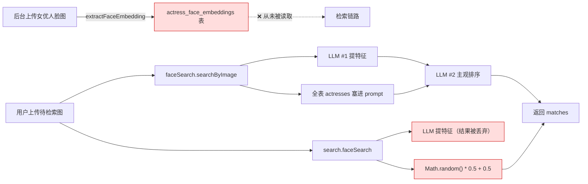
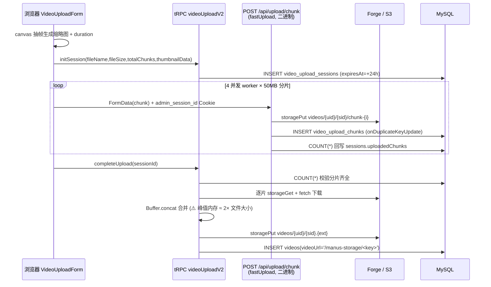
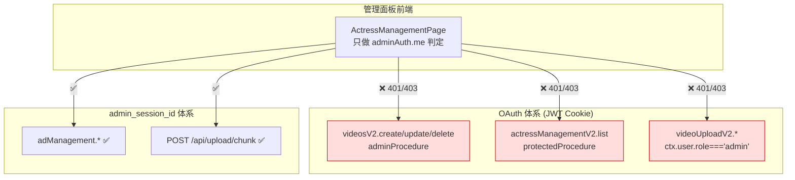
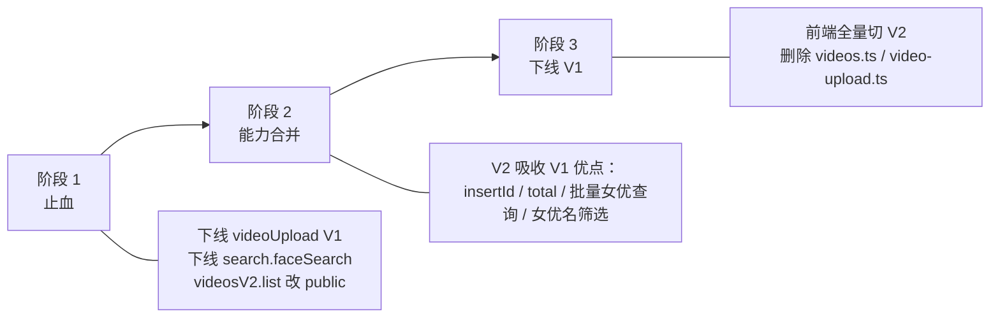
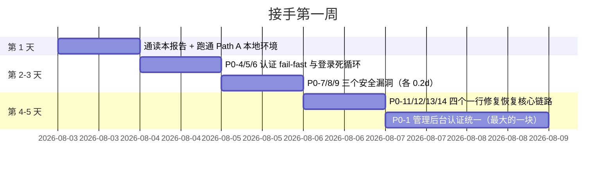

# OpenAdult 开发进度报告

> **快照日期：2026-08-01**
> 本报告由 4 个独立分析 agent（backend / frontend / datamodel / deploy）对 `~27,000` 行 TypeScript 全量扫描后汇总，所有结论均可回溯到具体的 `file:line`。
> 读者假设：**一名刚接手这个仓库的工程师**。目标是让你在 30 分钟内知道「哪些能用、哪些是壳、哪些会炸」。

---

## 目录

1. [总体完成度评估](#1-总体完成度评估)
2. [功能矩阵大表](#2-功能矩阵大表)
3. [子系统分节详解](#3-子系统分节详解)
4. [V1 / V2 双版本路由现状](#4-v1--v2-双版本路由现状)
5. [测试覆盖现状](#5-测试覆盖现状)
6. [代码观察与技术债清单](#6-代码观察与技术债清单)
7. [待办事项 Roadmap（P0 / P1 / P2）](#7-待办事项-roadmap)

---

## 1. 总体完成度评估

### 1.1 两个不同的百分比

必须区分两个概念，它们差距很大：

| 指标 | 数值 | 含义 |
|------|------|------|
| **功能面完成度** | **≈ 68%** | 按「功能点是否写了代码、代码是否跑得通」加权统计 |
| **生产就绪度** | **≈ 40%** | 按「今天部署上线能否正常服务用户」评估 |

### 1.2 功能面完成度的估算依据

四个 agent 共产出 **133 条 completionStatus 记录**，按状态分布：

| 状态 | 数量 | 占比 | 计分权重 | 得分 |
|------|-----:|-----:|---------:|-----:|
| ✅ complete（完成且接线） | 65 | 48.9% | 1.00 | 65.0 |
| 🟡 partial（可用但有缺陷/半接线） | 42 | 31.6% | 0.55 | 23.1 |
| 🟠 stub（只有骨架/空实现） | 14 | 10.5% | 0.20 | 2.8 |
| ❌ missing（表/字段/接口不存在或零调用） | 12 | 9.0% | 0.00 | 0.0 |
| **合计** | **133** | 100% | — | **90.9** |

> **90.9 / 133 = 68.3%**

权重取值说明：`partial` 取 0.55 而非 0.5，是因为绝大多数 partial 项已经能跑通主流程（缺的是分页、事务、边界处理）；`stub` 取 0.2 是因为函数签名、类型、调用点都已存在，只差实现体。

按子系统拆分：

| 子系统 | 记录数 | ✅ | 🟡 | 🟠 | ❌ | 加权完成度 |
|--------|-------:|---:|---:|---:|---:|-----------:|
| 后端（server/） | 37 | 15 | 12 | 5 | 5 | 63.8% |
| 前端（client/） | 34 | 17 | 12 | 3 | 2 | 71.8% |
| 数据模型（drizzle/ + db.ts + storage.ts） | 29 | 14 | 9 | 4 | 2 | 68.3% |
| 部署运维（deploy/ + scripts/） | 33 | 19 | 9 | 2 | 3 | 70.9% |

### 1.3 为什么生产就绪度只有 40%

功能写了 ≠ 能上线。以下 **6 条断链**每一条都能单独让核心业务归零：

| # | 断链 | 影响 | 证据 |
|---|------|------|------|
| 1 | **管理后台认证断裂** | 管理面板页面只做 admin 密码登录，但它调用的 `videosV2.*` / `actressManagementV2.*` / `videoUploadV2.*` 全部依赖 OAuth 的 `role='admin'`。除非管理员同时以 OAuth admin 身份登录，**整个后台的视频/女优管理与上传全部 401/403** | `client/src/pages/ActressManagementPage.tsx` vs `server/routers/videos-v2.ts:71`、`server/routers/actress-management-v2.ts:142` |
| 2 | **首页对匿名用户空白** | `videosV2.list` 是 `protectedProcedure`，首页六个分类查询全部 `enabled: isAuthenticated`，未登录访客看到空首页 | `server/routers/videos-v2.ts:161` |
| 3 | **HLS 播放必然 404** | 前端把服务端返回的 **m3u8 文本内容**当成 URL 喂给 `hls.loadSource()` | `client/src/components/VideoPlayer.tsx:207,228` |
| 4 | **SSAI 广告链路四处断开** | OpenResty 配置挂载点错位 + `resty.http` 未安装 + `adManagement.getAdsForVideo` / `recordImpression` 后端不存在 | `deploy/docker/docker-compose.yml:102`、`deploy/openresty/lua/ad_stitcher.lua:8,40` |
| 5 | **转码流水线无生产者** | transcoder 监听 `/data/uploads`，但该卷未挂给 app，且 `server/storage.ts` 走 Forge 代理不落本地磁盘 | `deploy/ffmpeg/transcode_watcher.sh:8,35` |
| 6 | **核心卖点是假的** | 「女优相似度检索」的相似度是 `Math.random()`，`actress_face_embeddings` 表只写不读 | `server/search.ts:165` |

另外整套部署栈 **从未做过运行时验证**（`DEPLOY_FIXES.md` 与 `LOCAL_DEV.md` 明确声明作者机器无 Docker），监控栈 5 个 scrape target 无一可用。

### 1.4 一句话总结

> 这是一个**广度极高、深度不均**的项目。骨架（tRPC 全链路类型、Drizzle schema、Docker 编排、部署文档）质量相当好；但大量功能停在「demo 能跑」的阶段，且前后端权限模型存在系统性错配。**接手后的第一周应该花在修断链，而不是加功能。**

---

## 2. 功能矩阵大表

图例：✅ 完成 ｜ 🟡 部分 ｜ 🟠 仅骨架 ｜ ❌ 缺失

### 2.1 框架与认证

| 模块 | 功能 | 状态 | 证据 | 备注 |
|------|------|:----:|------|------|
| 框架 | tRPC 初始化 + 三级权限中间件 | ✅ | `server/_core/trpc.ts:50,58,91,106` | `public` / `protected` / `admin` 三档 |
| 框架 | 请求上下文构造（认证失败静默降级） | ✅ | `server/_core/context.ts` | catch 吞掉全部异常，无日志 |
| 框架 | 服务器入口与路由挂载顺序 | ✅ | `server/_core/index.ts:112,124,126,130,136` | 端口自动避让见风险清单 |
| 认证 | Manus OAuth 回调 + JWT Cookie 签发 | ✅ | `server/_core/oauth.ts` | 1 年期 session |
| 认证 | 用户自动回源同步 + lastSignedIn 刷新 | ✅ | `server/_core/sdk.ts` | 每请求一次写库，写热点 |
| 认证 | `auth.me` / `auth.logout` | ✅ | `server/routers.ts:99` | |
| 认证 | 管理员独立密码认证（me/login/logout/changeCredentials） | 🟡 | `server/routers/admin-auth.ts:193,224,277,309` | 全部 `sql.raw` 拼接；默认凭据 admin/admin |
| 认证 | `admin_credentials` 表定义 | 🟡 | `server/routers/admin-auth.ts` 运行时 `CREATE TABLE IF NOT EXISTS` | 不在 schema、不在迁移 |
| 认证 | HttpError → HTTP 状态码映射 | ❌ | `shared/_core/errors.ts:51,67-73` | `statusCode` 全仓无读取方，403 退化成 500 |
| 系统 | `system.health` / `system.notifyOwner` | ✅ | `server/_core/systemRouter.ts` | |

### 2.2 视频管理

| 模块 | 功能 | 状态 | 证据 | 备注 |
|------|------|:----:|------|------|
| videos V1 | `list` / `getById` / `getCategories` | 🟡 | `server/routers/videos.ts:74,274,336` | 全表拉取 + JS 内存分页 |
| videos V1 | `create` / `update` / `delete` | 🟡 | `server/routers/videos.ts:375,469,552` | `protectedProcedure` + 内联 role 判断 |
| videos V1 | `getActresses`（下拉框数据源） | 🟡 | `server/routers/videos.ts:606` | public + 全表无裁剪，数据泄露面 |
| videos V2 | `create` | 🟡 | `server/routers/videos-v2.ts:71` | 按 title 回查自增 ID（竞态）；封面硬传 `videoId=0` |
| videos V2 | `list` | 🟡 | `server/routers/videos-v2.ts:161` | `protectedProcedure`（首页因此对游客空白）；女优 N+1 |
| videos V2 | `getById` / `update` / `delete` / `getCategories` | 🟡 | `server/routers/videos-v2.ts:248,306,410,463` | update 只改女优关联时必 500 |
| 数据 | `videos` 表 CRUD 接线 | ✅ | `drizzle/schema.ts:134` | |
| 数据 | `videos.views` 播放量自增 | 🟠 | `drizzle/schema.ts:134` 定义，全仓无 UPDATE | 「热门排序」等价按 id 排序 |
| 数据 | `videos.storageKey`（real 模式 CDN 路径依赖） | ❌ | `server/_core/hlsRoutes.ts:556` 用 `(videoData as any).storageKey` | 表里根本没这列 |
| 数据 | `video_actresses` 关联表 | ✅ | `drizzle/schema.ts:207` | 缺 (videoId,actressId) 唯一约束 |
| 前端 | `/videos` 列表页 V1（筛选/排序/分页） | ✅ | `client/src/App.tsx:75` | 唯一注册路由的列表页 |
| 前端 | VideosPageV2（作为后台 gallery 面板） | 🟡 | `client/src/pages/VideosPageV2.tsx:62,101` | 搜索框未接线；整页刷新跳转 |
| 前端 | 视频详情页 `/video/:id` | 🟡 | `client/src/App.tsx:76` | 收藏按钮是纯 UI |
| 前端 | VideoCard 懒加载 + hover 预览 | ✅ | `client/src/components/VideoCard.tsx` | |
| 前端 | 后台视频元数据管理 UI | 🟡 | `client/src/components/VideoManagementUI.tsx` | 分类硬编码 4 项；`limit:100` 无分页 |
| 前端 | 视频-女优关联组件 | ❌ | `client/src/components/VideoActressLinker.tsx` | 全项目零引用；且保存会清空已有关联 |

### 2.3 女优管理与人脸检索

| 模块 | 功能 | 状态 | 证据 | 备注 |
|------|------|:----:|------|------|
| actress V1 | `uploadActressFaceImage`（LLM 提 14 维伪 embedding） | 🟡 | `server/routers/actressManagement.ts:72` | **publicProcedure，无任何鉴权** |
| actress V1 | `getActressesWithEmbeddings` / `getActressById` / `delete` | 🟡 | `server/routers/actressManagement.ts:185,244,289` | 权限方向反了（读要登录、写公开） |
| actress V2 | `create` / `update` / `delete`（adminProcedure） | 🟡 | `server/routers/actress-management-v2.ts:70,220,299` | create 按 name 回查 ID |
| actress V2 | `list` / `getById` / `searchByName`（protectedProcedure） | 🟡 | `server/routers/actress-management-v2.ts:142,182,374` | list 无 ORDER BY，分页不稳定 |
| 数据 | `actresses` 表 CRUD | ✅ | `drizzle/schema.ts:172` | |
| 数据 | `actresses.videoCount` 维护 | 🟠 | `drizzle/schema.ts:172` 定义，只读不写 | `actresses.search` 已改实时 COUNT 兜底 |
| 数据 | `actresses.faceEmbedding` 遗留列 | ❌ | `drizzle/schema.ts:172` | 死列，实际数据在独立表 |
| 数据 | `actress_face_embeddings` 表 | 🟡 | `drizzle/schema.ts:467` | **只写不读**：检索侧从不查询它 |
| 检索 | `faceSearch.searchByImage`（两次 LLM） | 🟡 | `server/routers/faceSearch.ts:76` | 不读 embedding 表；`threshold` 入参无效 |
| 检索 | `faceSearch.searchByName` | 🟡 | `server/routers/faceSearch.ts:301` | 全表 JS 过滤；中文名命中永远 0.5 分 |
| 检索 | `faceSearch.getHistory` | 🟡 | `server/routers/faceSearch.ts:460` | **public + userId 来自 input，可越权读他人历史** |
| 检索 | `search.faceSearch` 相似度计算 | 🟠 | `server/search.ts:63,165` | `Math.random() * 0.5 + 0.5` |
| 检索 | 余弦相似度工具 `findSimilarActresses` | ❌ | `server/_core/faceRecognition.ts:251,293` | 已实现但全仓零调用 |
| 数据 | `face_search_history` 表 | 🟡 | `drizzle/schema.ts:497` | 写入静默失败（schema 漂移）；前端不读 |
| 前端 | `/face-search` 页面（名称 + 图片双模式） | ✅ | `client/src/App.tsx:73` | 阈值 0.3，与 ChatPage 的 0.7 不一致 |
| 前端 | 后台女优 CRUD + 人脸自动注册 | ✅ | `client/src/components/ActressManagementUI.tsx` | `limit:100` 无分页 |

### 2.4 AI 聊天 / 推荐 / 搜索

| 模块 | 功能 | 状态 | 证据 | 备注 |
|------|------|:----:|------|------|
| LLM | `invokeLLM()` 统一封装 | ✅ | `server/_core/llm.ts:467` | `max_tokens` 硬编码覆盖入参；无超时 |
| 聊天 | `chat.sendMessage` / `chat.getHistory` | ✅ | `server/routers.ts:136` | 历史顺序反了 + 末条消息重复 |
| 聊天 | RAG 上下文注入（偏好 + 相关视频 + 相关女优） | ✅ | `server/db.ts:826,987,1105` | 每轮 4~5 次串行查询，无缓存 |
| 聊天 | 提示词模板 | ✅ | `server/llm-prompts.ts` | `buildActressProfilePrompt` / `USER_QUERY_EXAMPLES` 零引用 |
| 推荐 | `recommendations.generate`（LLM 文案 + 本地打分） | 🟡 | `server/routers.ts:375,469` | 候选集固定前 100 条无 ORDER BY |
| 推荐 | `calculateRecommendationScore` 加权公式 | 🟡 | `server/db.ts:783`；`server/routers.ts:524` | `actressMatch` 恒传 0；avoided 惩罚被 `Math.max(x,0)` 抹平 |
| 推荐 | `recommendations` 表读写 | ✅ | `server/db.ts:608,645,703` | 先 DELETE 再 20 次单行 INSERT，无事务 |
| 偏好 | `userPreferences.get` / `update` | 🟡 | `server/routers.ts:700` | **前端零调用**，表永远为空 |
| 偏好 | `analyzeUserPreferences` 聚合 | ✅ | `server/db.ts:826` | |
| 搜索 | `searchHistory` list/save/delete/clearAll | ✅ | `server/routers.ts:742` | delete 有归属校验（两步式，TOCTOU） |
| 搜索 | `search.imageSearch`（以图搜片） | 🟡 | `server/search.ts:268` | 只搜库里最早入库的 100 条 |
| 搜索 | `actresses.search` | 🟡 | `server/routers.ts:594` | public + 全表拉取，廉价 DoS 面 |
| 搜索 | `db.searchVideos` 文本搜索助手 | 🟠 | `server/db.ts:227` | 完全忽略 `query` 参数；零调用 |
| 观看 | `db.trackWatchBehavior` 埋点 | ❌ | `server/db.ts:729,736,746` | 零调用；且 `&&` 拼 WHERE 导致跨用户覆盖 |
| 前端 | ChatPage（发消息 + 历史 + 卡片） | 🟡 | `client/src/App.tsx:71` | 历史 refetch 会清掉本地检索结果消息 |
| 前端 | 聊天页图片能力（顔認識 / 画像検索 / 分析） | ✅ | `client/src/pages/ChatPage.tsx` | 无 `reader.onerror`，读取失败会永久 loading |
| 前端 | 综合搜索结果页 `/search` | 🟡 | `client/src/App.tsx:77` | 纯客户端过滤，硬上限 100 条 |
| 前端 | 首页搜索框 + 搜索历史 + 6 分类流 | 🟡 | `client/src/pages/Home.tsx` | 「ランダム」与「おすすめ」入参相同，内容永远一样 |

### 2.5 用户功能（收藏 / 续播 / 仪表盘）

| 模块 | 功能 | 状态 | 证据 | 备注 |
|------|------|:----:|------|------|
| 收藏 | `favorites.add` / `remove` / `list` | 🟡 | `server/routers.ts:276`；`server/db.ts:392,412,436` | 后端完整，**前端无任何 add/remove 触发点** |
| 收藏 | `favorites` 表 | 🟡 | `drizzle/schema.ts:289` | 缺 (userId,videoId) 唯一约束，可重复插入 |
| 续播 | `resumePlayback.update` / `get` | ✅ | `server/routers.ts:330`；`server/db.ts:476,516` | |
| 续播 | `resume_playback` 表 | ✅ | `drizzle/schema.ts:316` | 缺唯一约束，select-then-insert 竞态 |
| 前端 | 播放器续播读写 | 🟡 | `client/src/components/VideoPlayer.tsx` | 5 秒 interval 因依赖数组问题几乎不触发 |
| 前端 | Dashboard 聊天历史 Tab | ✅ | `client/src/pages/Dashboard.tsx` | |
| 前端 | Dashboard 收藏 Tab | 🟡 | `client/src/pages/Dashboard.tsx:289` | 只渲染 `Video #{id}`，不可点击 |
| 前端 | Dashboard 搜索历史 Tab | 🟠 | `client/src/pages/Dashboard.tsx:59` | `const searchHistory: unknown[] = []` 死 UI |

### 2.6 文件上传（通用 / 视频分片）

| 模块 | 功能 | 状态 | 证据 | 备注 |
|------|------|:----:|------|------|
| 通用上传 | `fileUpload.uploadFile`（base64） | 🟡 | `server/file-upload.ts:72` | 无大小上限；filename 未清洗可穿越目录 |
| 通用上传 | `analyzeImage` / `analyzeVideo` / `analyzePDF` | 🟡 | `server/file-upload.ts:158,227,303` | 任意 URL 交给 LLM 拉取（SSRF 面）；`frameCount` 未用 |
| 通用上传 | `getUploadHistory` / `deleteUpload` | 🟡 | `server/file-upload.ts:367,420` | `total` 是当前页条数；删除不清 S3；前端零调用 |
| 数据 | `user_uploads` 表 | 🟡 | `drizzle/schema.ts:404` | `expiresAt` 从不写入也无清理任务 |
| 上传 V1 | `initSession`/`uploadChunk`/`completeUpload`/`cancel`/`getProgress` | 🟡 | `server/routers/video-upload.ts:114,194,266,445,481` | 会话存进程内 Map；thumbnail/duration 被丢弃；前端已弃用 |
| 上传 V2 | 6 个 procedure 全生命周期 | ✅ | `server/routers/video-upload-v2.ts:95,208,332,636,718,781` | 会话落库、支持断点续传 |
| 上传 V2 | 分片下载失败处理 | 🟡 | `server/routers/video-upload-v2.ts:332` | 失败只 console.error，会产出损坏视频并标记成功 |
| 上传 V2 | `getMissingChunks` 断点续传 | 🟡 | `server/routers/video-upload-v2.ts:781` | 依赖 `uploadedChunkIds`，而生产通道从不写该列 |
| 快传 | `POST /api/upload/chunk` + `GET /api/upload/status/:id` | ✅ | `server/_core/fastUpload.ts:157,282` | multer 内存 100MB/片；admin cookie 鉴权 |
| 数据 | `video_upload_sessions` / `video_upload_chunks` | ✅ | `drizzle/schema.ts:549,589` | 全库唯一物理外键；缺 (sessionId,chunkIndex) 唯一约束 |
| 存储 | `storagePut` / `storageGet`（Forge 代理） | ✅ | `server/storage.ts:181,221` | `storageGet` 未检查 `response.ok` |
| 存储 | `/manus-storage/*` 代理（Range 透传） | ✅ | `server/_core/storageProxy.ts:98,99` | **无任何鉴权**，知道 key 即可拉取 |
| 前端 | 分片上传表单（50MB × 4 并发 + 重试） | ✅ | `client/src/components/VideoUploadForm.tsx` | 单例 AbortController，多文件取消串台 |
| 前端 | 浏览器端抽帧生成缩略图 | ✅ | `client/src/components/VideoUploadForm.tsx` | 设手动封面时 duration 丢失 → 该视频失去 SSAI |
| 前端 | 通用文件上传框 FileUploadBox | 🟡 | `client/src/components/FileUploadBox.tsx` | 进度条是永不生效的死逻辑；PDF 被误当图片 |

### 2.7 HLS 流媒体

| 模块 | 功能 | 状态 | 证据 | 备注 |
|------|------|:----:|------|------|
| HLS | `hlsStream.getManifest`（含 SSAI 拼接） | 🟡 | `server/routers/hls-stream.ts:316` | duration<=0 时降级为直连 MP4 |
| HLS | `hlsStream.getAdInfo` / `getVideoAds` | 🟡 | `server/routers/hls-stream.ts:473,520` | 与 `getAdsForVideo` 逻辑重复且行为不一致 |
| HLS | Express 路由 manifest/segment/ad-segment | ✅ | `server/_core/hlsRoutes.ts:432,556` | pseudo 模式的分片端点忽略 start/dur |
| HLS | AES-128 密钥服务（发放 + 注册） | 🟠 | `server/_core/hlsRoutes.ts:88,94,104,152,154` | 密钥存 `process.env`；Referer 白名单形同虚设；缺失时返回全零 key |
| HLS | `encryption_keys` 表 | ❌ | 两处 TODO 指向该表，schema 与迁移中都不存在 | |
| 流媒体 | multi-chunk 视频 Range 重组 | ✅ | `server/_core/videoStream.ts:109,331` | end 未 clamp；分片失败会截断响应但仍 200 |
| 缩略图 | `extractVideoThumbnail`（首帧抽取） | 🟠 | `server/_core/videoThumbnail.ts:48` | 直接 `return null` |
| 缩略图 | `generatePlaceholderThumbnail` / `createDataURIThumbnail` | 🟡 | `server/_core/videoThumbnail.ts:84,113` | `?title=` 参数接收端不读；SVG 未转义 title |
| 前端 | hls.js 接线 + 画质切换 + 错误恢复 | 🟡 | `client/src/components/VideoPlayer.tsx:207,228` | **把 m3u8 文本当 URL 加载，必然 404** |
| 前端 | 播放器控制条（拖拽/缓冲/倍速/全屏） | ✅ | `client/src/components/VideoPlayer.tsx` | 渲染期读 `document.fullscreenElement` |

### 2.8 广告系统

| 模块 | 功能 | 状态 | 证据 | 备注 |
|------|------|:----:|------|------|
| 后端 | `adManagement` 11 个 procedure（素材/投放/分析） | ✅ | `server/routers/ad-management.ts:117,152,199,251,280,331,371,399,447,478,514` | 全声明 public + 手工 `verifyAdminFromCtx` |
| 后端 | `hlsStream.trackAdEvent` 埋点 | 🟡 | `server/routers/hls-stream.ts:403` | public、无限流、无签名，计费口径可伪造 |
| 后端 | 广告 priority 排序 | 🟠 | `server/routers/hls-stream.ts:280,285,286,291` | 注释说排序，代码只有 `slice(0,1)` |
| 数据 | `ads` / `ad_placements` 表 | ✅ | `drizzle/schema.ts:627,667` | |
| 数据 | `ad_impressions` 明细表 | 🟡 | `drizzle/schema.ts:701` | **只写不读**，分析页读的是 ads 聚合列 |
| CDN | OpenResty Lua SSAI 拼接（master + variant） | 🟡 | `deploy/openresty/lua/ad_stitcher.lua:8,40`、`variant_stitcher.lua:8,54` | `resty.http` 未安装；主配置挂载点错位 |
| CDN | `adManagement.getAdsForVideo`（Lua 依赖） | ❌ | Lua 调用该路径，`server/routers/ad-management.ts` 中不存在 | 语义最近的是 `hlsStream.getVideoAds`（query 非 mutation） |
| CDN | `adManagement.recordImpression`（Lua 依赖） | ❌ | `deploy/openresty/openresty-cdn.conf:140` | 后端不存在 |
| 转码 | 广告素材 4 档转码脚本 | ✅ | `deploy/ffmpeg/transcode_ad.sh` | 与正片同参数、不加密 |
| 前端 | 广告后台 UI（素材/投放/分析三 Tab） | ✅ | `client/src/components/AdManagementUI.tsx` | update 成功提示弹两次；4 个 mutation 无 onError |
| 前端 | direct/overlay 模式广告（pre/mid-roll + 埋点） | 🟡 | `client/src/components/VideoPlayer.tsx:329,330` | **无 post-roll 分支**；且 duration>0 时永远走 HLS 分支不可达 |
| 前端 | HLS/SSAI 模式广告（CUE 标记识别） | 🟡 | `client/src/components/VideoPlayer.tsx` | 只切 UI 状态，无倒计时、无 CTA、无埋点 |

### 2.9 多语言与主题

| 模块 | 功能 | 状态 | 证据 | 备注 |
|------|------|:----:|------|------|
| i18n | `LanguageContext`（ja/zh/en） | 🟠 | `client/src/contexts/LanguageContext.tsx:57,86,87` | **首帧不挂 Provider，`/dashboard` 首帧即崩** |
| i18n | `translations.ts` 三语词典 | 🟠 | `client/src/locales/translations.ts` | `getTranslation` 全项目零引用 |
| i18n | `LanguageSwitcher` 组件 | ❌ | `client/src/components/LanguageSwitcher.tsx` | 未被任何页面挂载，UI 上无切换入口 |
| i18n | `language.set` 服务端持久化 | 🟠 | `server/routers.ts:854` | handler 不写库直接 `return { success: true }` |
| i18n | `users.language` 列写入路径 | 🟠 | `drizzle/schema.ts:94`；被 `server/routers.ts:160` 读取 | 只读不写 |
| 主题 | `ThemeContext` 暗/亮切换 | 🟠 | `client/src/contexts/ThemeContext.tsx` | `App.tsx` 未传 `switchable`，`toggleTheme` 恒 undefined |
| 主题 | 404 页配色 | 🟡 | `client/src/pages/NotFound.tsx` | 全站唯一浅色页，与暗色主题冲突 |

### 2.10 数据库与迁移

| 模块 | 功能 | 状态 | 证据 | 备注 |
|------|------|:----:|------|------|
| DB | `getDb()` 惰性单例 + 空值降级 | ✅ | `server/db.ts:71` | 无池化配置、无重试退避、失败只 warn |
| DB | `users` 表接线（OAuth upsert） | ✅ | `server/db.ts:101,184` | |
| DB | `chat_messages` / `search_history` | ✅ | `drizzle/schema.ts:236,265` | |
| DB | 迁移体系 0000~0003 + journal | ✅ | `drizzle/meta/_journal.json` | 18 张表 |
| DB | `drizzle/relations.ts` 关系定义 | ❌ | `drizzle/relations.ts` | 空文件，relational query API 不可用 |
| DB | schema.ts 与最新快照一致性 | 🟡 | `drizzle/schema.ts:497` | `face_search_history.uploadedImageUrl` 可空但无 0004 迁移 |
| DB | 二级索引 | ❌ | 18 张表除 PK 外只有 2 个 UNIQUE + 1 个 FK | 所有 userId/videoId 过滤全表扫描 |
| DB | `db.ts` 作为唯一数据访问层（CLAUDE.md 约定） | 🟡 | 13 个文件直接 import `drizzle/schema` 自写查询 | 约定未落实 |
| DB | 孤儿迁移文件 | 🟡 | `drizzle/0000_yielding_pete_wisdom.sql` | 与 `0000_orange_toro.sql` 内容相同，未登记 |
| 类型 | `shared/types.ts` barrel | ❌ | `shared/types.ts` | 全仓零引用 |

### 2.11 部署运维

| 模块 | 功能 | 状态 | 证据 | 备注 |
|------|------|:----:|------|------|
| Docker | 生产编排 9 service / 10 卷 | ✅ | `deploy/docker/docker-compose.yml:13,59` | |
| Docker | 一次性 `migrate` 服务 | ✅ | `deploy/docker/docker-compose.yml:13,20` | app `depends_on: service_completed_successfully` |
| Docker | `Dockerfile.app` 三阶段 + 非 root | ✅ | `deploy/docker/Dockerfile.app` | 已 COPY `drizzle.config.ts` |
| Docker | 本地自包含栈 `docker-compose.local.yml` | 🟡 | `deploy/docker/docker-compose.local.yml` | **未做运行时验证**；硬编码 JWT_SECRET |
| Nginx | 生产主配置（SSL/CF 白名单/限流/SPA） | ✅ | `deploy/nginx/openadult-main.conf` | upstream 已改 `app:3000` |
| Nginx | Cloudflare IP 白名单表 | ✅ | `deploy/nginx/cloudflare-ips.conf` | 快照，无更新 cron |
| Nginx | 本地 HTTP-only 反代 | ✅ | `deploy/nginx/openadult-local.conf` | |
| 反爬 | JS Challenge（conf + challenge.html） | 🟠 | `deploy/nginx/js-challenge.conf`；`deploy/anti-block/challenge.html` | 主 conf 从未 include，且启用会造成 302 死循环 |
| CDN | OpenResty 主配置装载 | 🟡 | `deploy/docker/docker-compose.yml:102` | 挂到 `/etc/openresty/nginx.conf`，镜像实际读 `/usr/local/openresty/nginx/conf/nginx.conf` |
| 转码 | `transcode_hls.sh` 4 档 + AES-128 | ✅ | `deploy/ffmpeg/transcode_hls.sh` | |
| 转码 | `transcode_watcher.sh` inotify 触发 | 🟡 | `deploy/ffmpeg/transcode_watcher.sh:8,35` | 监听目录无生产者 |
| 转码 | `hlsStream.updateTranscodeStatus` 回调 | ❌ | `deploy/ffmpeg/transcode_watcher.sh:24` | 后端不存在，恒 404（被 `>/dev/null` 吞掉） |
| 反封锁 | 域名轮换（探测 / CF DNS / Telegram） | 🟡 | `deploy/anti-block/domain_rotator.py:57-61` | 探测节点是占位域名；配置回写端点不存在 |
| 反封锁 | `/api/system/update-config` 端点 | ❌ | `server/_core/systemRouter.ts` 只有 health/notifyOwner | 换域名后前端配置不回写 |
| 监控 | Prometheus + Grafana | 🟠 | `deploy/monitoring/prometheus.yml:10,17,22,27,32` | 5 个 target 全 down，Grafana 无 provisioning |
| 缓存 | Redis 服务 | 🟡 | `deploy/docker/docker-compose.yml` | 容器在跑，`package.json` 无 redis 客户端，应用零使用 |
| 脚本 | `deploy.sh` 一键部署 | 🟡 | `deploy/scripts/deploy.sh` | 证书写宿主路径，compose 挂的是命名卷，443 起不来 |
| 脚本 | Path A 本地开发（localdb/dev-up/dev-down） | ✅ | `scripts/localdb.sh`、`scripts/dev-up.sh`、`scripts/dev-down.sh` | 唯一实测通过的路径 |
| 构建 | `pnpm build`（vite + esbuild） | ✅ | `package.json` | |
| 构建 | 生产静态资源投递 | 🟡 | `deploy/docker/docker-compose.yml:86` + `.dockerignore` 排除 dist | 必须先在宿主 `pnpm build` |
| 文档 | README / 中文教程 / env 模板 / LOCAL_DEV / DEPLOY_FIXES | ✅ | `deploy/docs/DEPLOY_TUTORIAL_CN.md` 等 | 质量很高 |

### 2.12 未接线的模板残留

| 模块 | 功能 | 状态 | 证据 | 备注 |
|------|------|:----:|------|------|
| _core | `heartbeat` / `dataApi` / `voiceTranscription` | ❌ | `server/_core/heartbeat.ts` 等 | 全仓零 import |
| _core | `map.ts` | ❌ | `server/_core/map.ts` | 成人视频平台无地理需求，~320 行死代码 |
| _core | `imageGeneration.ts` | 🟡 | 仅被 `server/storage.ts` 提及 | 无业务调用点 |
| 前端 | `ComponentShowcase.tsx`（1437 行） | ❌ | `client/src/App.tsx:70-79` 无对应路由 | 阻止 shadcn 组件 tree-shaking |
| 前端 | `AIChatBox` / `Map` / `ManusDialog` / `useComposition` | ❌ | 均无生产引用 | 约 2000+ 行死代码 |

---

## 3. 子系统分节详解

### 3.1 视频管理

**已做**
- V1（`server/routers/videos.ts`）7 个 procedure，`list` 支持 category / actressName / minRating / sortBy 四维筛选，`create` 正确使用 `insertId`（`server/routers/videos.ts:421`）。
- V2（`server/routers/videos-v2.ts`）6 个 procedure，SQL 层真分页（LIMIT/OFFSET），写操作用 `adminProcedure`。
- 前端 `/videos` 页面（V1）功能完整：筛选条、清除、完整页码分页。
- 后台 `VideoManagementUI` 支持元数据 CRUD + 女优多选。

**没做**
- V1 的 `list` 是**全表拉取后 JS 内存分页**（`server/routers/videos.ts:74`），数据量增长后是首页最先崩的地方。
- V2 的 `list` 对每条视频单独查女优（N+1，`server/routers/videos-v2.ts:161`），`limit` 上限 100 意味着单请求可占 100 条 DB 连接。
- 三个文件的 `update` 在**只改女优关联**时必定 500：Drizzle 的 `mapUpdateSet()` 剔除 undefined 后 entries 为空会 `throw new Error("No values to set")`。
- V2 `create` 用「按 title 倒序取最新一条」回查自增 ID（`server/routers/videos-v2.ts:114`），同名并发插入会把女优关联挂到错误的视频上。
- `videos.views` 永远是 0，`getCategories` 用全表 SELECT 后 JS 去重而非 `SELECT DISTINCT`。
- 删除视频只清 `video_actresses`，不清 `favorites` / `resume_playback` / `recommendations`，也不回收 S3 对象。
- 全线无事务：`create` 中视频已建但关联未写会留下孤立视频。

**下一步**
1. 给 V1/V2 的 `update` 加 `if (Object.keys(updateData).length > 0)` 守卫（**P0**，5 分钟修）。
2. V2 `create` 改用 `(result as any).insertId`，对齐 V1 写法（**P0**）。
3. 把 V2 的 N+1 改成 V1 的「一次 `inArray` 批量取回 + 内存分组」（**P1**）。
4. V1 的女优筛选下推为 JOIN，配合 SQL LIMIT/OFFSET + 单独 COUNT（**P1**）。
5. 用 `db.transaction()` 包裹 create/update/delete（**P1**）。

---

### 3.2 女优管理

**已做**
- V2 完整 CRUD（`server/routers/actress-management-v2.ts:70,142,182,220,299,374`），前端 `ActressManagementUI` 支持图片上传 + 保存后自动注册人脸特征。
- 删除女优时会级联清理 `actress_face_embeddings`。

**没做**
- `uploadActressFaceImage` 是 **`publicProcedure` 且 handler 内无任何鉴权**（`server/routers/actressManagement.ts:72`）。任意匿名请求即可覆写任意女优的人脸底库，并触发一次 LLM 视觉调用 —— 数据污染 + 成本放大双重风险。同文件的 `deleteActressFaceEmbedding` 反而用了 `protectedProcedure`，策略自相矛盾。
- 校验顺序颠倒：先调 LLM 再校验 `actressId` 是否存在，传入不存在的 ID 会白烧一次 LLM。
- `list` 无 ORDER BY 但有 LIMIT/OFFSET，翻页结果不稳定。
- `searchByName` 拉全表 JS 过滤，且构造的 `searchQuery` 变量未使用。
- `create` 按 name 回查 ID，同名并发会返回错误的 actressId。
- `actresses.videoCount` 从不维护。
- 删除女优不清理 `user_preferences.preferredActresses` 与 `face_search_history` 中的引用。
- 前端 `limit:100` 无分页，第 101 位之后完全不可见。

**下一步**
1. `uploadActressFaceImage` 改为 admin 鉴权（**P0**）。
2. 校验前置到 LLM 调用之前（**P1**，直接省钱）。
3. `actress_face_embeddings.actressId` 加唯一索引 + `ON DUPLICATE KEY UPDATE`（**P1**）。
4. `list` 加 `orderBy(desc(actresses.createdAt))`（**P1**）。
5. 后台加分页 + 服务端搜索（**P2**）。

---

### 3.3 人脸检索（核心卖点，当前最不可用）

**已做**
- `server/_core/faceRecognition.ts` 实现了完整的 LLM 伪 embedding 提取（14 维归一化）+ 余弦相似度 + `findSimilarActresses`。
- `actress_face_embeddings` 表已建、写入链路已通（后台保存女优时自动注册）。
- 前端 `/face-search` 页面完整：名称/图片双模式、相似度条、AI 分析字段展示。

**没做 —— 这是整个项目最严重的功能空洞**

| 问题 | 证据 |
|------|------|
| `search.faceSearch` 的相似度是随机数，LLM 提取的特征被完全丢弃 | `server/search.ts:63,165` |
| `faceSearch.searchByImage` 不读 embedding 表，改把全表女优文本塞进 prompt 让 LLM 主观排序 | `server/routers/faceSearch.ts:76` |
| `findSimilarActresses` / `calculateCosineSimilarity` / `parseEmbedding` 全仓零调用 | `server/_core/faceRecognition.ts:251,181,293` |
| 即使接上，`threshold=0.7` 也几乎不过滤 —— 14 个 [0,1] 分量的向量两两余弦相似度通常 >0.9 | `server/_core/faceRecognition.ts:251` |
| `input.threshold` 声明后从未使用，实际下限硬编码在 prompt 里 | `server/routers/faceSearch.ts:76` |
| `getHistory` 是 public 且 userId 来自 input，可越权读他人历史（含上传图 URL） | `server/routers/faceSearch.ts:460` |
| `searchByName` 打分只比 name/japaneseName，中文名命中永远 0.5 分 | `server/routers/faceSearch.ts:301` |
| 两个入口阈值不一致：FaceSearchPage 用 0.3，ChatPage 用 0.7 | `client/src/pages/FaceSearchPage.tsx`、`client/src/pages/ChatPage.tsx` |

**下一步**
1. **决策先行**：是把「LLM 主观排序」定为正式方案（那就删掉 embedding 表和 `faceRecognition.ts`），还是把向量匹配接上（**P0，架构决策**）。
2. 若选向量方案：`findSimilarActresses` 接入 `searchByImage`，用真实数据重新标定 threshold（**P0**）。
3. `getHistory` 改 `protectedProcedure` 并从 `ctx.user.id` 取 userId（**P0，安全**）。
4. 下线 `search.faceSearch` 或让前端统一只调 `faceSearch` 命名空间（**P1**）。
5. 阈值抽成共享常量（**P2**）。

---

### 3.4 AI 聊天推荐

**已做**
- 聊天走真 RAG：每轮先并发检索用户偏好 + 相关视频 + 相关女优，注入 system prompt（`server/db.ts:826,987,1105`；`server/llm-prompts.ts`），保证模型只在真实库存内推荐。
- 推荐采用「LLM 生成文案 + 本地确定性加权打分」混合模式（`server/routers.ts:469`），排序可解释、不随模型漂移。
- 「预计算 + 读缓存」：`generate` 落库、`list` 只读，读路径不受 LLM 延迟影响。
- 前端 ChatPage 支持文本 + 顔認識 + 画像検索 三种输入，Streamdown 渲染 Markdown。

**没做**
| 问题 | 证据 |
|------|------|
| LLM 上下文顺序反了 + 末条消息重复：`getChatHistory` 返回最新在前，`sendMessage` 未 reverse；用户消息已先落库又被追加一次 | `server/routers.ts:136`；`server/db.ts:317` |
| `avoidedCategories` 惩罚不生效：`categoryMatch = -0.5` 被 `Math.max(categoryMatch, 0)` 抹平 | `server/routers.ts:507,524` |
| `actressMatch` 硬编码传 0（权重 0.2），得分理论上限只有 0.8，`> 0.2` 阈值语义偏移 | `server/routers.ts:524` |
| 候选集固定 `limit(100)` 且无 ORDER BY，新视频永远进不了推荐池 | `server/routers.ts:469` |
| `getUserFavorites(userId, 10)` 取出后从未使用 | `server/routers.ts:471` |
| `user_preferences` 前端零调用，表永远为空 → `categoryMatch` 恒为 0 | `server/routers.ts:700` |
| `getRelevantVideosForChat` 的 `userId` 参数从未使用；LIKE 前置通配符无法走索引且未转义 `%` `_` | `server/db.ts:987` |
| 无事务：`clearUserRecommendations` 后写入失败会留下空推荐列表 | `server/routers.ts:463` |
| LLM 无超时控制 | `server/_core/llm.ts:467` |
| 前端历史 refetch 会整体覆盖 messages，清掉本地检索结果卡片 | `client/src/pages/ChatPage.tsx` |
| 消息 id 三套生成方式（`Date.now()` / `createdAt` / `messages.length`），易撞 React key | `client/src/pages/ChatPage.tsx` |

**下一步**
1. `sendMessage` 里 `history.reverse()` 并去掉重复的末条 user 消息（**P0**，直接影响对话质量）。
2. 去掉 `Math.max(categoryMatch, 0)`，让 avoided 惩罚生效（**P1**）。
3. 接上 `actressMatch`（用 `userFavorites` → `video_actresses` 算），或把权重重新归一化（**P1**）。
4. 候选集改为「近 N 天 + 高热度 + 随机采样」而非无序前 100（**P1**）。
5. 前端补 `user_preferences` 设置界面（**P1**，否则推荐永远退化）。
6. `analyzeUserPreferences` 加 Redis 短 TTL 缓存（Redis 容器已就绪但零使用）（**P2**）。

---

### 3.5 搜索

**已做**
- `searchHistory` 四个 procedure 完整，delete 有归属校验。
- `search.imageSearch` 走 LLM 打标签后匹配 `video.tags`。
- `actresses.search` 支持多字段模糊匹配 + 实时 COUNT 兜底 videoCount。

**没做**
- `search.imageSearch` 只在**最早入库的 100 条视频**里做子串匹配（`server/search.ts:268`），用户会认为搜索坏了。
- `db.searchVideos(query, limit)` 完全忽略 `query`（`server/db.ts:227`），是个会说谎的公开 API（当前零调用）。
- `actresses.search` 是 public + 全表拉取无 LIMIT（`server/routers.ts:594`），廉价 DoS 面。
- 前端 `/search` 页是**纯客户端过滤**：`videosQuery` 硬写 `limit:100`，关键词永远不发给后端（`client/src/pages/SearchResultsPage.tsx`）。
- `urlQuery` 用 `useMemo(..., [window.location.search])` —— 非响应式依赖，一次提交可能触发两次 refetch 并写两条搜索历史。
- 无请求竞态防护，慢请求后返回会覆盖快请求结果。
- 全站无全文索引，`videos` 表连 `category` 列都没有索引。

**下一步**
1. 给 `videosV2.list` 加 `query` 入参并下推到 SQL（**P0**，搜索是核心入口）。
2. `actresses.search` 加 LIMIT + 收紧权限（**P1**）。
3. 删除或实现 `db.searchVideos`（**P1**）。
4. 评估 MySQL FULLTEXT 索引或独立搜索服务（**P2**）。

---

### 3.6 上传（V1 / V2）

**架构现状**

**已做**
- V2 会话与分片元数据全部落库，支持断点续传与多实例部署。
- `completeUpload` 用 `COUNT(*)` 而非会话计数器做完整性校验（作者已意识到竞态问题）。
- 二进制通道刻意绕开 tRPC，避免 base64 的 33% 体积膨胀。
- 前端 50MB × 4 并发 + 每片 3 次退避重试 + 进度/速度/ETA。

**没做**
| 问题 | 证据 | 严重度 |
|------|------|:------:|
| 分片下载失败只 `console.error`，照常 `Buffer.concat` 并标记 completed → **产出损坏视频且提示成功** | `server/routers/video-upload-v2.ts:332` | 🔴 |
| 「支持 100GB」不成立：合并需 2× 文件大小的内存，必然 OOM | `server/routers/video-upload-v2.ts:332` | 🔴 |
| `uploadChunk` 对 `uploadedChunkIds` 做读-改-写，并发丢下标 | `server/routers/video-upload-v2.ts:208` | 🔴 |
| `getMissingChunks` 依赖 `uploadedChunkIds`，而生产通道（fastUpload）从不写该列 → 断点续传失效 | `server/routers/video-upload-v2.ts:781` | 🔴 |
| 会话归属从不校验，任一 admin 拿到 sessionId 即可操作他人会话 | `server/routers/video-upload-v2.ts:208,332,718` | 🟠 |
| `failed` 状态枚举全库从未被写入，异常会话永久卡在 `processing` | `drizzle/schema.ts:549` | 🟠 |
| 合并成功不删分片对象与 chunk 行，实际占用 2× 空间；`expiresAt` 无清理任务 | `server/routers/video-upload-v2.ts:332,718` | 🟠 |
| `sessionId` 用 `Math.random().toString(36).substr(2,9)`（已废弃 API + 非密码学安全） | `server/routers/video-upload-v2.ts:95` | 🟡 |
| V1 会话存进程内 Map，含全部分片 Buffer；`thumbnailData`/`duration` 收了但落库时被丢弃 | `server/routers/video-upload.ts:114,266` | 🟡 |
| V1 清理周期与过期阈值同为 1 小时 → **超过 1 小时的上传会被中途清掉** | `server/routers/video-upload.ts` | 🟡 |
| 前端单例 `AbortController`，多文件并发时取消一个会中断全部 | `client/src/components/VideoUploadForm.tsx` | 🟡 |
| 设手动封面时跳过抽帧 → `duration` 为 0 → 该视频永久失去 SSAI 能力 | `client/src/components/VideoUploadForm.tsx` | 🟡 |

**下一步**
1. `completeUpload` 分片下载失败必须抛错并置 `status='failed'`（**P0**）。
2. `getMissingChunks` 改为从 `video_upload_chunks` 表读（对齐 `getProgress`）（**P0**）。
3. `uploadChunk` 去掉 `uploadedChunkIds` 读-改-写，统一用 `COUNT(*)`（**P0**）。
4. 加会话归属校验（**P1**）。
5. 改用 S3 Multipart Upload（`UploadPart` + `CompleteMultipartUpload`），彻底不经服务端内存（**P1**，这是「100GB」的唯一正解）。
6. 下线 V1（前端已无调用点）（**P1**）。
7. 加过期会话与孤儿分片的清理定时任务（**P2**）。

---

### 3.7 HLS 流媒体

**已做**
- 双模式设计：`HLS_MODE=pseudo` 生成伪清单、片段 302 到 S3；`HLS_MODE=real` + `CDN_BASE_URL` 生成多码率 master playlist（`server/_core/hlsRoutes.ts:432,556`）。
- `/manus-storage/*` 支持 Range 透传，视频拖动可用（`server/_core/storageProxy.ts:99`）。
- multi-chunk 历史视频的流式重组（`server/_core/videoStream.ts:109`）。
- FFmpeg 4 档码率 + AES-128 转码脚本完整（`deploy/ffmpeg/transcode_hls.sh`）。

**没做**
| 问题 | 证据 |
|------|------|
| **前端把 m3u8 文本当 URL 加载**，hls.js 必然 404，随后 NETWORK_ERROR 分支还会反复 `startLoad()` 重试 | `client/src/components/VideoPlayer.tsx:207,228` vs 正确端点 `server/_core/hlsRoutes.ts:432` |
| AES 密钥存 `process.env`，重启即丢、多实例不共享 | `server/_core/hlsRoutes.ts:104,152,154` |
| Referer 白名单形同虚设：未配置时 `[""].some(o => referer.includes(""))` 恒为 true | `server/_core/hlsRoutes.ts:94` |
| 密钥缺失时静默返回全零 key，加密形同虚设 | `server/_core/hlsRoutes.ts:104` |
| `encryption_keys` 表不存在（两处 TODO 指向它） | `server/_core/hlsRoutes.ts:88,152` |
| pseudo 模式的 `/segment` 端点忽略 start/dur，每个「分片」都 302 到完整 MP4 | `server/_core/hlsRoutes.ts` |
| `videos.storageKey` / `ads.storageKey` 列不存在，real 模式退化为用数字 id 当目录名 | `server/_core/hlsRoutes.ts:556` |
| 中插展开无上限：`midRollInterval=1` 时 2 小时视频展开 ~7000 个插入点 | `server/_core/hlsRoutes.ts:556` |
| `Range` 的 end 未 clamp 到文件末尾，越界请求会声明非法 Content-Length | `server/_core/videoStream.ts:109` |
| 分片拉取失败时响应被截断但状态码仍 200/206 | `server/_core/videoStream.ts:109` |
| `extractVideoThumbnail` 是永远返回 null 的空实现 | `server/_core/videoThumbnail.ts:48` |

**下一步**
1. 前端改用 `GET /api/hls/manifest/:videoId.m3u8` 端点 URL（**P0**，一行改动恢复整个播放链路）。
2. 密钥落库：新建 `encryption_keys` 表 + 迁移（**P0**）。
3. Referer 白名单未配置时改为拒绝（**P0**）。
4. `videos` / `ads` 表加 `storageKey` 列（**P1**，real 模式的前提）。
5. `Range` end clamp + 416 处理 + 分片失败改 `res.destroy()`（**P1**）。
6. 中插插入次数封顶 + `midRollInterval` 下限校验（**P2**）。

---

### 3.8 广告系统

**已做**
- 后端 11 个管理 procedure 齐全（素材 CRUD / 投放位 CRUD / 分析汇总），前端 `AdManagementUI` 三 Tab 全部接线。
- 双通道设计：CDN 侧 SSAI（`#EXT-X-DISCONTINUITY` 拼接，广告拦截器无法按域名过滤）+ 前端覆盖层（能拿点击/完播埋点）。
- 广告与正片用完全相同的 ffmpeg 编码参数，保证拼接无缝；广告刻意不加密以便 CDN 长缓存。
- 埋点双写：明细进 `ad_impressions`，同时原子自增 `ads` 上的计数器。

**没做**
| 问题 | 证据 |
|------|------|
| **`priority` 排序未实现**：注释写「Sort by priority」，代码只有 `slice(0,1)` | `server/routers/hls-stream.ts:280,285,286` |
| direct 模式覆盖层广告**近乎不可达**：`duration>0` 时服务端一律返回 `type:'hls'`，前端提前 return | `client/src/components/VideoPlayer.tsx:329`；`server/routers/hls-stream.ts:316` |
| **post-roll 前端零消费**：服务端会返回，`VideoPlayer` 只处理 pre/mid-roll | `client/src/components/VideoPlayer.tsx:330` |
| HLS 模式广告只切 UI 状态：无倒计时、无 CTA、无 impression/click 埋点 | `client/src/components/VideoPlayer.tsx` |
| `trackAdEvent` 无鉴权、无限流、无签名，计费口径可任意伪造 | `server/routers/hls-stream.ts:403` |
| `ad_impressions` 明细表**只写不读**，分析页读的是 `ads` 聚合列 | `drizzle/schema.ts:701` |
| 「跳过」与「自然播完」都上报 `complete`，完播率被高估 | `client/src/components/VideoPlayer.tsx` |
| mid-roll 触发窗口写死 `[triggerAt, triggerAt+5)`，拖拽跨过即整条跳过 | `client/src/components/VideoPlayer.tsx` |
| `getAdsForVideo` / `getVideoAds` 逻辑重复且行为不一致（后者缺 `slice(0,1)`） | `server/routers/hls-stream.ts:280,520` |
| CDN 侧 Lua 依赖的 `adManagement.getAdsForVideo` / `recordImpression` **后端不存在** | `deploy/openresty/lua/ad_stitcher.lua:40`；`deploy/openresty/openresty-cdn.conf:140` |

**下一步**
1. 实现 `priority` 排序（把 `ads.priority` 加进 SELECT 投影 + sort）（**P1**）。
2. 补 post-roll 前端分支（**P1**）。
3. `trackAdEvent` 加签名校验或 IP/会话限流（**P1**）。
4. 统一 `getAdsForVideo` / `getVideoAds` 为单一实现（**P1**）。
5. 若要启用 CDN SSAI：先补齐 `getAdsForVideo` / `recordImpression` 两个 procedure（**P2**，取决于是否上 OpenResty）。
6. 跳过与完播分离为独立事件（**P2**）。

---

### 3.9 管理后台

**已做**
- 独立密码认证：自建 `admin_credentials` 表、bcrypt、30 天 `admin_session_id` JWT（密钥 = `JWT_SECRET + "_admin"`）。
- 单页 + 六 Tab 布局：画廊 / 上传 / 视频 / 女优 / 广告 / 凭据（`client/src/pages/ActressManagementPage.tsx`）。
- `adManagement` 与 `/api/upload/chunk` 正确对接了 admin cookie。

**没做 —— 这是当前最严重的架构断裂**

其余问题：

| 问题 | 证据 |
|------|------|
| **默认凭据 admin/admin**，首次 login 时自动播种，源码公开可知 | `server/routers/admin-auth.ts:224` |
| **全部 SQL 用 `sql.raw` 字符串拼接**，只转义单引号（MySQL 反斜杠可突破） | `server/routers/admin-auth.ts:224,309` |
| `admin_credentials` 表不在 schema / 不在迁移，`drizzle-kit` 永远看不到它 | `server/routers/admin-auth.ts` |
| 无登录失败次数限制、锁定、验证码或延迟 | `server/routers/admin-auth.ts:224` |
| 无服务端会话吊销：改密后其他设备旧 token 仍有效 30 天 | `server/routers/admin-auth.ts:277,309` |
| `adManagement` 11 个 procedure 全声明 public，靠每个 handler 首行手工两行校验拦截 | `server/routers/ad-management.ts:117` |
| 用户名枚举时序侧信道：用户不存在直接返回，存在才跑 bcrypt | `server/routers/admin-auth.ts:224` |
| 门禁只在客户端；`Home.tsx` 页脚明文暴露 `/admin-login` 入口 | `client/src/pages/ActressManagementPage.tsx`、`client/src/pages/Home.tsx` |
| `activeTab` 不同步 URL，刷新退回 gallery | `client/src/pages/ActressManagementPage.tsx` |

**下一步（这是 P0 里的 P0）**
1. **统一认证模型**。两个方案二选一：
   - **方案 A（推荐）**：新增 `adminSessionProcedure` 中间件（校验 `admin_session_id`），把 `videosV2` / `actressManagementV2` / `videoUploadV2` 的写操作全部迁到它上面。
   - **方案 B**：废弃独立密码认证，管理面板改走 OAuth + `role='admin'`，`adManagement` 迁到 `adminProcedure`。
2. `admin_credentials` 纳入 `drizzle/schema.ts` + 生成 0004 迁移，SQL 全部改参数化（**P0，安全**）。
3. 默认密码改为从环境变量读取，或首次登录强制改密（**P0**）。
4. 加登录限流（**P1**）。
5. `ADMIN_COOKIE_NAME` / `getAdminJwtSecret()` 在 `admin-auth.ts` 与 `ad-management.ts` 各写了一份，抽到共享模块（**P1**）。

---

### 3.10 认证

**已做**
- Manus OAuth 全链路：回调 → `exchangeCodeForToken` → `getUserInfo` → `upsertUser` → 签发 1 年 JWT → 302 回首页。
- 所有者自动提权：`openId === OWNER_OPEN_ID` 时强制 `role='admin'`（`server/db.ts:101`）。
- 用户不存在时用 `GetUserInfoWithJwt` 自动回源补建。
- 前端在 QueryCache/MutationCache 层统一拦截未登录并跳转（`client/src/main.tsx:66,70`）。

**没做**
| 问题 | 证据 | 严重度 |
|------|------|:------:|
| **`JWT_SECRET` 缺失时 `cookieSecret` 降级为空字符串**，jose 不拒绝零长度密钥 → 任何人可伪造任意 openId 的 session | `server/_core/env.ts:36` | 🔴 |
| **登录死循环**：`verifySession()` 要求 name 非空，但签发时用 `name: options.name \|\| ""` → OAuth 资料无 name 的用户永远登不上 | `server/_core/sdk.ts` | 🔴 |
| `verifySession()` 解出 appId 后只校验非空，不与 `ENV.appId` 比对 → JWT_SECRET 复用时可跨应用越权 | `server/_core/sdk.ts` | 🟠 |
| `fastUpload` 的 `verifyAdminSession` 在 `cookieSecret` 缺失时回退到硬编码 `"fallback-secret"` | `server/_core/fastUpload.ts:157` | 🟠 |
| OAuth `state` 只是 `btoa(redirectUri)`，完全可预测，不具备 CSRF 防护 | `client/src/const.ts`；`server/_core/oauth.ts` | 🟠 |
| Cookie `sameSite:'none'` 硬编码，本地 HTTP 开发会被浏览器丢弃；domain 提升逻辑整段注释掉（与域名轮换直接冲突） | `server/_core/cookies.ts:137` | 🟠 |
| `authenticateRequest` 每个请求都 `upsertUser` 写库 | `server/_core/sdk.ts` | 🟡 |
| `adminProcedure` 未登录返回 403 而非 401，前端无法区分「该登录」与「无权限」 | `server/_core/trpc.ts:106` | 🟡 |
| `createContext` 无条件吞掉所有认证异常且不记日志 | `server/_core/context.ts` | 🟡 |
| `HttpError.statusCode` 全仓无读取方，`ForbiddenError(403)` 退化成 500 | `shared/_core/errors.ts:51` | 🟡 |
| 前端靠 `error.message === UNAUTHED_ERR_MSG` 字符串全等判定未登录，i18n 后会静默失效 | `client/src/main.tsx:66` | 🟡 |

**下一步**
1. `env.ts` 加启动期 fail-fast 断言（`cookieSecret` / `databaseUrl` / `appId`）（**P0**）。
2. 修 name 空值导致的登录死循环（**P0**）。
3. `fastUpload` 去掉 `"fallback-secret"` 兜底（**P0**）。
4. `verifySession` 校验 `appId === ENV.appId`（**P1**）。
5. Cookie 按环境切换 sameSite；恢复 domain 提升逻辑以配合域名轮换（**P1**）。
6. 注册 Express 错误中间件让 `HttpError.statusCode` 生效（**P1**）。
7. 前端改判 `error.data?.code === 'UNAUTHORIZED'`（**P1**）。
8. `upsertUser` 改 fire-and-forget 或按分钟去重（**P2**）。

---

### 3.11 多语言

**已做**
- `LanguageContext` + `translations.ts` 三语词典（ja/zh/en）+ `LanguageSwitcher` 组件均已实现。
- 后端 `chat.sendMessage` 会按 `ctx.user.language` 切换 system prompt 语种（`server/routers.ts:160`）。

**没做 —— 基本全套闲置，且带一个必崩 bug**

| 问题 | 证据 |
|------|------|
| **`LanguageProvider` 首帧不挂 Provider** → `/dashboard` 首帧 `useLanguage()` 抛错，被 ErrorBoundary 兜住，页面永久显示错误 | `client/src/contexts/LanguageContext.tsx:57,86,87` |
| `getTranslation` 全项目零引用 | `client/src/locales/translations.ts` |
| `LanguageSwitcher` 未被任何页面挂载，UI 上无切换入口 | `client/src/components/LanguageSwitcher.tsx` |
| `Dashboard` 自带一份内联翻译表，与 `locales/` 并存 | `client/src/pages/Dashboard.tsx:79,95,111` |
| `language.set` 是空实现，`users.language` 只读不写 | `server/routers.ts:854` |
| 词典只覆盖 nav/home/chat/common 四组，其余页面全部硬编码日语 | `client/src/locales/translations.ts` |
| 三语文案无类型约束，漏键只在运行时静默回落成 key 字符串 | `client/src/locales/translations.ts` |

**下一步**
1. 修 `LanguageProvider` 首帧崩溃（改用 `useState` 惰性初始化读 localStorage，删掉 `isLoaded` 分支）（**P0**，`/dashboard` 目前完全打不开）。
2. 实现 `language.set` 写库（**P1**）。
3. 挂载 `LanguageSwitcher`，删掉 Dashboard 内联翻译表（**P1**）。
4. `translations` 加 `Record<Language, typeof ja>` 类型约束（**P2**）。
5. 逐页迁移硬编码文案（**P2**，工作量大，可分批）。

---

### 3.12 部署运维

**已做（质量相当高的部分）**
- 9 service Docker 编排 + 一次性 `migrate` 服务 + 严格依赖顺序（`deploy/docker/docker-compose.yml:13,20,59`）。
- `DEPLOY_FIXES.md` 记录的 14 项审计修复**逐条可验证为已落地**（容器内服务名 DNS、OpenResty 主上下文、migrate 服务、Dockerfile COPY drizzle.config.ts 等）。
- 源站硬化：Cloudflare IP 白名单 + `deny all`。
- 两条零交集的本地开发路径：Path A（免 root 便携 MariaDB，**已实测通过**）+ Path B（自包含 compose）。
- 811 行中文部署教程 + env 模板 + LOCAL_DEV 指南。

**没做**

| 断链 | 证据 | 后果 |
|------|------|------|
| OpenResty 主配置挂载点错位 | `deploy/docker/docker-compose.yml:102` → 应为 `/usr/local/openresty/nginx/conf/nginx.conf` | 容器以默认配置启动，SSAI 全部 location 404 |
| `lua-resty-http` 未安装（官方 alpine 镜像不内置，compose 无 opm 步骤） | `deploy/openresty/lua/ad_stitcher.lua:8` | Lua 在 require 阶段 500 |
| `adManagement.getAdsForVideo` 不存在 | `deploy/openresty/lua/ad_stitcher.lua:40` | 广告决策永远失败（Lua 有降级分支，退化为纯正片） |
| `adManagement.recordImpression` 不存在 | `deploy/openresty/openresty-cdn.conf:140` | CDN 侧曝光不上报 |
| 转码目录无生产者（upload-data 卷未挂给 app，storage 走 Forge 代理） | `deploy/ffmpeg/transcode_watcher.sh:8,35` | `HLS_MODE=real` 所需 .ts 永远不生成 |
| `hlsStream.updateTranscodeStatus` 不存在 | `deploy/ffmpeg/transcode_watcher.sh:24` | 转码状态永远不推进（错误被 `>/dev/null` 吞掉） |
| `/api/system/update-config` 不存在 | `deploy/anti-block/domain_rotator.py` | 换域名后前端 apiBase/cdnBase 不回写 |
| 探测节点是占位域名 `*.openadult.internal` | `deploy/anti-block/domain_rotator.py:57-61` | 4 点串行超时 40s/轮，多地投票形同虚设 |
| Prometheus 5 个 target 全部 down | `deploy/monitoring/prometheus.yml:10,17,22,27,32` | `/api/metrics` 未实现、exporter 未编排、redis:6379 不是 metrics 端口 |
| `deploy.sh` 证书写宿主路径，compose 挂命名卷 | `deploy/scripts/deploy.sh` vs `deploy/docker/docker-compose.yml` | 一键部署后 nginx 443 起不来 |
| JS Challenge 挂载了但主 conf 从未 include | `deploy/nginx/js-challenge.conf` | 未启用；启用会 302 死循环 |
| nginx healthcheck 用 curl，但 `nginx:1.25-alpine` 无 curl | `deploy/docker/docker-compose.yml` | 容器永久 unhealthy |
| Redis 空转（无客户端依赖） | `package.json` | 256MB 内存浪费 |
| 生产静态资源依赖宿主 bind mount + `.dockerignore` 排除 dist | `deploy/docker/docker-compose.yml:86` | 纯 `docker compose up` 得到空 web root |
| 端口自动避让在生产有害 | `server/_core/index.ts:91` | 漂移后 nginx upstream / prometheus target 全部 502 |
| `startServer().catch(console.error)` 不 exit(1) | `server/_core/index.ts:179` | 启动失败时进程「活着但不可用」 |
| 构建期 `VITE_ANALYTICS_*` 未设置产出坏 HTML | `client/index.html` | serve-static 抛未捕获 URIError（`.dev-app.log` 已复现） |
| Backblaze 端点在 4+ 处硬编码 | `deploy/openresty/openresty-cdn.conf` + 两个 Lua | 换区/换存储商需改多处 |

**下一步**
1. 修 OpenResty 挂载点 + 自建带 `opm get lua-resty-http` 的 `Dockerfile.cdn`（**P1**，前提是决定要上 SSAI）。
2. 补 3 个缺失端点：`getAdsForVideo` / `recordImpression` / `updateTranscodeStatus` / `update-config`（**P1**）。
3. `deploy.sh` 证书改为 seed 到命名卷（对齐 `LOCAL_DEV.md` 的正确姿势）（**P0**，否则一键部署直接失败）。
4. 生产禁用端口避让 + 启动失败 `process.exit(1)`（**P0**）。
5. nginx healthcheck 改 `wget`（**P2**）。
6. 实现 `/api/metrics` + 补 exporter sidecar 或直接删掉监控栈（**P2**，别留假监控）。
7. **跑一次真实的 `docker compose up` 端到端验证**（**P0**，整套栈从未运行时验证过）。

---

## 4. V1 / V2 双版本路由现状

### 4.1 全景

| 功能域 | V1 路由 | V2 路由 | 前端实际调用 | 迁移状态 |
|--------|---------|---------|--------------|----------|
| 视频 CRUD | `videos`（`server/routers/videos.ts`） | `videosV2`（`server/routers/videos-v2.ts`） | **两者都在用**：`/videos` 页 + `VideoDetailPage` + `VideoActressLinker` 用 V1；Home / SearchResults / VideoManagementUI / VideosPageV2 用 V2 | 🟡 未完成 |
| 女优管理 | `actressManagement`（人脸 embedding 专用） | `actressManagementV2`（CRUD） | **职责不同，都在用**：`ActressManagementUI` 同时调两者 | ✅ 实为职责拆分而非版本迭代 |
| 视频上传 | `videoUpload`（`server/routers/video-upload.ts`） | `videoUploadV2` | **仅 V2**；V1 前端零调用 | 🟢 可直接下线 V1 |
| 人脸检索 | `search.faceSearch`（`server/search.ts:63`） | `faceSearch.searchByImage`（`server/routers/faceSearch.ts:76`） | **两者都在用**：ChatPage 调 `search.faceSearch`，FaceSearchPage 调 `faceSearch.searchByImage` | 🔴 严重：V1 是随机数 |

### 4.2 差异对照

| 维度 | videos (V1) | videosV2 |
|------|-------------|----------|
| 读权限 | `publicProcedure` | `protectedProcedure`（首页因此对游客空白） |
| 写权限 | `protectedProcedure` + 内联 `ctx.user?.role !== 'admin'` | `adminProcedure` 中间件 |
| 分页 | 全表拉取 + JS `slice` | SQL `LIMIT` / `OFFSET` |
| total 返回 | ✅ 有 | ❌ 无（前端靠 `videos.length < limit` 启发式判断） |
| 新记录 ID | ✅ `(result as any).insertId`（`server/routers/videos.ts:421`） | ❌ 按 title 倒序回查（`server/routers/videos-v2.ts:114`） |
| 女优查询 | 一次 `inArray` 批量 + 内存分组 | ❌ 逐条 JOIN（N+1） |
| 女优名筛选 | ✅ 支持 | ❌ 不支持 |
| 存在性校验 | ❌ update/delete 不校验 | ✅ 校验 |

**结论：V1 与 V2 各有一半更好。**不是简单的「V2 替代 V1」，而是两个分叉实现。

### 4.3 迁移建议

**阶段 1（P0，本周）**
1. 从 `server/routers.ts` 注销 `videoUpload`（V1），删除 `server/routers/video-upload.ts`。前端零调用，零风险。
2. 从 `server/search.ts` 移除 `faceSearch` 导出（`server/search.ts:63`），ChatPage 改调 `faceSearch.searchByImage`。这是在删一个会返回随机数的假功能。
3. `videosV2.list` / `getById` / `getCategories` 改为 `publicProcedure`，恢复游客首页。

**阶段 2（P1，2~3 周）**
4. V2 `create` 改用 `insertId`；`list` 返回 `total`；女优查询改批量；补 `actressName` 筛选参数。
5. 权限统一：V1 的内联 role 判断全部迁到 `adminProcedure`（或按第 3.9 节的方案 A 迁到 `adminSessionProcedure`）。
6. `actressManagement` V1 只保留 embedding 相关 procedure，并加 admin 鉴权；CRUD 全部由 V2 承担（现状已如此，补文档说明即可）。

**阶段 3（P2）**
7. `VideoDetailPage` / `VideoActressLinker` 切到 V2，删除 `server/routers/videos.ts`。
8. `VideoActressLinker` 本身建议直接删除（零引用 + 保存会清空已有关联，是个定时炸弹）。

---

## 5. 测试覆盖现状

### 5.1 测试文件清单

`vitest.config.ts` 只配置了 `environment: "node"`，因此**前端测试完全不会被执行**。

| 文件 | 行数 | 用例数 | 覆盖内容 | 类型 |
|------|-----:|-------:|----------|------|
| `server/admin-auth.test.ts` | 85 | 4 | `adminAuth.me`（无 cookie / 非法 cookie）、`logout` 清 cookie、`login` 在 DB 不可用时抛错 | 集成（mock DB） |
| `server/auth.logout.test.ts` | 62 | 1 | `auth.logout` 清 session cookie | 集成 |
| `server/chat-preferences.test.ts` | 91 | 6 | `buildChatSystemPrompt` 的三语切换、空上下文、注入相关视频 | 纯函数 |
| `server/chat.test.ts` | 14 | 1 | `appRouter` 上是否挂了所有子路由 | 形状断言 |
| `server/faceSearch.test.ts` | 215 | 11 | `searchByName` 三语名匹配 + 打分 + 空结果；视频女优过滤；关键词切分；余弦相似度（同向=1 / 正交=0） | 纯逻辑（复刻实现） |
| `server/file-upload.test.ts` | 88 | 7 | 6 个 procedure 是否存在 + 是否都是 protected | 形状断言 |
| `server/search.test.ts` | 140 | 14 | faceSearch / imageSearch / 搜索历史 / 视频女优关系 / 错误处理 | 集成（mock） |
| `server/routers/video-playback.test.ts` | 106 | 8 | `resolveVideoUrl` / `resolvePreviewUrl` 逻辑、HLS manifest URL 生成、上传会话字段校验 | 纯逻辑（复刻实现） |
| `server/routers/video-upload.test.ts` | 276 | 12 | **V1** initSession（非 admin 拒绝 / 100GB 上限 / 格式校验）、uploadChunk、getProgress、cancelUpload | 集成（mock） |
| `client/src/pages/ChatPage.test.tsx` | **2** | **0** | 全文仅两行注释「tests will be added in a future phase」 | 🟠 空 |

**合计：9 个可执行测试文件，64 个用例。**

### 5.2 覆盖质量评估

| 观察 | 说明 |
|------|------|
| 大量测试是**形状断言**而非行为验证 | `server/chat.test.ts`、`server/file-upload.test.ts` 只断言 procedure 存在，重构改名会挂，但逻辑写错完全测不出来 |
| 大量测试**复刻实现而非调用实现** | `server/faceSearch.test.ts` 的 `searchByName` 匹配逻辑、`server/routers/video-playback.test.ts` 的 `resolveVideoUrl` 都是在测试文件里重写了一遍逻辑再断言。实现改了测试不会红 |
| 测试的是 V1，生产用的是 V2 | `server/routers/video-upload.test.ts` 276 行全部针对 `videoUpload`（V1），而前端实际走 `videoUploadV2` + `/api/upload/chunk` |
| 余弦相似度有真测试，但被测函数零调用 | `server/faceSearch.test.ts` 测了 `calculateCosineSimilarity`，而 `server/_core/faceRecognition.ts:181` 全仓无调用点 |

### 5.3 未覆盖的关键路径

| 优先级 | 未覆盖路径 | 为什么危险 |
|:------:|------------|-----------|
| 🔴 | `server/routers/videos.ts` / `videos-v2.ts` 全部 13 个 procedure | 「update 只改女优关联必 500」这种确定性 bug 一个用例就能抓到 |
| 🔴 | `server/routers/video-upload-v2.ts` 全部 6 个 procedure | 生产上传通道零测试；分片失败会产出损坏视频 |
| 🔴 | `server/_core/fastUpload.ts` 二进制上传端点 | 前端实际走这条路，零测试 |
| 🔴 | `server/routers/actress-management-v2.ts` 全部 6 个 procedure | 后台核心 CRUD |
| 🔴 | `server/_core/sdk.ts` 的 `verifySession` / `createSessionToken` | 「name 为空导致登录死循环」的必崩 bug 一个 round-trip 测试就能抓到 |
| 🟠 | `server/routers/ad-management.ts` 11 个 procedure | 每个 handler 靠手工两行鉴权，忘写就全公开——正是测试该守的边界 |
| 🟠 | `server/routers/hls-stream.ts` `getManifest` / `trackAdEvent` | m3u8 生成正确性 + 广告拼接位置 |
| 🟠 | `server/_core/hlsRoutes.ts` Referer 白名单 | 「未配置 = 完全放行」的逻辑漏洞 |
| 🟠 | `server/db.ts` 的 `calculateRecommendationScore` / `analyzeUserPreferences` | 纯函数，最容易测也最该测 |
| 🟠 | `server/_core/videoStream.ts` Range 解析 | 越界 Range、416 边界 |
| 🟡 | 全部前端组件（`vitest.config.ts` 根本不跑 jsdom） | `LanguageProvider` 首帧崩溃、`VideoPlayer` HLS URL 错配都是渲染层 bug |
| 🟡 | Docker / Nginx / OpenResty / FFmpeg 整套部署栈 | 零运行时验证 |

### 5.4 测试建议

1. **P0：把「复刻实现」的测试改成「调用实现」**。`server/faceSearch.test.ts` 与 `server/routers/video-playback.test.ts` 目前是纯装饰。
2. **P0：给 `verifySession`/`createSessionToken` 加 round-trip 测试**（签发 → 校验），能立刻抓到 name 空值的死循环。
3. **P0：给 `videos.update` / `videosV2.update` 加「只传 actressIds」的用例**。
4. **P1：加 jsdom 环境跑前端测试**（`vitest.config.ts` 加 projects 或第二份配置），至少覆盖 `LanguageProvider` 与 `VideoPlayer` 的 HLS 分支。
5. **P1：给 `ad-management.ts` 每个 procedure 加「无 admin cookie → 抛错」的用例**，把手工鉴权变成受测契约。
6. **P2：把 `video-upload.test.ts` 从 V1 迁到 V2。**

---

## 6. 代码观察与技术债清单

以下为 4 个 agent 在通读源码时逐条记录的 **CODE_OBSERVATIONS**，按 severity 分组。「优先级」列是本报告给出的建议修复排序。

### 6.1 🔴 Bug（确定性缺陷 / 安全漏洞）— 共 46 条

| # | 文件 | 问题 | 优先级 |
|--:|------|------|:------:|
| 1 | `server/_core/env.ts:36` | `JWT_SECRET` 缺失时 `cookieSecret` 降级为空串，零长度 HS256 密钥可被任意伪造 → **完全绕过认证** | **P0** |
| 2 | `server/_core/sdk.ts` | `verifySession` 要求 name 非空但签发时用 `\|\| ""` → 无 name 的 OAuth 用户**登录死循环** | **P0** |
| 3 | `server/routers/admin-auth.ts:224,309` | 全部 `sql.raw` 字符串拼接，只转义单引号，MySQL 反斜杠可突破 → **SQL 注入** | **P0** |
| 4 | `server/routers/admin-auth.ts:224` | 默认凭据硬编码 admin/admin，首次 login 自动播种 → **公开后门** | **P0** |
| 5 | `server/routers/actressManagement.ts:72` | `uploadActressFaceImage` 是 public 且无鉴权 → 匿名可覆写人脸底库 + 刷 LLM 账单 | **P0** |
| 6 | `server/routers/faceSearch.ts:460` | `getHistory` public + userId 来自 input → **越权读他人检索历史** | **P0** |
| 7 | `server/_core/hlsRoutes.ts:94` | `[""].some(o => referer.includes(""))` 恒真 → **Referer 白名单完全失效，AES 密钥任意来源可取** | **P0** |
| 8 | `server/_core/hlsRoutes.ts:104,152,154` | HLS 密钥存 `process.env` → 重启即丢、多实例不共享、可从 `/proc/<pid>/environ` 读出 | **P0** |
| 9 | `server/search.ts:165` | `const score = Math.random() * 0.5 + 0.5` → **核心卖点是假的** | **P0** |
| 10 | `client/src/components/VideoPlayer.tsx:207,228` | 把 m3u8 **文本内容**当 URL 传给 `hls.loadSource()` → **HLS 播放必然 404** | **P0** |
| 11 | `client/src/contexts/LanguageContext.tsx:86,87` | 首帧不挂 Provider → `/dashboard` 首帧即被 ErrorBoundary 兜住 | **P0** |
| 12 | `server/routers/video-upload-v2.ts:332` | 分片下载失败不中断 → **产出损坏视频并标记「上传成功」** | **P0** |
| 13 | `server/routers/video-upload-v2.ts:781` | `getMissingChunks` 读的列生产通道从不写 → **断点续传失效** | **P0** |
| 14 | `server/routers/videos.ts:469`、`videos-v2.ts:306`、`actress-management-v2.ts:220` | 只改关联时 `.set()` 全 undefined → Drizzle `throw "No values to set"` → **必定 500** | **P0** |
| 15 | `server/db.ts:736,746` | `trackWatchBehavior` 用 JS `&&` 拼 WHERE，userId 条件被丢弃 → **跨用户数据污染**（当前零调用） | **P0** |
| 16 | `server/routers.ts:136` | 聊天 LLM 上下文顺序反了 + 末条消息重复 → 多轮对话连贯性退化 | **P0** |
| 17 | `server/routers.ts:507,524` | `avoidedCategories` 惩罚被 `Math.max(x,0)` 抹平 → 用户设置的排斥分类完全无效 | **P1** |
| 18 | `server/routers/videos-v2.ts:114`、`actress-management-v2.ts:99` | 按 title/name 回查自增 ID → 同名并发返回错误 ID | **P1** |
| 19 | `server/routers/videos-v2.ts:98` | `generatePlaceholderThumbnail(0, title)` 硬传 videoId=0 → 所有占位封面都指向 `/api/video-thumbnail/0` | **P1** |
| 20 | `server/routers/video-upload-v2.ts:208` | `uploadedChunkIds` 读-改-写无锁，并发丢下标 + 重试重复 push | **P1** |
| 21 | `server/routers/hls-stream.ts:280` | 注释说按 priority 排序，代码只有 `slice(0,1)` → 后台 priority 配置完全无效 | **P1** |
| 22 | `server/routers/faceSearch.ts:76` | 降级兜底写在 catch 里，但「LLM 返回不含 `[...]`」这个最常见失败不抛错 → 静默返回空 | **P1** |
| 23 | `server/storage.ts:221` | `storageGet` 未检查 `response.ok` → 返回 `undefined` 一路传给下游 fetch | **P1** |
| 24 | `server/_core/llm.ts:467` | `max_tokens` 硬编码 32768 覆盖入参，`maxTokens` 类型字段是谎言 | **P1** |
| 25 | `server/_core/videoStream.ts:109` | Range 的 end 未 clamp → 越界请求声明非法 Content-Length，客户端挂起 | **P1** |
| 26 | `server/_core/videoStream.ts:109` | 分片拉取失败时响应被截断但状态码仍 200/206 | **P1** |
| 27 | `server/_core/fastUpload.ts:157,282` | 进度计算未防除零，`totalChunks=0` 时返回 NaN | **P1** |
| 28 | `server/file-upload.ts:367` | `getUploadHistory` 的 `total` 是当前页条数 → 前端分页永远算出 1 页 | **P1** |
| 29 | `server/file-upload.ts:420` | `deleteUpload` catch 把「不存在 / 无权限 / DB 故障」统一成一句文案 | **P1** |
| 30 | `server/file-upload.ts:420` | `deleteUpload` 只删 DB 行不删 S3 对象 → **用户以为删了的私密文件仍可访问**（隐私问题） | **P1** |
| 31 | `server/routers/video-upload.ts:266` | V1 收了 `thumbnailData`/`duration` 但落库时丢弃，duration 硬编码 0 | **P1** |
| 32 | `server/_core/faceRecognition.ts:251` | 14 维 [0,1] 向量两两余弦相似度普遍 >0.9 → `threshold=0.7` 几乎不过滤 | **P1** |
| 33 | `server/_core/voiceTranscription.ts` | SSRF：任意 URL 直接 fetch；16MB 上限在 `arrayBuffer()` **之后**才检查 | **P1**（当前零调用） |
| 34 | `server/_core/voiceTranscription.ts` | 静音音频返回 `text: ""` 被误判为 SERVICE_ERROR | **P2** |
| 35 | `shared/_core/errors.ts:51` | `statusCode` 全仓无读取方 → `ForbiddenError(403)` 退化成 500 | **P1** |
| 36 | `drizzle/schema.ts:289,316,207,589,467` | 5 张关联表缺唯一索引，重复写入静默产生重复行（收藏重复、分片重传拼两次） | **P1** |
| 37 | `server/_core/videoThumbnail.ts:113` | `createDataURIThumbnail` 未转义 title → 含 `&`/`<` 的标题产出非法 XML | **P2** |
| 38 | `client/src/pages/VideoDetailPage.tsx:85` | 收藏按钮只 setState + toast，**从不落库** | **P1** |
| 39 | `client/src/pages/VideoDetailPage.tsx:100` | `handleShare` 降级分支只 toast「已复制」，从不调 clipboard | **P2** |
| 40 | `client/src/pages/VideoDetailPage.tsx` | `parseInt("abc")` = NaN → 页面永久转圈而非显示「未找到」 | **P2** |
| 41 | `client/src/pages/VideosPageV2.tsx:62` | 搜索框完全未接线 | **P1** |
| 42 | `client/src/pages/VideosPageV2.tsx` | 换排序/分类不重置 page → 显示「没有内容」 | **P1** |
| 43 | `client/src/pages/SearchResultsPage.tsx` | 视频搜索是纯客户端过滤 + 硬上限 100 条 | **P1** |
| 44 | `client/src/pages/ChatPage.tsx` | 两个文件读取 handler 无 `reader.onerror` → 读取失败会**永久 loading** | **P1** |
| 45 | `client/src/pages/FaceSearchPage.tsx` | mimeType 写死 `image/jpeg` 但 accept 是 `image/*` → PNG/GIF 存错类型 | **P2** |
| 46 | `client/src/components/VideoPlayer.tsx` | 5 秒续播 interval 因依赖数组包含 `currentTime` 几乎不触发 | **P1** |

**（续，前端组件层）**

| # | 文件 | 问题 | 优先级 |
|--:|------|------|:------:|
| 47 | `client/src/components/VideoPlayer.tsx:330` | direct 模式广告不处理 post-roll | **P1** |
| 48 | `client/src/components/VideoUploadForm.tsx` | 单例 `abortControllerRef`，多文件取消串台 | **P1** |
| 49 | `client/src/components/VideoUploadForm.tsx` | AbortSignal 未传给 fetch → 取消后最多仍传 200MB | **P2** |
| 50 | `client/src/components/VideoActressLinker.tsx` | 挂载时不加载已有关联，保存是全量覆盖 → **静默删除已有女优关联** | **P1**（建议直接删组件） |
| 51 | `client/src/components/AIChatBox.tsx` | 未处理 IME 组合态，日/中文输入按 Enter 会提交半成品 | **P2** |
| 52 | `client/src/components/AIChatBox.tsx` | JSDoc 声称自动滚动，实际只在 handleSubmit 调一次 | **P2** |
| 53 | `client/src/components/FilePickerButton.tsx` | JSX children 覆盖透传 children → `ChatPage` 里的两个图标永不渲染 | **P2** |
| 54 | `client/src/components/FileUploadBox.tsx` | `onFileUpload` 第二个实参传的是 `fileKey` 而非 `fileType` | **P2** |
| 55 | `client/src/components/FileUploadBox.tsx` | 进度条 `setInterval` 写在 await 之后 + 组件卸载不清理 → 永不生效 + 定时器泄漏 | **P2** |
| 56 | `client/src/components/FileUploadBox.tsx` | PDF 被 `getFileType()` 兜底成 `image` → 送去 `analyzeImage` 必然失败 | **P2** |
| 57 | `client/src/components/FileUploadBox.tsx` | file input 不重置 value，重选同一文件无反应 | **P2** |
| 58 | `client/src/components/DashboardLayoutSkeleton.tsx` | 绝对定位无 `relative` 祖先 → 用户信息块横跨整屏底部 | **P2** |
| 59 | `client/src/components/Map.tsx` | 脚本加载失败时 Promise 永久 pending；无「已加载」判重 | **P2**（建议删除） |
| 60 | `client/src/components/ManusDialog.tsx` | 非受控模式下弹窗关闭后无法重新打开 | **P2**（建议删除） |

### 6.2 🟠 Warning（性能 / 一致性 / 潜在风险）— 主要条目

| # | 文件 | 问题 | 优先级 |
|--:|------|------|:------:|
| 1 | `server/_core/index.ts:91` | 生产环境端口自动避让 → 容器起来但外部不可达，healthcheck 重启循环 | **P0** |
| 2 | `server/_core/index.ts:179` | 启动失败不 `process.exit(1)` → 进程「活着但不可用」 | **P0** |
| 3 | `server/_core/fastUpload.ts:157` | `cookieSecret` 缺失时回退硬编码 `"fallback-secret"` | **P0** |
| 4 | `server/_core/storageProxy.ts:99` | `/manus-storage/*` **无任何鉴权**，知道 key 即可拉任意对象（含他人上传分片） | **P0** |
| 5 | `server/routers/hls-stream.ts:403` | `trackAdEvent` 无鉴权无限流 → 广告计费口径可任意伪造 | **P1** |
| 6 | `server/_core/cookies.ts:137` | `sameSite:'none'` 硬编码 → 本地 HTTP 开发 cookie 被丢弃；domain 提升逻辑被注释掉，与域名轮换冲突 | **P1** |
| 7 | `server/_core/oauth.ts`、`client/src/const.ts` | OAuth `state` = `btoa(redirectUri)`，完全可预测，无 CSRF 防护 | **P1** |
| 8 | `server/_core/sdk.ts` | `verifySession` 不校验 `appId === ENV.appId` → JWT_SECRET 复用可跨应用越权 | **P1** |
| 9 | `server/_core/sdk.ts` | 每请求 `upsertUser` 刷新 lastSignedIn → users 表写热点 | **P2** |
| 10 | `server/_core/llm.ts` | LLM 调用**无超时控制** → 上游挂起会无限占住连接 | **P1** |
| 11 | `server/db.ts:987,1105` | LIKE 前置通配符无法走索引；`%`/`_` 未转义 → 输入单个 `%` 即匹配全表 | **P1** |
| 12 | `server/db.ts:392` | `addFavorite` 无唯一约束也无 upsert → 重复收藏 | **P1** |
| 13 | `server/routers.ts:469`、`server/search.ts:268` | 推荐/图搜候选集固定 `limit(100)` 无 ORDER BY | **P1** |
| 14 | `server/routers.ts:854` | `language.set` 空实现 | **P1** |
| 15 | `server/file-upload.ts:72` | filename 未清洗直接拼 S3 key → 可穿越目录；无文件大小上限；`fileType` 允许 video | **P1** |
| 16 | `server/file-upload.ts:158,227,303` | 任意 URL 交给 LLM 网关拉取（连 `.url()` 都没有）→ SSRF 探测 + 白嫖额度 | **P1** |
| 17 | `server/file-upload.ts:72` | DB 不可用时仍完成 S3 写入 → 产生无主对象 | **P2** |
| 18 | `server/routers/videos.ts:74` | 内存分页，随 videos 表线性劣化 | **P1** |
| 19 | `server/routers/videos-v2.ts:161` | N+1，limit 100 时单请求占 100 条 DB 连接 | **P1** |
| 20 | `server/routers/videos.ts:375,469,552` | 全线无事务，中途失败留下不一致状态 | **P1** |
| 21 | `server/routers/videos.ts:606` | `getActresses` public + 全表无裁剪（含 bio / faceEmbedding） | **P1** |
| 22 | `server/routers/actress-management-v2.ts:142` | `list` 有 LIMIT/OFFSET 无 ORDER BY，翻页不稳定 | **P1** |
| 23 | `server/routers/actress-management-v2.ts:299` | 删除 embedding 的 catch 块为空，吞掉所有异常 | **P1** |
| 24 | `server/routers/actressManagement.ts:72` | 先调 LLM 再校验 actressId 存在性 → 白烧钱 | **P1** |
| 25 | `server/routers/ad-management.ts:117` | 11 个 procedure 靠手工两行鉴权，新增时漏写即完全公开 | **P1** |
| 26 | `server/routers/ad-management.ts` | 认证代码在两个文件各写一份；`listPlacements` 在 `.orderBy()` 后链 `.where()` 并 `as any` | **P1** |
| 27 | `server/routers/faceSearch.ts:76,301` | 全表 SELECT 后 JS 过滤；全量女优拼进 prompt，token 成本线性上升 | **P1** |
| 28 | `server/routers/video-upload-v2.ts:208,332,718` | 会话归属从不校验 | **P1** |
| 29 | `server/routers/video-upload-v2.ts:332,718` | 存储泄漏：合并后不删分片、cancel 不删 S3、`expiresAt` 无清理 | **P1** |
| 30 | `server/routers/video-upload.ts` | V1 清理周期 = 过期阈值 = 1h → 超 1 小时的上传被中途清掉 | **P2**（建议直接下线 V1） |
| 31 | `server/_core/hlsRoutes.ts:556` | 中插展开无上限；广告 CDN 路径 pre/post 与 mid 不一致 | **P2** |
| 32 | `server/_core/videoStream.ts:109` | 缺 416 处理；`res.write` 无背压处理 | **P2** |
| 33 | `server/_core/fastUpload.ts:157` | 未校验 session 归属与 `chunkIdx < totalChunks`；multer memoryStorage 无并发闸门 | **P1** |
| 34 | `server/_core/map.ts` | 只检查 HTTP 状态码，不看响应体的 `status` 字段 | **P2**（建议删除） |
| 35 | `server/llm-prompts.ts` | `buildActressProfilePrompt` 未转义即插值 → prompt injection（当前零调用） | **P2** |
| 36 | `drizzle/schema.ts` | 全库仅 1 个物理外键；**零二级索引** | **P1** |
| 37 | `shared/const.ts` | 错误文案被当跨端协议：`error.message === UNAUTHED_ERR_MSG` | **P1** |
| 38 | `client/src/_core/hooks/useAuth.ts` | `useMemo` 内做 localStorage 副作用；`undefined` 被写成字符串 `"undefined"` | **P1** |
| 39 | `client/src/_core/hooks/useAuth.ts` | 重定向死循环守卫比较 pathname 与绝对 URL，永不相等 → 守卫是死代码 | **P1** |
| 40 | `client/src/lib/videoUrl.ts` | `videoId` 缺失时把 `multi-chunk:<sid>` 哨兵原样返回 → 静默 404 | **P2** |
| 41 | `client/src/pages/SearchResultsPage.tsx` | `useMemo` 依赖 `window.location.search`（非响应式）；无竞态防护 | **P1** |
| 42 | `client/src/pages/Dashboard.tsx:289` | 收藏列表展示的是**视频创建时间**而非收藏时间；只渲染 `Video #id` | **P2** |
| 43 | `client/src/pages/ChatPage.tsx` | 历史 refetch 整体覆盖 messages；消息 id 三套生成方式 | **P1** |
| 44 | `client/src/components/VideoPlayer.tsx` | 广告倒计时在 `setState` updater 内做副作用（StrictMode 会重复上报 complete） | **P1** |
| 45 | `client/src/components/VideoPlayer.tsx` | Safari 原生 HLS / MP4 分支无 cleanup，切视频时旧下载不中止 | **P2** |
| 46 | `client/src/components/VideoUploadForm.tsx` | 手动封面时跳过抽帧 → duration=0 → 该视频永久失去 SSAI | **P1** |
| 47 | `client/src/components/VideoManagementUI.tsx`、`ActressManagementUI.tsx` | 底部「キャンセル」不清 formData，右上角 X 清 → 编辑内容会串到新建表单 | **P1** |
| 48 | `client/src/components/AdManagementUI.tsx` | `handleUpdateAd` 双 onSuccess → 成功提示弹两次；4 个 mutation 无 onError | **P2** |
| 49 | `client/src/components/DashboardLayout.tsx` | menuItems 是脚手架占位（`/some-path` 是死链）；localStorage 宽度无 NaN/范围校验 | **P2** |
| 50 | `client/src/components/ErrorBoundary.tsx` | 生产环境直接渲染完整 `error.stack` → 信息泄露 | **P1** |
| 51 | `client/src/pages/ComponentShowcase.tsx` | 未注册路由但 import 全部 shadcn 组件 → 阻止 tree-shaking | **P2** |
| 52 | `client/src/locales/translations.ts` | 三语无类型约束；`value \|\| key` 会把空串文案当未命中 | **P2** |

### 6.3 🟡 Info（死代码 / 可维护性 / 小优化）— 汇总

**死代码清单（可直接删除，约 2500+ 行）**

| 位置 | 内容 | 行数 |
|------|------|-----:|
| `client/src/pages/ComponentShowcase.tsx` | 未注册路由 | ~1437 |
| `server/_core/map.ts` + `client/src/components/Map.tsx` | 地图能力，成人视频平台无需求 | ~320 + ~100 |
| `server/_core/heartbeat.ts` / `dataApi.ts` / `voiceTranscription.ts` / `imageGeneration.ts` | Manus 模板残留，零业务调用 | ~400 |
| `client/src/components/AIChatBox.tsx` | 仅被 showcase 引用 | ~200 |
| `client/src/components/VideoActressLinker.tsx` | 零引用，且保存会清空关联 | ~150 |
| `client/src/components/ManusDialog.tsx` | 零引用 | ~100 |
| `client/src/components/LanguageSwitcher.tsx` | 未挂载 | ~60 |
| `client/src/hooks/useComposition.ts` | 零引用（讽刺的是 AIChatBox 正需要它） | ~30 |
| `server/routers/video-upload.ts` | V1，前端零调用 | 517 |
| `drizzle/relations.ts` | 空骨架 | ~30 |
| `shared/types.ts` | barrel，零引用 | — |
| `drizzle/0000_yielding_pete_wisdom.sql` | 孤儿迁移，与 `0000_orange_toro.sql` 内容相同 | — |

**未使用的导入 / 变量（各文件散布）**

| 文件 | 内容 |
|------|------|
| `server/routers.ts:53` | `getVideoById` / `getActressesByVideo` / `trackWatchBehavior` / `buildSearchAnalysisPrompt` / `like` / `or` / `recommendations` 均导入未用 |
| `server/search.ts` | `eq` 未使用 |
| `server/routers/ad-management.ts` | `requireAdmin` 是空函数且零调用；`adImpressions` / `sql` / `and` 未用 |
| `server/routers/actress-management-v2.ts` | `searchQuery` 变量声明后未用；`inArray` / `sql` 未用 |
| `server/routers/videos-v2.ts` | `inArray` 未用 |
| `server/routers/video-upload-v2.ts` | `finalVideoUrl` 解构后未用；`videoActresses` / `and` 未用 |
| `server/routers/faceSearch.ts` | `like` / `or` 未用 |
| `server/routers/hls-stream.ts` | `buildManifest` 的 `videoStreamUrl` 参数未用；`protectedProcedure` / `desc` 未用 |
| `server/_core/hlsRoutes.ts:556` | `totalSegments` 计算后未用 |
| `server/routers/actressManagement.ts` | `actressIds` 计算后未用（本意应是 `inArray` 查询） |
| `client/src/pages/Home.tsx` | `isLoading` / `recentVideos` / `deleteHistoryMutation` / `generateRecommendationsMutation` 无触发点；`Upload` / `resolveVideoUrl` 未用 |
| `client/src/pages/VideosPage.tsx` | `useEffect` / `toast` / 整组 Select 组件未用 |
| `client/src/pages/ChatPage.tsx` | `Grid3x3` 未用；`selectedFileUrl` 写入后从不读 |
| `client/src/pages/Dashboard.tsx` | `Clock` / `CardDescription` 未用 |
| `client/src/components/VideoPlayer.tsx` | `adVideoRef` 赋值后从不读；`title` prop 从不渲染 |

**注释与实现不符**

| 文件 | 内容 |
|------|------|
| `server/routers/hls-stream.ts:280` | 「Sort by priority」实际只有 `slice(0,1)` |
| `server/_core/fastUpload.ts` | 注释说 `INSERT IGNORE`，实际用 `onDuplicateKeyUpdate` |
| `server/_core/faceRecognition.ts:181` | 注释说 Euclidean distance，实际算的是余弦相似度 |
| `server/db.ts:826` | `topCategories` 注释描述的逻辑与实现完全不同 |
| `client/src/components/VideoUploadForm.tsx` | 注释写 exponential backoff，实际是线性 |
| `client/src/components/VideoActressLinker.tsx` | 「AI検索」实际只是 `String.includes` |
| `server/_core/llm.ts:345` | 错误文案说 `OPENAI_API_KEY`，实际读的是 `BUILT_IN_FORGE_API_KEY` |

**其他 Info 级别**

- `server/routers.ts:742` `searchHistory.delete` 用两步式（SELECT 校验 + DELETE），存在 TOCTOU；同文件 `favorites.remove` 已是一步式，风格不统一。
- `server/db.ts:71` 数据库宕机与「确实没数据」在调用方看来完全一致，线上表现为「页面空白但无错误日志」。
- `server/_core/vite.ts` `app.use("*")` 兜底让拼错的 `/api/*` 返回 200 HTML 而非 404 JSON。
- `server/_core/heartbeat.ts` `callForge` 引用了后声明的 `mapForgeError`（TDZ 隐患）。
- `drizzle/schema.ts` JSON 存储风格分裂：`json().$type<T>()` 与 `text` 存 JSON 字符串两套并存。
- `drizzle/schema.ts` `users.lastSignedIn` 无 `onUpdateNow()`；`fileSize` 是 BigInt（算术会 TypeError）；所有 `decimal` 列读出是 string。
- `client/src/pages/VideosPage.tsx` 用已废弃的 `onKeyPress`（应为 `onKeyDown`）；筛选状态不同步 URL。
- `client/src/pages/VideosPageV2.tsx` 时长格式化只有「分:秒」两段，超 1 小时显示成「125:30」。
- `client/src/pages/ActressManagementPage.tsx` 顶部 `"use client"` 是 Next.js 概念，本项目无效。
- `client/src/hooks/useMobile.tsx` 首帧一律按桌面端渲染，移动端有布局闪烁。

---

## 7. 待办事项 Roadmap

### P0 — 阻断性问题（必须先修，否则平台不可用 / 有安全漏洞）

| # | 事项 | 涉及文件 | 预估 |
|--:|------|----------|-----:|
| 1 | **统一管理后台认证模型**（新增 `adminSessionProcedure` 或让后台走 OAuth admin） | `server/_core/trpc.ts`、`server/routers/admin-auth.ts`、`server/routers/videos-v2.ts`、`server/routers/actress-management-v2.ts`、`server/routers/video-upload-v2.ts`、`client/src/pages/ActressManagementPage.tsx` | 2d |
| 2 | `admin_credentials` 纳入 schema + 0004 迁移，全部 SQL 改参数化 | `drizzle/schema.ts`、`drizzle/`、`server/routers/admin-auth.ts` | 1d |
| 3 | 默认凭据改为环境变量注入或首次强制改密 | `server/routers/admin-auth.ts` | 0.5d |
| 4 | `env.ts` 加启动期 fail-fast（`cookieSecret` / `databaseUrl` / `appId`） | `server/_core/env.ts`、`server/_core/index.ts` | 0.5d |
| 5 | 移除 `fastUpload` 的 `"fallback-secret"` 兜底 | `server/_core/fastUpload.ts` | 0.2d |
| 6 | 修 name 空值导致的登录死循环 | `server/_core/sdk.ts` | 0.5d |
| 7 | `uploadActressFaceImage` 加 admin 鉴权 | `server/routers/actressManagement.ts` | 0.2d |
| 8 | `faceSearch.getHistory` 改 `protectedProcedure` + 用 `ctx.user.id` | `server/routers/faceSearch.ts` | 0.2d |
| 9 | HLS Referer 白名单未配置时改为拒绝 | `server/_core/hlsRoutes.ts` | 0.2d |
| 10 | HLS 密钥落库（新建 `encryption_keys` 表 + 迁移） | `drizzle/schema.ts`、`server/_core/hlsRoutes.ts` | 1d |
| 11 | 前端 HLS 改用 `/api/hls/manifest/:id.m3u8` 端点 URL | `client/src/components/VideoPlayer.tsx`、`server/routers/hls-stream.ts` | 0.5d |
| 12 | 修 `LanguageProvider` 首帧崩溃（`/dashboard` 目前打不开） | `client/src/contexts/LanguageContext.tsx` | 0.2d |
| 13 | `videosV2.list` / `getById` / `getCategories` 改 `publicProcedure`（恢复游客首页） | `server/routers/videos-v2.ts` | 0.2d |
| 14 | 三处 `update` 加 `Object.keys(updateData).length > 0` 守卫 | `server/routers/videos.ts`、`videos-v2.ts`、`actress-management-v2.ts` | 0.3d |
| 15 | `completeUpload` 分片失败必须抛错 + 置 `status='failed'` | `server/routers/video-upload-v2.ts` | 0.5d |
| 16 | `getMissingChunks` 改从 `video_upload_chunks` 读；`uploadChunk` 去掉读-改-写 | `server/routers/video-upload-v2.ts` | 0.5d |
| 17 | 聊天 LLM 上下文 `reverse()` + 去掉重复末条消息 | `server/routers.ts` | 0.3d |
| 18 | `/manus-storage/*` 加 key 前缀白名单或签名校验 | `server/_core/storageProxy.ts` | 1d |
| 19 | 生产禁用端口避让 + `startServer` 失败时 `process.exit(1)` | `server/_core/index.ts` | 0.2d |
| 20 | `deploy.sh` 证书改 seed 到命名卷 | `deploy/scripts/deploy.sh` | 0.3d |
| 21 | **跑一次真实的端到端 `docker compose up` 验证** | `deploy/docker/` 全部 | 2d |
| 22 | **人脸检索架构决策**：向量匹配 vs LLM 排序，二选一并删掉另一半 | `server/search.ts`、`server/routers/faceSearch.ts`、`server/_core/faceRecognition.ts` | 1d（决策）+ 3d（实施） |
| 23 | 修 `db.trackWatchBehavior` 的 `&&` → `and()`（或直接删除该函数） | `server/db.ts` | 0.1d |
| 24 | 下线 `videoUpload` V1 与 `search.faceSearch` | `server/routers.ts`、`server/routers/video-upload.ts`、`server/search.ts`、`client/src/pages/ChatPage.tsx` | 0.5d |

**P0 合计约 17 人日。**

---

### P1 — 影响核心体验 / 数据正确性

| # | 事项 | 涉及文件 |
|--:|------|----------|
| 1 | 给 `drizzle/schema.ts` 补齐二级索引（userId / videoId / actressId / adId / category / createdAt） + 5 个唯一约束（favorites / resume_playback / video_actresses / video_upload_chunks / actress_face_embeddings） | `drizzle/schema.ts` + 新迁移 |
| 2 | 修 `face_search_history.uploadedImageUrl` schema 漂移（生成 0004 迁移） | `drizzle/schema.ts`、`drizzle/` |
| 3 | 用 `db.transaction()` 包裹所有多步写入 | `server/routers/videos.ts`、`videos-v2.ts`、`actress-management-v2.ts`、`ad-management.ts`、`server/routers.ts` |
| 4 | V2 `create` 改用 `insertId`；`list` 返回 `total`；女优查询改批量；补 `actressName` 筛选 | `server/routers/videos-v2.ts` |
| 5 | V1 `list` 女优筛选下推为 JOIN + SQL 分页 | `server/routers/videos.ts` |
| 6 | 给 `videosV2.list` 加 `query` 入参并下推 SQL（修好搜索） | `server/routers/videos-v2.ts`、`client/src/pages/SearchResultsPage.tsx`、`client/src/pages/VideosPageV2.tsx` |
| 7 | 前端接上 `favorites.add/remove` | `client/src/pages/VideoDetailPage.tsx`、`client/src/pages/Dashboard.tsx` |
| 8 | 前端补 `user_preferences` 设置界面（否则推荐永远退化） | `client/src/pages/Dashboard.tsx`、`server/routers.ts` |
| 9 | 修推荐打分：去掉 `Math.max(categoryMatch,0)`、接上 `actressMatch`、候选集改有序采样 | `server/routers.ts`、`server/db.ts` |
| 10 | 实现广告 `priority` 排序；统一 `getAdsForVideo` / `getVideoAds` | `server/routers/hls-stream.ts` |
| 11 | 补 post-roll 前端分支；跳过与完播拆成独立事件 | `client/src/components/VideoPlayer.tsx` |
| 12 | `trackAdEvent` 加签名或限流 | `server/routers/hls-stream.ts` |
| 13 | `deleteUpload` / `videos.delete` / `cancelUpload` 补 S3 对象清理（新增 `storageDelete`） | `server/storage.ts`、`server/file-upload.ts`、`server/routers/videos.ts`、`server/routers/video-upload-v2.ts` |
| 14 | `uploadFile` 加 filename 清洗 + 大小上限；分析类 URL 加域名白名单 | `server/file-upload.ts` |
| 15 | LLM 调用加 `AbortSignal` 超时；修 `max_tokens` 硬编码覆盖 | `server/_core/llm.ts` |
| 16 | `storageGet` 加 `response.ok` 检查 | `server/storage.ts` |
| 17 | 注册 Express 错误中间件让 `HttpError.statusCode` 生效 | `server/_core/index.ts`、`shared/_core/errors.ts` |
| 18 | 前端未登录判定改 `error.data?.code === 'UNAUTHORIZED'` | `client/src/main.tsx` |
| 19 | 修 `useAuth` 的 `useMemo` 副作用与死守卫 | `client/src/_core/hooks/useAuth.ts` |
| 20 | 修续播 5 秒 interval 的依赖数组问题 | `client/src/components/VideoPlayer.tsx` |
| 21 | 上传取消改为 `Map<sessionId, AbortController>` | `client/src/components/VideoUploadForm.tsx` |
| 22 | 后台两个表单的「キャンセル」统一清 formData | `client/src/components/VideoManagementUI.tsx`、`ActressManagementUI.tsx` |
| 23 | `ErrorBoundary` 生产环境不渲染 stack | `client/src/components/ErrorBoundary.tsx` |
| 24 | Cookie 按环境切 sameSite；恢复 domain 提升（配合域名轮换） | `server/_core/cookies.ts` |
| 25 | `videos` / `ads` 表加 `storageKey` 列（real 模式前提） | `drizzle/schema.ts` |
| 26 | 补 4 个部署栈缺失端点：`getAdsForVideo` / `recordImpression` / `updateTranscodeStatus` / `/api/system/update-config` | `server/routers/ad-management.ts`、`server/routers/hls-stream.ts`、`server/_core/systemRouter.ts`、`server/_core/index.ts` |
| 27 | 修 OpenResty 挂载点 + 自建带 `lua-resty-http` 的 `Dockerfile.cdn` | `deploy/docker/docker-compose.yml`、新增 `deploy/docker/Dockerfile.cdn` |
| 28 | 测试：把「复刻实现」的用例改成「调用实现」；补 `verifySession` round-trip、`update` 空 set、`ad-management` 鉴权用例 | `server/faceSearch.test.ts`、`server/routers/video-playback.test.ts`、新增测试文件 |
| 29 | 加 jsdom 测试环境跑前端测试 | `vitest.config.ts`、`client/src/pages/ChatPage.test.tsx` |
| 30 | `language.set` 实现写库；挂载 `LanguageSwitcher`；删 Dashboard 内联翻译表 | `server/routers.ts`、`client/src/App.tsx`、`client/src/pages/Dashboard.tsx` |
| 31 | `actresses.search` 加 LIMIT + 收紧权限；`videos.getActresses` 字段裁剪 | `server/routers.ts`、`server/routers/videos.ts` |
| 32 | `actress_face_embeddings.actressId` 加唯一索引 + upsert | `drizzle/schema.ts`、`server/routers/actressManagement.ts` |
| 33 | `actressManagementV2.list` 加 ORDER BY；后台加分页 | `server/routers/actress-management-v2.ts`、`client/src/components/ActressManagementUI.tsx` |
| 34 | 上传会话归属校验 + `chunkIdx` 越界校验 | `server/routers/video-upload-v2.ts`、`server/_core/fastUpload.ts` |
| 35 | `videos.views` 自增 + `actresses.videoCount` 维护 | `server/routers/videos.ts`、`server/routers/videos-v2.ts`、`server/db.ts` |

---

### P2 — 优化 / 清理 / 长期演进

| # | 事项 | 涉及文件 |
|--:|------|----------|
| 1 | **删除死代码约 2500 行**（见 §6.3 清单） | `client/src/pages/ComponentShowcase.tsx`、`server/_core/map.ts`、`client/src/components/Map.tsx`、`heartbeat.ts`、`dataApi.ts`、`voiceTranscription.ts`、`AIChatBox.tsx`、`VideoActressLinker.tsx`、`ManusDialog.tsx`、`useComposition.ts`、`drizzle/relations.ts`、`shared/types.ts`、`drizzle/0000_yielding_pete_wisdom.sql` |
| 2 | 清理各文件未使用的 import / 变量（见 §6.3） | 全仓 |
| 3 | 修正与实现不符的注释（见 §6.3） | 全仓 |
| 4 | 上传改用 S3 Multipart Upload，彻底不经服务端内存（真正支持大文件） | `server/routers/video-upload-v2.ts`、`server/storage.ts` |
| 5 | 加过期会话 / 孤儿分片 / 过期上传的清理定时任务 | 新增 `server/jobs/` |
| 6 | 接入 Redis：`analyzeUserPreferences` 短 TTL 缓存、presigned URL 缓存、登录限流 | `package.json`、`server/db.ts`、`server/_core/videoStream.ts` |
| 7 | 实现 `/api/metrics` + 补 exporter sidecar，或直接删掉监控栈（别留假监控） | `server/_core/index.ts`、`deploy/monitoring/prometheus.yml`、`deploy/docker/docker-compose.yml` |
| 8 | `extractVideoThumbnail` 真实实现（ffmpeg / 服务端抽帧） | `server/_core/videoThumbnail.ts` |
| 9 | 转码流水线接上真实生产者（app 写盘 or 消息队列触发） | `deploy/ffmpeg/transcode_watcher.sh`、`deploy/docker/docker-compose.yml`、`server/routers/video-upload-v2.ts` |
| 10 | JS Challenge 接线（补 `location /challenge` + include）或删除 | `deploy/nginx/openadult-main.conf`、`deploy/nginx/js-challenge.conf` |
| 11 | Backblaze 端点抽成环境变量（当前硬编码 4+ 处） | `deploy/openresty/openresty-cdn.conf`、两个 Lua |
| 12 | 前端代码分割 + 路由懒加载（当前全部静态 import，hls.js/recharts/tfjs 都进首包） | `client/src/App.tsx` |
| 13 | 筛选/排序/分页状态同步到 URL query string | `client/src/pages/VideosPage.tsx`、`VideosPageV2.tsx`、`ActressManagementPage.tsx` |
| 14 | 全站补 `isError` 分支（当前只判 `isLoading`，错误静默显示「没有数据」） | 全部页面 |
| 15 | i18n 逐页迁移硬编码文案；`translations` 加类型约束 | `client/src/locales/translations.ts` + 全部页面 |
| 16 | 主题切换真正可用（`App.tsx` 传 `switchable`；业务页改用语义色 token） | `client/src/App.tsx`、`client/src/contexts/ThemeContext.tsx` + 全部页面 |
| 17 | 落实 CLAUDE.md 的「DB 操作集中在 db.ts」约定（当前 13 个文件自写查询） | `server/db.ts` + 13 个路由文件 |
| 18 | 评估 MySQL FULLTEXT 或独立搜索服务 | `drizzle/schema.ts`、`server/routers/videos-v2.ts` |
| 19 | 更新 CLAUDE.md：表数量 15 → 18；补充 V1/V2 现状、双认证体系说明 | `CLAUDE.md` |
| 20 | Cloudflare IP 白名单加自动更新 cron | `deploy/nginx/cloudflare-ips.conf` + 新增脚本 |

---

## 附：建议的第一周工作序列

给刚接手的工程师：

顺序理由：
1. 先把本地环境跑起来（Path A 是唯一实测通过的路径）。
2. 再修「一行改动、立刻恢复整条链路」的 bug（HLS URL、LanguageProvider、videosV2 权限、update 空 set）—— 投入产出比最高，也能立刻建立对代码库的信心。
3. 最后啃管理后台认证统一 —— 这是唯一需要架构决策的 P0。

---

*本报告基于 2026-08-01 的代码快照。所有 `file:line` 引用已于同日核对。注意 `server/db.ts` 与 `server/routers.ts` 在分析期间正被持续追加中文 JSDoc 注释，若后续注释继续增补，这两个文件的行号可能再次漂移。*
